# 视频与素材获取链接

[【Unity教程搬运】2023年学习Unity初级/中级（类似胡闹厨房）上_哔哩哔哩_bilibili](https://www.bilibili.com/video/BV1gT411Z7bL/?spm_id_from=333.337.search-card.all.click&vd_source=1b4bedc9a40f7ef5916c246b866fc93e)

[【Unity教程搬运】2023年学习Unity初级/中级（类似胡闹厨房）下_哔哩哔哩_bilibili](https://www.bilibili.com/video/BV1yv4y1n7y2/?spm_id_from=333.788&vd_source=1b4bedc9a40f7ef5916c246b866fc93e)

[【Unity教程搬运】学习Unity多人游戏（类似胡闹厨房，免费完整课程，Netcode for Game Objects 2023年Unity教程）_哔哩哔哩_bilibili](https://www.bilibili.com/video/BV12o4y1z7D6/?spm_id_from=333.788&vd_source=1b4bedc9a40f7ef5916c246b866fc93e)

[【Unity教程搬运】如何在游戏中添加模组（MOD）！_哔哩哔哩_bilibili](https://www.bilibili.com/video/BV1y8411k7nE/?spm_id_from=333.999.0.0&vd_source=1b4bedc9a40f7ef5916c246b866fc93e)

# [Unity]3D胡闹厨房复刻

## 01 创建项目

### 001 3DURP和git

#### [1] 创建项目

##### a:选择3dURP模板

> 也可以自己在包管理中自行下载安装URP，看是否有自定义的需要。
>
> 这里为了简单，直接创建，所以b的部分可以不跟。

我建议Unity应该是最新的稳定版本，无论如何我们都需要抓住引擎的最新变化，跟上时代，有些教程的坑也不得不迈过去。


在`Window->Package Manager`里，安装URP的包


##### b:设置URP

> 如果你进入项目中发现没有自带默认的Settings文件夹，那么是因为你使用的是默认的Unity渲染管线，其实也可以在安装好URP包后就自己设置。

我们进行一些初步的设置，获取下图的文件

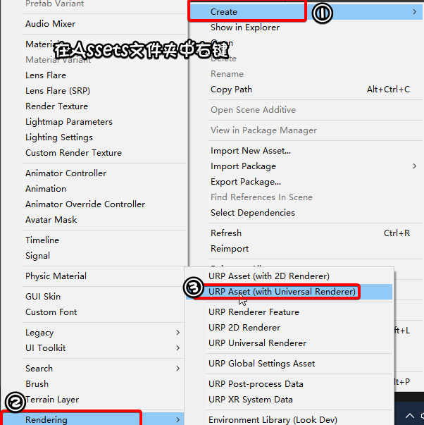

接着就会获得`Universal Render Pipeline Asset`和`Unviversal Render Data`文件，到`Project Settings-Graphics-URP Global Settings`中获取默认的文件。

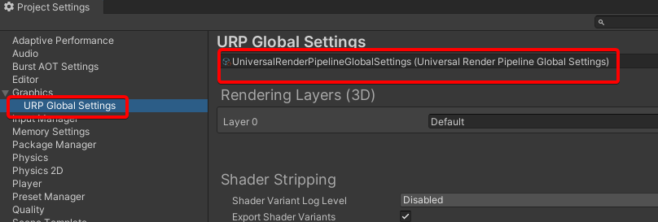


##### c:Layout布局

看窗口摆放怎么舒服怎么来，具体设置挺无聊的，就不说了。

#### [2] 项目管理

##### a:Github Desktop

> 我认为它简单易用，相较于git这个工具，我不需要隔一段时间需要重新配置ssh和key这些麻烦，对那些报错毫无头绪，并且它会自动保存好我们的github账号信息，实在是很方便。

参考这篇教程[【github】如何将unity项目托管到github（快速便捷）_unity链接github仓库-CSDN博客](https://blog.csdn.net/qq_34168477/article/details/134791224)

首先就是创建新的库，注意git要放在unity项目文件的根目录中。

其次就是**创建文件，命名为.gitignore**

```bash
# This .gitignore file should be placed at the root of your Unity project directory
#
# Get latest from https://github.com/github/gitignore/blob/master/Unity.gitignore
#
/[Ll]ibrary/
/[Tt]emp/
/[Oo]bj/
/[Bb]uild/
/[Bb]uilds/
/[Ll]ogs/
/[Mm]emoryCaptures/

# Asset meta data should only be ignored when the corresponding asset is also ignored
!/[Aa]ssets/**/*.meta

# Uncomment this line if you wish to ignore the asset store tools plugin
# /[Aa]ssets/AssetStoreTools*

# Autogenerated Jetbrains Rider plugin
[Aa]ssets/Plugins/Editor/JetBrains*

# Visual Studio cache directory
.vs/

# Gradle cache directory
.gradle/

# Autogenerated VS/MD/Consulo solution and project files
ExportedObj/
.consulo/
*.csproj
*.unityproj
*.sln
*.suo
*.tmp
*.user
*.userprefs
*.pidb
*.booproj
*.svd
*.pdb
*.mdb
*.opendb
*.VC.db

# Unity3D generated meta files
*.pidb.meta
*.pdb.meta
*.mdb.meta

# Unity3D generated file on crash reports
sysinfo.txt

# Builds
*.apk
*.unitypackage

# Crashlytics generated file
crashlytics-build.properties

# General
.DS_Store
.AppleDouble
.LSOverride

# Icon must end with two \r
Icon

# Thumbnails
._*

# Files that might appear in the root of a volume
.DocumentRevisions-V100
.fseventsd
.Spotlight-V100
.TemporaryItems
.Trashes
.VolumeIcon.icns
.com.apple.timemachine.donotpresent

# Directories potentially created on remote AFP share
.AppleDB
.AppleDesktop
Network Trash Folder
Temporary Items
.apdisk

# Windows thumbnail cache files
Thumbs.db
Thumbs.db:encryptable
ehthumbs.db
ehthumbs_vista.db

# Dump file
*.stackdump

# Folder config file
[Dd]esktop.ini

# Recycle Bin used on file shares
$RECYCLE.BIN/

# Windows Installer files
*.cab
*.msi
*.msix
*.msm
*.msp

# Windows shortcuts
*.lnk
```

需要关心的问题是，我们该上传unity项目当中哪些是有用的内容，把冗杂的部分去除，这样我们实际要上传添加的文件就不会太多了。


因为我们不需要安装`git large`增加麻烦，[About large files on GitHub - GitHub Docs](https://docs.github.com/en/repositories/working-with-files/managing-large-files/about-large-files-on-github)，不需要太大的项目内容（不方便下载），加上实际上有效的操作本身就不需要太多的硬盘空间。


##### b:Unity项目的回滚注意事项

当然这样的操作也会给我们带来问题，首先我们就需要提交第一次的初始项目，而这个初始项目，我们后续的操作都不能回退到这初始的第一步，因为这样会让unity无法识别到任何文件，这个项目也就废了。

这是因为Github Desktop自身逻回滚的逻辑不同于我们想的那样回退到指定的历史。

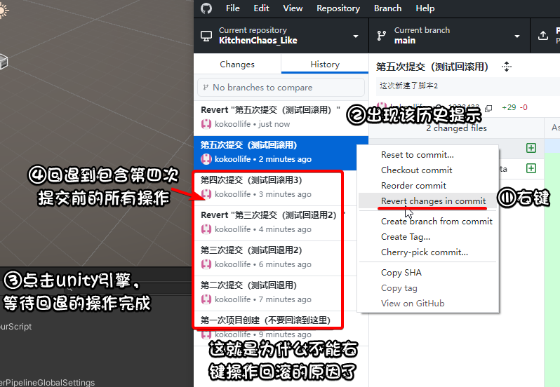

后续看自己需要是否提交到远程仓库了，也只是鼠标点击的事情。


当然如果你希望可以随时获取存放的大文件，并且回退到指定的历史版本，**我建议使用SourceTree**，更符合我们的使用逻辑，不过需要耗费的时间也同样很久，看自己的需要。

最后可以选择任何git工具，svn也可以，我只是选择学习成本最低的，`github desktop`你只需要登录设置就可以了，能够快速管理项目才是最好的。

##### c:VS的基本配置

像Unity下载安装和配置，网上的教程该有的都有，这里就说VS的插件安装。


点击下载，等待安装提示，关闭vs


如果出现了VSIX Install程序，就点击确认安装，然后重启即可


如果希望调节细微的颜色差异，可以`工具->选项`我们来看一下代码提示的效果，默认的效果也还可以，比原先的VS提示好多了。

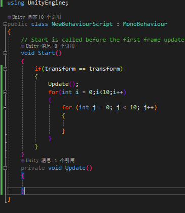

对于新行，我们这里可以调节，看自己喜欢


##### d:导入素材

将`KitchenChaosAssets.unitypackage`文件拖拽到asset文件夹中，然后导入，获得如下的素材，我们不需要关心美术资源问题。


##### e:基本场景搭建

首先删除掉SampleSceneProfile这个文件，然后就是搭建基本场景的操作。

[体积 (Volume) | Universal RP | 12.1.1 (unity3d.com)](https://docs.unity3d.com/cn/Packages/com.unity.render-pipelines.universal@12.1/manual/Volumes.html)

> **Profile**是一个体积配置文件资源，其中包含的 Volume 组件存储了 URP 用于处理此体积的属性。
>
> 单击 **New** 和 **Clone** 按钮来创建体积配置文件或克隆当前的体积配置文件。


换材质，让我们的地面变得好一些。


去拿一些预制体摆放到平面上，搭建后处理步骤需要的场地。

##### f:Scene窗口移动和相机预设

Shift+鼠标中键移动，快速平移

鼠标中键移动，正常平移

按住右键+WASD，Scene窗口移动

按住右键+鼠标中键滚轮，控制移动速度

点击游戏游戏对象，然后F键，就是快速移动到指定的游戏对象

在层次结构中点击相机Main Camera游戏对象，然后Ctrl+Shift+F，就能让Game窗口变成跟Scene窗口一样，让相机预设到指定位置


##### g:后处理

色调映射:

> 一个场景中包含很多细节的静态画面，但该画面的对比度并不特别高，也不真实，就像我们进入上图默认的scene界面那样，所有物体都有光照加阴影，看起来像那么一回事，不过仔细观察，会发现看起来都一样，这不太符合真实的光影效果。
>
> 动态色调映射用于使平面 HDR 图像看起来有力且充满细节。色调映射涉及减少图像中的色调值，使其适合在数字屏幕上查看。

[色调映射 (Tonemapping) | Universal RP | 12.1.1 (unity3d.com)](https://docs.unity3d.com/cn/Packages/com.unity.render-pipelines.universal@12.1/manual/post-processing-tonemapping.html)

启用色调映射，位于正常渲染之后，也就是后处理阶段，那么我们要确保我们确实开启了后处理选项。


颜色调整：

> 调整最终渲染的图像的整体色调、亮度和对比度

这里值的设置如下：


泛光：

> 泛光效果会产生从图像明亮区域边界向外延伸的光线条纹。这种效果给人的感觉是极其明亮的光线压制住了摄像机。
>
> 人话：闪亮登场


看看效果如何：


渐晕/暗角：

[渐晕 (Vignette) | Universal RP | 12.1.1 (unity3d.com)](https://docs.unity3d.com/cn/Packages/com.unity.render-pipelines.universal@12.1/manual/post-processing-vignette.html?q=vignett)

> 相对于中心朝图像边缘变暗和/或去饱和，一种让我们把注意力更集中放在画面的中心的做法。


**抗锯齿**：anti-aliasing

[相机组件参考 |通用 RP |14.0.11 (unity3d.com)](https://docs.unity3d.com/Packages/com.unity.render-pipelines.universal@14.0/manual/camera-component-reference.html)

TAA会开启后会有一些很严重的抖动


屏幕空间环境光遮蔽 （SSAO）

[环境光遮蔽 |通用 RP |14.0.11 (unity3d.com)](https://docs.unity3d.com/Packages/com.unity.render-pipelines.universal@14.0/manual/post-processing-ssao.html)

> 环境光遮蔽效果可实时使彼此靠近的折痕、孔洞、交叉点和表面变暗。在现实世界中，这些区域往往会阻挡或遮挡环境光，因此它们看起来更暗。


更多其他内容

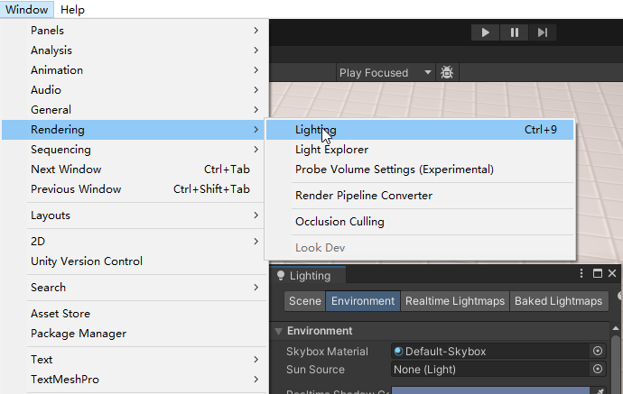

复制备份后，我们可以尝试加入其他各种千奇百怪的各种组件，做出不同的后处理效果。


## 02 简陋实现

### 001 玩家控制器

#### [1]简单移动

##### a:逻辑与动画分离


##### b:新建脚本`Player.cs`

```csharp
using UnityEngine;

public class Player : MonoBehaviour
{
    //私有就保证不被其他脚本修改该变量，序列化保证我们可以方便在检查器中调节这个变量。
    [SerializeField] private float moveSpeed = 7f;

    private void Update() {
        //实现上下左右移动，有效的是三维坐标(x,0,z)
        Vector2 inputVector = new Vector2(0, 0);
        if (Input.GetKey(KeyCode.W)) {
            inputVector.y = +1;
        }
        if (Input.GetKey(KeyCode.S)) {
            inputVector.y = -1;
        }
        if (Input.GetKey(KeyCode.A)) {
            inputVector.x = -1;
        }
        if (Input.GetKey(KeyCode.D)) {
            inputVector.x = +1;
        }
        //归一化，解决对角线移动速度过快问题
        inputVector = inputVector.normalized;

        Vector3 moveDir = new Vector3(inputVector.x, 0, inputVector.y);
        //要考虑帧率对游戏的影响和速度
        transform.position += moveDir * moveSpeed * Time.deltaTime;

        Debug.Log(Time.deltaTime);
    }
}
```

FPS:


帧率其实也可以通过`Time.deltaTime`来反映


##### c:Debug

只要修改视觉效果，就如下图那样


#### [2]简单旋转

不建议使用transform的rotation，因为这里面涉及到四元数，并不直观；建议用欧拉角。

##### a:修改脚本`Player.cs`

```csharp
using UnityEngine;

public class Player : MonoBehaviour
{
    [SerializeField] private float moveSpeed = 7f;

    private void Update() {
        //...

        //添加旋转
        float rotateSpeed = 10f;
        //平滑处理，相较于lerp旋转效果会好些，可以更快切换方向。
        transform.forward = Vector3.Slerp(transform.forward, moveDir, Time.deltaTime * rotateSpeed);
    }
}

```

#### [3]简单动画

##### a:动画控制器


##### b:新建脚本`PlayerAnimator.cs`


```csharp
using UnityEngine;

public class PlayerAnimator : MonoBehaviour
{
    private const string IS_WALKING = "IsWalking";

    //Player脚本
    [SerializeField] private Player player;

    private Animator animator;

    private void Awake() {
        animator = GetComponent<Animator>();
    }

    private void Update() {
        animator.SetBool(IS_WALKING, player.IsWalking());
    }
}
```

##### c:修改脚本`Player.cs`

```csharp
using UnityEngine;

public class Player : MonoBehaviour
{
    [SerializeField] private float moveSpeed = 7f;

    //弄个判断是否走的布尔变量
    private bool isWalking;

    private void Update() {
        //...

        //判断
        isWalking = moveDir != Vector3.zero;
        float rotateSpeed = 10f;
        transform.forward = Vector3.Slerp(transform.forward, moveDir, Time.deltaTime * rotateSpeed);
    }
    
    //私有变量通过函数获取
    public bool IsWalking() {
        return isWalking;
    }
}
```

##### d:Debug


### 002 镜头和重构

#### [1]cinemachine实现镜头跟随

##### a:操作

安装


然后实现镜头跟随


#### [2]重构之前的输入系统

##### a:新建脚本`GameInput.cs`


```csharp
using UnityEngine;

public class GameInput : MonoBehaviour
{
    public Vector2 GetMovementVectorNormalized() {
        Vector2 inputVector = new Vector2(0, 0);
        if (Input.GetKey(KeyCode.W)) {
            inputVector.y = +1;
        }
        if (Input.GetKey(KeyCode.S)) {
            inputVector.y = -1;
        }
        if (Input.GetKey(KeyCode.A)) {
            inputVector.x = -1;
        }
        if (Input.GetKey(KeyCode.D)) {
            inputVector.x = +1;
        }
        inputVector = inputVector.normalized;
        return inputVector;
    }
}
```

##### b:修改脚本`Player.cs`


```csharp
using UnityEngine;

public class Player : MonoBehaviour
{
    [SerializeField] private float moveSpeed = 7f;
    [SerializeField] private GameInput gameInput;

    private bool isWalking;

    private void Update() {
        Vector2 inputVector = gameInput.GetMovementVectorNormalized();
        Vector3 moveDir = new Vector3(inputVector.x, 0, inputVector.y);
        transform.position += moveDir * moveSpeed * Time.deltaTime;

        isWalking = moveDir != Vector3.zero;
        float rotateSpeed = 10f;
        transform.forward = Vector3.Slerp(transform.forward, moveDir, Time.deltaTime * rotateSpeed);
    }

    public bool IsWalking() {
        return isWalking;
    }
}
```

#### [3]新输入系统重构

##### a:安装


启用它


在assets中右键新建出`Input Actions`，并且应用生成对应的对应C#脚本，设置好对应的输入


##### b:修改脚本`GameInput.cs`

```csharp
using UnityEngine;

public class GameInput : MonoBehaviour
{
    private PlayerInputActions playerInputActions;

    private void Awake() {
        playerInputActions = new PlayerInputActions();
        playerInputActions.Player.Enable();
    }

    public Vector2 GetMovementVectorNormalized() {
        Vector2 inputVector = playerInputActions.Player.Move.ReadValue<Vector2>();

        inputVector = inputVector.normalized;

        return inputVector;
    }
}
```

#### [4]碰撞

##### a:修改脚本`Player.cs`

```csharp
using UnityEngine;

public class Player : MonoBehaviour
{
    [SerializeField] private float moveSpeed = 7f;
    [SerializeField] private GameInput gameInput;

    private bool isWalking;

    private void Update() {
        Vector2 inputVector = gameInput.GetMovementVectorNormalized();
        Vector3 moveDir = new Vector3(inputVector.x, 0, inputVector.y);


        //加入物理的射线检测，进行碰撞的检查，没检测到碰撞体就说明可以过去
        float playerRadius = .7f;
        //不过使用这类射线做法的坏处就是它是从中心发出很薄的光线，如果射线没有对准到碰撞体
        //如果当前物体用了2d碰撞体或者它并没有与地面接触，那么就有可能让玩家无法碰撞生效
        //bool canMove = !Physics.Raycast(transform.position, moveDir, playerRadius);
        //所以改成能发出无限光的做法，这样就能避免上面提到的缺陷，而是变成了好像一整个物体与碰撞体接触的情况
        float playerHeight = 2f;
        float moveDistance = moveSpeed * Time.deltaTime;
        //当然说是这样说，其实测试的时候还是会有一定的概率出现穿墙问题，目前原因不明
        bool canMove = !Physics.CapsuleCast(transform.position,transform.position + Vector3.up * playerHeight, playerRadius,moveDir,moveDistance);

        //下面这段就是对碰撞的优化了
        //我们要想到，如果只允许横或者纵着走并接触碰撞的情况，这时候是可以移动的
        //那么如果对角线移动的化，只依靠上面的代码，其实是不够，还需要特别判断
        if (!canMove) {
            //打算只允许x方向移动，并且速度归一化处理
            Vector3 moveDirX = new Vector3(moveDir.x, 0, 0).normalized;
            canMove = !Physics.CapsuleCast(transform.position, transform.position + Vector3.up * playerHeight, playerRadius, moveDirX, moveDistance);

            if (canMove) {
                //只允许X方向
                moveDir = moveDirX;
            }
            else {
                //只允许z方向移动
                Vector3 moveDirZ = new Vector3(0, 0, moveDir.z).normalized;
                canMove = !Physics.CapsuleCast(transform.position, transform.position + Vector3.up * playerHeight, playerRadius, moveDirZ, moveDistance);

                if (canMove) {
                    moveDir = moveDirZ;
                }
                //这个就是
                else {
                    //不能移动到任何一个方向
                    Debug.Log("对角线位置");
                }
            }
        }

        if (canMove) {
            transform.position += moveDir * moveDistance;
        }

        isWalking = moveDir != Vector3.zero;
        float rotateSpeed = 10f;
        transform.forward = Vector3.Slerp(transform.forward, moveDir, Time.deltaTime * rotateSpeed);
    }

    public bool IsWalking() {
        ...
    }
}
```


##### b:Debug

下面就可以看到物体的对角线位置不能移动的问题（**这是故意保留的**），然后或许未来会有别的碰撞优化处理。

至少处理了对角线移动操作


## 03 游戏机制

### 001 交互操作

#### [1]清空柜台

设置掩码


##### a:修改脚本`Player.cs`

```csharp
using UnityEngine;

public class Player : MonoBehaviour
{
    [SerializeField] private float moveSpeed = 7f;
    [SerializeField] private GameInput gameInput;
    [SerializeField] private LayerMask countersLayerMask;

    private bool isWalking;
    private Vector3 lastInteractDir;

    private void Update() {
        HandleMovement();
        HandleInteractions();
    }

    public bool IsWalking() {
        return isWalking;
    }

    private void HandleInteractions() {
        Vector2 inputVector = gameInput.GetMovementVectorNormalized();
        Vector3 moveDir = new Vector3(inputVector.x, 0f, inputVector.y); 

        //这样就不需要我们持续接触物理的射线检测碰撞了，而是一步到位，靠近就显示是否可以交互。
        if(moveDir != Vector3.zero) {
            lastInteractDir = moveDir;
        }

        float interactDistance = 2f;
        if (Physics.Raycast(transform.position, lastInteractDir, out RaycastHit raycastHit, interactDistance,countersLayerMask)) {
            if(raycastHit.transform.TryGetComponent(out ClearCounter clearCounter)) {
                clearCounter.Interact();
            }
        }
    }

    private void HandleMovement() {
        Vector2 inputVector = gameInput.GetMovementVectorNormalized();
        Vector3 moveDir = new Vector3(inputVector.x, 0, inputVector.y);
        float playerRadius = .7f;
        float playerHeight = 2f;
        float moveDistance = moveSpeed * Time.deltaTime;
        bool canMove = !Physics.CapsuleCast(transform.position, transform.position + Vector3.up * playerHeight, playerRadius, moveDir, moveDistance);
        if (!canMove) {
            Vector3 moveDirX = new Vector3(moveDir.x, 0, 0).normalized;
            canMove = !Physics.CapsuleCast(transform.position, transform.position + Vector3.up * playerHeight, playerRadius, moveDirX, moveDistance);
            if (canMove) {
                moveDir = moveDirX;
            }
            else {
                Vector3 moveDirZ = new Vector3(0, 0, moveDir.z).normalized;
                canMove = !Physics.CapsuleCast(transform.position, transform.position + Vector3.up * playerHeight, playerRadius, moveDirZ, moveDistance);
                if (canMove) {
                    moveDir = moveDirZ;
                }
                else {
                }
            }
        }

        if (canMove) {
            transform.position += moveDir * moveDistance;
        }

        isWalking = moveDir != Vector3.zero;
        float rotateSpeed = 10f;
        transform.forward = Vector3.Slerp(transform.forward, moveDir, Time.deltaTime * rotateSpeed);
    }
}
```


##### b:新建脚本`ClearCounter.cs`


```cs
using UnityEngine;

public class ClearCounter : MonoBehaviour
{
    public void Interact() {
        Debug.Log("交互 " + this.name);
    }
}
```

##### c:Debug

这样当玩家接触后，交互是自动操作的，提示信息。

#### [2]交互实现

用事件来让我们的操作实现不是自动的，而是交给玩家去选择是否执行。

##### a:输入映射

首先要做的就是确认交互的按键操作。


##### b:修改脚本`GameInput.cs`

```csharp
using UnityEngine;
using System;
using UnityEngine.InputSystem;

public class GameInput : MonoBehaviour
{
    //弄个事件处理，这个事件处理就负责调用有关交互的相关函数
    public event EventHandler onInteractAction;

    private PlayerInputActions playerInputActions;

    private void Awake() {
        playerInputActions = new PlayerInputActions();
        playerInputActions.Player.Enable();

        //启用输入的话，就调用事件相关的函数
        playerInputActions.Player.Interact.performed += Interact_Performed;
    }

    //负责调用有关交互的相关函数
    private void Interact_Performed(InputAction.CallbackContext context) {
        onInteractAction?.Invoke(this, EventArgs.Empty);
    }


    public Vector2 GetMovementVectorNormalized() {
        ...
    }
}
```

##### c:修改脚本`Player.cs`

```csharp
using System;
using UnityEngine;

public class Player : MonoBehaviour
{
    [SerializeField] private float moveSpeed = 7f;
    [SerializeField] private GameInput gameInput;
    [SerializeField] private LayerMask countersLayerMask;

    private bool isWalking;
    private Vector3 lastInteractDir;

    private void Start() {
        //开始状态就需要把可以交互的函数挂入到这个事件处理中
        gameInput.onInteractAction += GameInput_OnInteractAction;
    }

    //跟下面代码重复只是为了方便测试
    private void GameInput_OnInteractAction(object sender, EventArgs e) {
        Vector2 inputVector = gameInput.GetMovementVectorNormalized();
        Vector3 moveDir = new Vector3(inputVector.x, 0f, inputVector.y);

        if (moveDir != Vector3.zero) {
            lastInteractDir = moveDir;
        }

        float interactDistance = 2f;
        if (Physics.Raycast(transform.position, lastInteractDir, out RaycastHit raycastHit, interactDistance, countersLayerMask)) {
            if (raycastHit.transform.TryGetComponent(out ClearCounter clearCounter)) {
                clearCounter.Interact();
            }
        }
    }

    private void Update() {
        HandleMovement();
        HandleInteractions();
    }

    public bool IsWalking() {
        return isWalking;
    }

    private void HandleInteractions() {
        Vector2 inputVector = gameInput.GetMovementVectorNormalized();
        Vector3 moveDir = new Vector3(inputVector.x, 0f, inputVector.y); 

        if(moveDir != Vector3.zero) {
            lastInteractDir = moveDir;
        }

        float interactDistance = 2f;
        if (Physics.Raycast(transform.position, lastInteractDir, out RaycastHit raycastHit, interactDistance,countersLayerMask)) {
            if(raycastHit.transform.TryGetComponent(out ClearCounter clearCounter)) {
                //clearCounter.Interact();
            }
        }
    }

    private void HandleMovement() {
        ...
    }
}
```

##### d:Debug

现在接触特定掩码物体，然后按下交互键，就能输出交互的信息，而不是自动交互了。

#### [3]交互提示

需要注意选中后需要让材质略微盖过原来的柜台物体。


##### a:新建脚本`SelectedCounterVisual`

```csharp
using UnityEngine;

public class SelectedCounterVisual : MonoBehaviour
{
    [SerializeField] private ClearCounter clearCounter;
    [SerializeField] private GameObject visualGameObject;

    //现在就是处理视觉的逻辑了
    private void Start() {
        Player.Instance.OnSelectedCounterChanged += Player_OnSelectedCounterChanged;
    }

    private void Player_OnSelectedCounterChanged(object sender, Player.OnSelectedCounterChangedEventArgs e) {
        //就做个简单的判断
        if(e.selectedCounter == clearCounter) {
            Show();
        }
        else {
            Hide();
        }
    }

    private void Show() {
        visualGameObject.SetActive(true);
    }

    private void Hide() {
        visualGameObject.SetActive(false);
    }
}
```


##### b:修改脚本`Player.cs`

```csharp
using System;
using UnityEngine;

public class Player : MonoBehaviour
{
    //单例
    public static Player Instance { get; private set; }

    //事件处理，这个专门负责处理切换柜台的逻辑和视觉
    public event EventHandler<OnSelectedCounterChangedEventArgs> OnSelectedCounterChanged;
    //设定哪些是可以传入的参数
    public class OnSelectedCounterChangedEventArgs : EventArgs {
        public ClearCounter selectedCounter;
    }

    [SerializeField] private float moveSpeed = 7f;
    [SerializeField] private GameInput gameInput;
    [SerializeField] private LayerMask countersLayerMask;

    private bool isWalking;
    private Vector3 lastInteractDir;
    private ClearCounter selectedCounter;

    private void Awake() {
        if(Instance != null) {
            Debug.LogError("There is more than one Player instance");
        }
        Instance = this;
    }

    //注意awake初始化，start负责处理只有脚本激活后才能做的事情
    private void Start() {
        gameInput.onInteractAction += GameInput_OnInteractAction;
    }

    private void GameInput_OnInteractAction(object sender, EventArgs e) {
        //因为已经通过判断是否有柜台这个判断依据了，所以我们就可以把视觉和逻辑拆出来的同时，还把实现功能也分开
        //减少了重复代码
        if (selectedCounter != null) {
            //变成了只对特定的对象进行交互
            selectedCounter.Interact();
        }
        
    }

    private void Update() {
        ...
    }

    public bool IsWalking() {
        ...
    }

    private void HandleInteractions() {
        Vector2 inputVector = gameInput.GetMovementVectorNormalized();
        Vector3 moveDir = new Vector3(inputVector.x, 0f, inputVector.y); 

        if(moveDir != Vector3.zero) {
            lastInteractDir = moveDir;
        }

        float interactDistance = 2f;
        if (Physics.Raycast(transform.position, lastInteractDir, out RaycastHit raycastHit, interactDistance,countersLayerMask)) {
            if(raycastHit.transform.TryGetComponent(out ClearCounter clearCounter)) {
                //如果有柜台，就更新成这个
                if(clearCounter != selectedCounter) {
                    SetSelectedCounter(clearCounter);
                }
            }
            else {
                SetSelectedCounter(null);
            }
        }
        else {
            SetSelectedCounter(null);
        }
    }

    private void HandleMovement() {
        ...
    }

    //设置当前选中的柜台对象
    private void SetSelectedCounter(ClearCounter selectedCounter) {
        this.selectedCounter = selectedCounter;

        OnSelectedCounterChanged?.Invoke(this, new OnSelectedCounterChangedEventArgs {
            selectedCounter = selectedCounter,
        });
    }
}
```

##### c:Debug


### 002 捡起与放下物品

#### [1]厨房对象

弄个西红柿游戏对象(**空对象**)，然后预制体美术资源中就有西红柿的，弄到一起，做到逻辑与视觉分离，最后保存这个游戏对象为预制体。

##### a:修改脚本`ClearCounter.cs`


```csharp
using UnityEngine;

public class ClearCounter : MonoBehaviour
{
    //物品的预制体
    [SerializeField] private Transform tomatoPrefab;
    //物品生成的位置（再柜台平面上）
    [SerializeField] private Transform counterTopPoint;

    public void Interact() {
        Debug.Log("交互 " + this.name);
        //预制体都要生成实例化
        Transform tomatoTransform = Instantiate(tomatoPrefab, counterTopPoint);
        //这个预制体的局部坐标要都设为0
        tomatoPrefab.localPosition = Vector3.zero;
    }
}
```

现在交互了，就会生成


##### b:新建脚本`KitchenObjectSO.cs`

我们将要生成很多物体，所以需要SO静态管理数据

```csharp
using UnityEngine;

[CreateAssetMenu()]
public class KitchenObjectSO :ScriptableObject
{
    public Transform prefab;
    public Sprite sprite;
    public string objectName;
}
```

然后就是在Assets中右键生成数据文件，比如`Tomato`，重命名放入对应的文件夹方便管理


同样的我们可以弄其他数据


##### c:继续修改`ClearCounter.cs`


```csharp
using UnityEngine;

public class ClearCounter : MonoBehaviour
{
    [SerializeField] private KitchenObjectSO kitchenObjectSO;
    [SerializeField] private Transform counterTopPoint;

    public void Interact() {
        Debug.Log("交互 " + this.name);
        Transform kitchenObjectTransform = Instantiate(kitchenObjectSO.prefab, counterTopPoint);
        kitchenObjectTransform.localPosition = Vector3.zero;
        //获取到生成的数据
        Debug.Log(kitchenObjectTransform.GetComponent<KitchenObject>().GetKitchenObjectSO());
    }
}
```

现在就方便我们调效果了，当然也存在问题，就是会生成出多个物体，并且重合在一起。


##### d:新建脚本`KitchenObject.cs`

挂上脚本


还有番茄预制体


```csharp
using UnityEngine;

public class KitchenObject : MonoBehaviour
{
    [SerializeField] private KitchenObjectSO kitchenObjectSO;

    //获取到对应物体的SO数据
    public KitchenObjectSO GetKitchenObjectSO() { return kitchenObjectSO; }
}
```


#### [2]厨房父对象

##### a:修改脚本`ClearCounter.cs`


可以看到生成的层次结构是被限制的，并且食物的父类是位置


```csharp
using UnityEngine;

public class ClearCounter : MonoBehaviour
{
    [SerializeField] private KitchenObjectSO kitchenObjectSO;
    [SerializeField] private Transform counterTopPoint;
    //从原父类设置成另一个新父类操作用，具体看Update测试
    [SerializeField] private ClearCounter secondClearCounter;
    [SerializeField] private bool testing;

    private KitchenObject kitchenObject;

    private void Update() {
        //测试，让一个物体的父类改变，做到逻辑上移动物体到另一个柜台的操作
        if(testing && Input.GetKeyDown(KeyCode.T)) {
            if(kitchenObject != null) {
                kitchenObject.SetClearCounter(secondClearCounter);
            }
        }
    }

    public void Interact() {
        if(kitchenObject == null) {
            Transform kitchenObjectTransform = Instantiate(kitchenObjectSO.prefab, counterTopPoint);
            //获取到对应对象，这样就做到唯一生成了
            //然后就是要把这个生成的物品对象去设置为对应的柜台
            kitchenObjectTransform.GetComponent<KitchenObject>().SetClearCounter(this);          
        }
        else {
            //如果物品不为空，就说明已经有对应柜台了。
            Debug.Log(kitchenObject.GetClearCounter());
        }
    }

    //获取生成点
    public Transform GetKitchenObjectFollowTransform() {
        return counterTopPoint;
    }
    
    //因为父类的切换，也会涉及到物体占用位置，所以我们在检查器中开启debug检查是否有一些变量遗漏
    public void SetKitchenObject(KitchenObject kitchenObject) {
        this.kitchenObject = kitchenObject;
    }

    public KitchenObject GetKitchenObject() { return kitchenObject; }

    public void ClearKitchenObject() { kitchenObject = null; }

    public bool HasKitchenObject() { return kitchenObject != null; }
}
```

##### b:修改脚本`KitchenObject.cs`

```csharp
using UnityEngine;

public class KitchenObject : MonoBehaviour
{
    [SerializeField] private KitchenObjectSO kitchenObjectSO;

    private ClearCounter clearCounter;

    public KitchenObjectSO GetKitchenObjectSO() { ... }

    //设置柜台
    public void SetClearCounter(ClearCounter clearCounter) {
        if(this.clearCounter != null) {
            //不为空，就需要清空当前的父类
            this.clearCounter.ClearKitchenObject();
        }

        this.clearCounter = clearCounter;

        if (clearCounter.HasKitchenObject()) {
            Debug.LogError("Counter already has a KitchenObject!");
        }

        clearCounter.SetKitchenObject(this);//柜台也对应好这个食物
        //修改父类和局部坐标
        transform.parent = clearCounter.GetKitchenObjectFollowTransform();
        transform.localPosition = Vector3.zero;
    }
    //获取柜台
    public ClearCounter GetClearCounter() { return clearCounter; }
}
```

可以看到测试效果，先生成物体，然后改变父类，同样因为`SetClearCounter`函数，改变位置


对检查器开启debug检查相关变量，父类是否正确发生改变，相应的原柜台KitchenObject就要为空，那么自然可以交互放入新的番茄。


#### [3]玩家捡起

前面可以知道把一个物体从柜台0移动到柜台1，本质上其实跟玩家捡起物品是没有任何区别的，它们都是游戏对象，但是我们实际实现代码后，会提示报错，因为我们没有统一一个接口，方便我们只是实现这个获取这个行为。

##### a:新建脚本`IKitchenObjectParent.cs`

```csharp
using UnityEngine;

public interface IKitchenObjectParent
{
    public Transform GetKitchenObjectFollowTransform();

    public void SetKitchenObject(KitchenObject kitchenObject);

    public KitchenObject GetKitchenObject();

    public void ClearKitchenObject();

    public bool HasKitchenObject();
}
```

##### b:修改脚本`ClearCounter.cs`

```csharp
using UnityEngine;

//实现这个接口
public class ClearCounter : MonoBehaviour,IKitchenObjectParent
{
    [SerializeField] private KitchenObjectSO kitchenObjectSO;
    [SerializeField] private Transform counterTopPoint;

    private KitchenObject kitchenObject;
    //不再需要移动物品的测试

    public void Interact(Player player) {
        if(kitchenObject == null) {
            Transform kitchenObjectTransform = Instantiate(kitchenObjectSO.prefab, counterTopPoint);
            kitchenObjectTransform.GetComponent<KitchenObject>().SetKitchenObjectParent(this);          
        }
        else {
            //Debug.Log(kitchenObject.GetClearCounter());/
            //拿在玩家手上
            kitchenObject.SetKitchenObjectParent(player);
        }
    }

    public Transform GetKitchenObjectFollowTransform() {
        return counterTopPoint;
    }
    
    public void SetKitchenObject(KitchenObject kitchenObject) {
        this.kitchenObject = kitchenObject;
    }

    public KitchenObject GetKitchenObject() { return kitchenObject; }

    public void ClearKitchenObject() { kitchenObject = null; }

    public bool HasKitchenObject() { return kitchenObject != null; }
}
```

##### c:修改脚本`KitchenObject.cs`

重写改写了一下函数名称，建议用Ctrl+F替换，注意是当前文档还是，当前项目进行改写，不要用右键的重命名，可能会影响不相干的变量.

```csharp
using UnityEngine;

public class KitchenObject : MonoBehaviour
{
    [SerializeField] private KitchenObjectSO kitchenObjectSO;

    private IKitchenObjectParent kitchenObjectParent;

    public KitchenObjectSO GetKitchenObjectSO() { return kitchenObjectSO; }

    public void SetKitchenObjectParent(IKitchenObjectParent kitchenObjectParent) {
        if(this.kitchenObjectParent != null) {
            this.kitchenObjectParent.ClearKitchenObject();
        }

        this.kitchenObjectParent = kitchenObjectParent;

        if (kitchenObjectParent.HasKitchenObject()) {
            Debug.LogError("IKitchenObjectParent already has a KitchenObject!");
        }

        kitchenObjectParent.SetKitchenObject(this);
        transform.parent = kitchenObjectParent.GetKitchenObjectFollowTransform();
        transform.localPosition = Vector3.zero;
    }
    public IKitchenObjectParent GetClearCounter() { return kitchenObjectParent; }

    //销毁自己
    public void DestroySelf() {
        kitchenObjectParent.ClearKitchenObject();
        Destroy(gameObject);
    }

    //静态函数，重构物品生成
    public static KitchenObject SpawnKitchenObject(KitchenObjectSO kitchenObjectSO,IKitchenObjectParent kitchenObjectParent) {
        Transform kitchenObjectTransform = Instantiate(kitchenObjectSO.prefab);

        KitchenObject kitchenObject = kitchenObjectTransform.GetComponent<KitchenObject>();

        kitchenObject.SetKitchenObjectParent(kitchenObjectParent);

        return kitchenObject;
    }
}
```

##### d:修改脚本`Player.cs`


```csharp
using System;
using UnityEngine;

public class Player : MonoBehaviour,IKitchenObjectParent {
    public static Player Instance { get; private set; }

    public event EventHandler<OnSelectedCounterChangedEventArgs> OnSelectedCounterChanged;
    public class OnSelectedCounterChangedEventArgs : EventArgs {
        public ClearCounter selectedCounter;
    }

    [SerializeField] private float moveSpeed = 7f;
    [SerializeField] private GameInput gameInput;
    [SerializeField] private LayerMask countersLayerMask;
    //拿物品的位置
    [SerializeField] private Transform kitchenObjectHoldPoint;

    private bool isWalking;
    private Vector3 lastInteractDir;
    private ClearCounter selectedCounter;
    //要拿的物品
    private KitchenObject KitchenObject;

    private void Awake() {
        ...
    }

    private void Start() {
        ...
    }

    private void GameInput_OnInteractAction(object sender, EventArgs e) {
        if (selectedCounter != null) {
            //传入玩家自身对象为参数
            selectedCounter.Interact(this);
        }
    }

    private void Update() {
        ...
    }

    public bool IsWalking() {
        ...
    }

    private void HandleInteractions() {
        ...
    }

    private void HandleMovement() {
        ...
    }

    private void SetSelectedCounter(ClearCounter selectedCounter) {
        ...
    }

    //实现接口
    public Transform GetKitchenObjectFollowTransform() {
        return kitchenObjectHoldPoint;
    }

    public void SetKitchenObject(KitchenObject kitchenObject) {
        this.KitchenObject = kitchenObject;
    }

    public KitchenObject GetKitchenObject() {
        return KitchenObject;
    }

    public void ClearKitchenObject() {
        KitchenObject = null;
    }

    public bool HasKitchenObject() {
        return KitchenObject != null;
    }
}
```

测试拿起效果,现在就是利用接口实现了不同类型的对象,做到了一样的行为.


#### [4]货柜

##### a:新建脚本`BaseCounter.cs`


```cs
using UnityEngine;

public class BaseCounter : MonoBehaviour,IKitchenObjectParent
{
    [SerializeField] private Transform counterTopPoint;

    private KitchenObject kitchenObject;

    public virtual void Interact(Player player) {
        Debug.LogError("BaseCounter.Interact()");
    }

    public Transform GetKitchenObjectFollowTransform() {
        return counterTopPoint;
    }

    public void SetKitchenObject(KitchenObject kitchenObject) {
        this.kitchenObject = kitchenObject;
    }

    public KitchenObject GetKitchenObject() { return kitchenObject; }

    public void ClearKitchenObject() { kitchenObject = null; }

    public bool HasKitchenObject() { return kitchenObject != null; }

    public Transform GetCounterTopPoint() {
        return counterTopPoint;
    }
}
```

##### b:新建脚本`ContainerCounter.cs`


```csharp
using System;
using UnityEngine;

public class ContainerCounter : BaseCounter
{
    public event EventHandler OnPlayerGrabbedObject;

    [SerializeField] private KitchenObjectSO kitchenObjectSO;
    public override void Interact(Player player) {
        //如果现在玩家手上没有物品
        if (!player.HasKitchenObject()) {
            //现在的逻辑改成玩家直接拿到物品，我们不需要在柜台上生成，然后玩家拿取，所以不需要获取到生成的位置。
            KitchenObject.SpawnKitchenObject(kitchenObjectSO, player);
            OnPlayerGrabbedObject?.Invoke(this, EventArgs.Empty);
        }
        //如果玩家现在手上有物品
        else {
            Debug.Log("手上有东西，这里debug一下");
        }
    }
}
```

##### c:修改脚本`ClearCounter.cs`

而且原先实现的功能，也不符合我们要做对应模型的效果。

```csharp
using UnityEngine;

//不再需要实现接口，交给父类解决
public class ClearCounter : BaseCounter
{
    [SerializeField] private KitchenObjectSO kitchenObjectSO;
    public override void Interact(Player player) {
        //如果当前柜台没有放置物品
        if (!HasKitchenObject()) {
            //如果当前玩家手上有东西            
            if (player.HasKitchenObject()) {
                //那么就放物品到这个柜台上
                player.GetKitchenObject().SetKitchenObjectParent(this);
            }
            //如果玩家手上现在没拿东西
            else {

            }
        }
        //如果当前柜台放东西
        else {
            //如果玩家现在手上有东西
            if (player.HasKitchenObject()) {

            }
            //如果玩家现在手上没有东西
            else {
                //那么玩家就可以拿取柜台上的物品
                GetKitchenObject().SetKitchenObjectParent(player);
            }
        }
    }
}
```

##### d:修改脚本`Player.cs`

```csharp
//改动就是把原来的ClearCounter类都改为BaseCounter类，将其适配成父类及其子类都可以交互,相关参数和成员属性就不在这里写了.

    private void HandleInteractions() {
        Vector2 inputVector = gameInput.GetMovementVectorNormalized();
        Vector3 moveDir = new Vector3(inputVector.x, 0f, inputVector.y);

        if (moveDir != Vector3.zero) {
            lastInteractDir = moveDir;
        }

        float interactDistance = 2f;
        if (Physics.Raycast(transform.position, lastInteractDir, out RaycastHit raycastHit, interactDistance, countersLayerMask)) {
            //这个函数就举例一下out BaseCounter baseCounter
            if (raycastHit.transform.TryGetComponent(out BaseCounter baseCounter)) {
                if (baseCounter != selectedCounter) {
                    SetSelectedCounter(baseCounter);
                }
            }
            else {
                SetSelectedCounter(null);
            }
        }
        else {
            SetSelectedCounter(null);
        }
    }
```

##### e:修改脚本`SelectedCounterVisual.cs`

```csharp
using UnityEngine;

public class SelectedCounterVisual : MonoBehaviour {
    [SerializeField] private BaseCounter baseCounter;//把原来的ClearCounter修改
    [SerializeField] private GameObject[] visualGameObjectArray;//可能一个物体需要提示发光的部分不知有一个

    private void Start() {
        Player.Instance.OnSelectedCounterChanged += Player_OnSelectedCounterChanged;
    }

    private void Player_OnSelectedCounterChanged(object sender, Player.EventArgs e) {
        if (e.selectedCounter == baseCounter) {
            Show();
        }
        else {
            Hide();
        }
    }

    private void Show() {
        foreach(GameObject visualGameObject in visualGameObjectArray) {
            visualGameObject.SetActive(true);
        }
    }

    private void Hide() {
        foreach (GameObject visualGameObject in visualGameObjectArray) {
            visualGameObject.SetActive(false);
        }
    }
}
```

##### f:新建脚本`ContainerCounterVisual.cs`

```csharp
using UnityEngine;

public class ContainerCounterVisual : MonoBehaviour
{
    private const string OPEN_CLOSE = "OpenClose";

    private Animator animator;

    [SerializeField] private ContainerCounter containerCounter;

    private void Awake() {
        animator = GetComponent<Animator>();
    }

    //具体视觉效果把动画效果启用，告知给事件处理。
    private void Start() {
        containerCounter.OnPlayerGrabbedObject += ContainerCounter_OnPlayerGrabbedObject;
    }

    private void ContainerCounter_OnPlayerGrabbedObject(object sender,System.EventArgs e) {
        animator.SetTrigger(OPEN_CLOSE);
    }
}
```

##### g:Debug


### 003 切东西和扔垃圾

#### [1]视觉改进

问题：

> 当我们移动到柜台位置附近，并且往左右移动后，柜台不会选择，当我们按上w键后，柜台虽然是被提示选中了，但是人物的朝向却不是柜台。

##### a:修改脚本`Player.cs`

修改处理移动的函数

```csharp
    private void HandleMovement() {
        Vector2 inputVector = gameInput.GetMovementVectorNormalized();
        Vector3 moveDir = new Vector3(inputVector.x, 0, inputVector.y);
        float playerRadius = .7f;
        float playerHeight = 2f;
        float moveDistance = moveSpeed * Time.deltaTime;
        bool canMove = !Physics.CapsuleCast(transform.position, transform.position + Vector3.up * playerHeight, playerRadius, moveDir, moveDistance);
        if (!canMove) {
            Vector3 moveDirX = new Vector3(moveDir.x, 0, 0).normalized;
            //加多个方向的判断
            canMove = moveDir.x != 0 && !Physics.CapsuleCast(transform.position, transform.position + Vector3.up * playerHeight, playerRadius, moveDirX, moveDistance);
            if (canMove) {
                moveDir = moveDirX;
            }
            else {
                Vector3 moveDirZ = new Vector3(0, 0, moveDir.z).normalized;
                //在判断完x轴后，就判断多z轴
                canMove = moveDir.z != 0 && !Physics.CapsuleCast(transform.position, transform.position + Vector3.up * playerHeight, playerRadius, moveDirZ, moveDistance);
                if (canMove) {
                    moveDir = moveDirZ;
                }
                else {
                }
            }
        }

        if (canMove) {
            transform.position += moveDir * moveDistance;
        }

        isWalking = moveDir != Vector3.zero;
        float rotateSpeed = 10f;
        transform.forward = Vector3.Slerp(transform.forward, moveDir, Time.deltaTime * rotateSpeed);
    }
```


#### [2]切割柜台

像之前弄货柜和柜台一样的做法，就是挂载的脚本不一样而已，弄出切割柜台。

##### a:修改脚本`GameInput.cs`


```csharp
using UnityEngine;
using System;
using UnityEngine.InputSystem;

public class GameInput : MonoBehaviour
{
    public event EventHandler OnInteractAction;
    public event EventHandler OnInteractAlternateAction;

    private PlayerInputActions playerInputActions;

    private void Awake() {
        playerInputActions = new PlayerInputActions();
        playerInputActions.Player.Enable();
        playerInputActions.Player.Interact.performed += Interact_Performed;
        //处理
        playerInputActions.Player.InteractAlternate.performed += InteractAlternate_performed;
    }

    private void InteractAlternate_performed(InputAction.CallbackContext context) {
        OnInteractAlternateAction?.Invoke(this, EventArgs.Empty);
    }

    private void Interact_Performed(InputAction.CallbackContext context) {
        ...
    }


    public Vector2 GetMovementVectorNormalized() {
        ...
    }
}
```


##### b:新建脚本`CuttingCounter.cs`


```csharp
using System;
using UnityEngine;


public class CuttingCounter : BaseCounter {
    //处理切割进度视觉的实现逻辑
    public event EventHandler<OnProgressChangedEventArgs> OnProgressChanged;
    public class OnProgressChangedEventArgs : EventArgs {
        public float progressNormalized;
    }
    //要把不同事件的做的事情分开一小步
    public event EventHandler OnCut;//这个只负责动画

    [SerializeField] private CuttingRecipeSO[] cuttingRecipeSOArray;

    private int cuttingProcess;//切割进度

    public override void Interact(Player player) {
        if (!HasKitchenObject()) {          
            if (player.HasKitchenObject()) {
                //加多一层检查，可以切的东西才能放入
                if (HasRecipeWithInput(player.GetKitchenObject().GetKitchenObjectSO())) {
                    player.GetKitchenObject().SetKitchenObjectParent(this);
                    cuttingProcess = 0;

                    //正则化进度数据
                    CuttingRecipeSO cuttingRecipeSO = GetCuttingRecipeSOWithInput(GetKitchenObject().GetKitchenObjectSO());

                    OnProgressChanged?.Invoke(this, new OnProgressChangedEventArgs {
                        progressNormalized = (float)cuttingProcess/ cuttingRecipeSO.cuttingProgressMax
                    });
                }
            }
            else {

            }
        }
        else {
            if (player.HasKitchenObject()) {

            }
            else {
                GetKitchenObject().SetKitchenObjectParent(player);
            }
        }
    }

    public override void InteractAlternate(Player player) {
        //如果有食物，并且要确保已经切割的东西，不能再次切割
        if (HasKitchenObject() && HasRecipeWithInput(GetKitchenObject().GetKitchenObjectSO())) {
            //举例：放入番茄销毁，然后获得番茄片
            cuttingProcess++;

            OnCut?.Invoke(this, EventArgs.Empty);
            CuttingRecipeSO cuttingRecipeSO = GetCuttingRecipeSOWithInput(GetKitchenObject().GetKitchenObjectSO());

            OnProgressChanged?.Invoke(this, new OnProgressChangedEventArgs {
                progressNormalized = (float)cuttingProcess / cuttingRecipeSO.cuttingProgressMax
            });

            if (cuttingProcess >= cuttingRecipeSO.cuttingProgressMax) {
                KitchenObjectSO outputKitchenObjectSO = GetOutputForInput(GetKitchenObject().GetKitchenObjectSO());

                GetKitchenObject().DestroySelf();

                KitchenObject.SpawnKitchenObject(outputKitchenObjectSO, this);
            }
        }
    }

    //检查配方
    private bool HasRecipeWithInput(KitchenObjectSO inputKitchenObjectSO) {
        CuttingRecipeSO cuttingRecipeSO = GetCuttingRecipeSOWithInput(inputKitchenObjectSO);
        return cuttingRecipeSO != null;
    }

    private KitchenObjectSO GetOutputForInput(KitchenObjectSO inputKitchenObjectSO) {
        CuttingRecipeSO cuttingRecipeSO = GetCuttingRecipeSOWithInput(inputKitchenObjectSO);
        if(cuttingRecipeSO != null) {
            return cuttingRecipeSO.output;
        }
        else { 
            return null; 
        }
    }

    private CuttingRecipeSO GetCuttingRecipeSOWithInput(KitchenObjectSO inputKitchenObjectSO) {
        foreach(CuttingRecipeSO cuttingRecipeSO in cuttingRecipeSOArray) {
            if(cuttingRecipeSO.input == inputKitchenObjectSO) {
                return cuttingRecipeSO;
            }
        }
        return null;
    }
}
```

##### c:修改脚本`Player.cs`

```csharp
    private void Start() {
        gameInput.OnInteractAction += GameInput_OnInteractAction;
        //调用切割交互
        gameInput.OnInteractAlternateAction += GameInput_OnInteractAlternateAction;
    }

    private void GameInput_OnInteractAlternateAction(object sender, EventArgs e) {
        if(selectedCounter != null) {
            selectedCounter.InteractAlternate(this);
        }
    }
```

##### d:修改脚本`BaseCounter.cs`

```csharp
//新增，需要注意，不是所有柜台都需要去做多次交互，所以我们没必要真搞这个错误提示，会影响到后面其他测试的。
    public virtual void InteractAlternate (Player player) {
        Debug.LogError("BaseCounter.InteractAlternate()");
    }
```

##### e:新建脚本`CuttingRecipeSO`

 创建数据


```csharp
using UnityEngine;

[CreateAssetMenu()]
public class CuttingRecipeSO : ScriptableObject
{
    public KitchenObjectSO input;
    public KitchenObjectSO output;
    public int cuttingProgressMax;
}
```

##### f:新建脚本`ProgressBarUI.cs`

切割进度UI：

画布`ProgressBarUI`，RenderMode设置为`WorldSpace`这样才不会占据屏幕，Rect Transform中位置和长宽的值都设为0（除了Y轴），这样就会相对世界坐标中，位于切割柜台的局部坐标中，因为我们要显示进度，所以y轴值为正。

`UI-Image`命名为`Bar`也就是弄滑动滚条，所以是画布的子游戏对象，注意设置长宽，不要占了太多，调整颜色，SourceImage的最好选择**白色1像素的图片**，ImageType选择Filled，Fill Method选择Horizontal

接着复制多一个`Bar`游戏对象，命名为`Background`，ImageType选Simple


```csharp
using UnityEngine;
using UnityEngine.UI;

public class ProgressBarUI : MonoBehaviour
{
    [SerializeField] private CuttingCounter cuttingCounter;
    [SerializeField] private Image barImage;

    private void Start() {
        cuttingCounter.OnProgressChanged += CuttingCounter_OnProgressChanged;

        barImage.fillAmount = 0f;

        Hide();
    }

    private void CuttingCounter_OnProgressChanged(object sender, CuttingCounter.OnProgressChangedEventArgs e) {
        barImage.fillAmount = e.progressNormalized;

        //如果没开始，或者已经完成了，那么就隐藏掉进度UI
        if(e.progressNormalized == 0f || e.progressNormalized == 1f) {
            Hide();
        }
        else {
            Show();
        }
    }

    private void Show() {
        gameObject.SetActive(true);
    }

    private void Hide() {
        gameObject.SetActive(false);
    }
}
```

##### g:新建脚本`CuttingCounterVisual.cs`

负责处理如果切割物品就显示切割动画


```csharp
using System.Collections;
using System.Collections.Generic;
using UnityEngine;

public class CuttingCounterVisual : MonoBehaviour
{
    private const string CUT = "Cut";

    [SerializeField] private CuttingCounter cuttingCounter;

    private Animator animator;

    private void Awake() {
        animator = GetComponent<Animator>();
    }

    private void Start() {
        cuttingCounter.OnCut += CuttingCounter_OnCut;
    }

    private void CuttingCounter_OnCut(object sender, System.EventArgs e) {
        animator.SetTrigger(CUT);
    }
}
```

##### h:新建脚本`LookAtCamera.cs`

处理UI面对相机出现的各种状态情况。

```csharp
using UnityEngine;

public class LookAtCamera : MonoBehaviour
{
    private enum Mode {
        LookAt,
        LookAtInverted,
        CameraForward,
        CameraForwardInverted,
    }

    [SerializeField] private Mode mode;

    private void LateUpdate() {
        switch (mode) {
            case Mode.LookAt:
                transform.LookAt(Camera.main.transform); break;
            case Mode.LookAtInverted:
                Vector3 dirFromCamera = transform.position - Camera.main.transform.position;
                transform.LookAt(transform.position + dirFromCamera);
                break;
            case Mode.CameraForward:
                transform.forward = Camera.main.transform.forward;
                break;
            case Mode.CameraForwardInverted:
                transform.forward = -Camera.main.transform.forward;
                break;
        }
    }
}
```

Debug下：

一个切割涉及到很多内容：

- 处理切割的输入
- 放置切割物品的正确逻辑处理，还有玩家的拿取
- 切割数据的是否正确对应
- 切割进度的UI能不能正确表示，并起到提示玩家的作用


##### i:BUG

如果一个食物需要切割3次才能变成其他物体，

当你在切割柜台A切了1次，然后把东西放在切割柜台B切了2次，那么最终这个食物还是要求你在切割柜台B中切割3次才能完成转换

并且切割柜台A的切割进度不会消失。

#### [3]垃圾桶

也是一样的，就不啰嗦了，弄出垃圾桶的模型，挂上对应的常用脚本

##### a:新建脚本`TrashCounter.cs`

```csharp
public class TrashCounter : BaseCounter
{
    public override void Interact(Player player) {
        if (player.HasKitchenObject()) {
            player.GetKitchenObject().DestroySelf();
        }
    }
}
```


### 004 灶台和盘子

#### [1]灶台烤东西

没什么好说的，弄个灶台模型，准备好生肉、熟肉、烤焦的肉这三个模型，还有新建对应的数据SO。

从生肉切换到熟肉的数据


**Debug**：


对应的食物数据和模型的层次结构：


##### a:新建脚本`StoveCounter.cs`

```csharp
using System;
using UnityEngine;

public class StoveCounter : BaseCounter,IHasProgress
{
    //不建议用携程，会产生一系列复杂的问题
    //private void Start() {
    //    StartCoroutine(HandleFryTimer());
    //}
    //private IEnumerator HandleFryTimer() {
    //    yield return new WaitForSeconds(1f);
    //}
    public event EventHandler<IHasProgress.OnProgressChangedEventArgs> OnProgressChanged;
    public event EventHandler<OnStateChangedEventArgs> OnStateChanged;
    public class OnStateChangedEventArgs : EventArgs {
        public State state;
    }

    //弄烤的状态
    public enum State {
        Idle,
        Frying,
        Fried,
        Burned,
    }

    [SerializeField] private FryingRecipeSO[] fryingRecipeSOArray;
    [SerializeField] private BurningRecipeSO[] burningRecipeSOArray;

    private State state;
    //缓存数据，避免放入物体，物体切换到另一个物体会报没有这个菜谱的空引用错误。
    private FryingRecipeSO fryingRecipeSO;
    private BurningRecipeSO burningRecipeSO;
    private float fryingTimer;
    private float burningTimer;

    private void Start() {
        state = State.Idle;
    }

    private void Update() {
        if (HasKitchenObject()) {
            switch (state) {
                case State.Idle:
                    break;
                case State.Frying:
                    fryingTimer += Time.deltaTime;

                    OnProgressChanged?.Invoke(this, new IHasProgress.OnProgressChangedEventArgs {
                        progressNormalized = fryingTimer / fryingRecipeSO.fryingTimerMax,
                    });

                    if (fryingTimer > fryingRecipeSO.fryingTimerMax) {
                        GetKitchenObject().DestroySelf();
                        KitchenObject.SpawnKitchenObject(fryingRecipeSO.output, this);

                        state = State.Fried;

                        burningTimer = 0f;
                        //这个时候input
                        burningRecipeSO = GetBurningRecipeSOWithInput(GetKitchenObject().GetKitchenObjectSO());

                        OnStateChanged?.Invoke(this, new OnStateChangedEventArgs {
                            state = state,
                        });
                    }
                    break;
                case State.Fried:
                    burningTimer += Time.deltaTime;

                    OnProgressChanged?.Invoke(this, new IHasProgress.OnProgressChangedEventArgs {
                        progressNormalized = burningTimer / burningRecipeSO.burningTimerMax,
                    });

                    if (burningTimer > burningRecipeSO.burningTimerMax) {
                        GetKitchenObject().DestroySelf();
                        KitchenObject.SpawnKitchenObject(burningRecipeSO.output, this);

                        state = State.Burned;

                        OnStateChanged?.Invoke(this, new OnStateChangedEventArgs {
                            state = state,
                        });

                        OnProgressChanged?.Invoke(this, new IHasProgress.OnProgressChangedEventArgs {
                            progressNormalized = 0f,
                        });
                    }
                    break;
                case State.Burned:
                    break;
            }
            Debug.Log(state);
        }
    }

    public override void Interact(Player player) {
        if (!HasKitchenObject()) {
            if (player.HasKitchenObject()) {
                if (HasRecipeWithInput(player.GetKitchenObject().GetKitchenObjectSO())) {
                    player.GetKitchenObject().SetKitchenObjectParent(this);
                    //不需要一直获取这个数据对象，所以只交互一次。
                    fryingRecipeSO = GetFryingRecipeSOWithInput(GetKitchenObject().GetKitchenObjectSO());
                    state = State.Frying;//切换到对应状态
                    fryingTimer = 0f;//重置

                    OnStateChanged?.Invoke(this, new OnStateChangedEventArgs {
                        state = state,
                    });

                    OnProgressChanged?.Invoke(this, new IHasProgress.OnProgressChangedEventArgs {
                        progressNormalized = fryingTimer/fryingRecipeSO.fryingTimerMax,
                    });
                }
            }
            else {

            }
        }
        else {
            if (player.HasKitchenObject()) {

            }
            else {
                GetKitchenObject().SetKitchenObjectParent(player);
                
                state = State.Idle;

                OnStateChanged?.Invoke(this, new OnStateChangedEventArgs {
                    state = state,
                });

                OnProgressChanged?.Invoke(this, new IHasProgress.OnProgressChangedEventArgs {
                    progressNormalized = 0f,
                });
            }
        }
    }

    private bool HasRecipeWithInput(KitchenObjectSO inputKitchenObjectSO) {
        FryingRecipeSO fryingRecipeSO = GetFryingRecipeSOWithInput(inputKitchenObjectSO);
        return fryingRecipeSO != null;
    }

    private KitchenObjectSO GetOutputForInput(KitchenObjectSO inputKitchenObjectSO) {
        FryingRecipeSO fryingRecipeSO = GetFryingRecipeSOWithInput(inputKitchenObjectSO);
        if (fryingRecipeSO != null) {
            return fryingRecipeSO.output;
        }
        else {
            return null;
        }
    }

    private FryingRecipeSO GetFryingRecipeSOWithInput(KitchenObjectSO inputKitchenObjectSO) {
        foreach (FryingRecipeSO fryingRecipeSO in fryingRecipeSOArray) {
            if (fryingRecipeSO.input == inputKitchenObjectSO) {
                return fryingRecipeSO;
            }
        }
        return null;
    }

    private BurningRecipeSO GetBurningRecipeSOWithInput(KitchenObjectSO inputKitchenObjectSO) {
        foreach (BurningRecipeSO burningRecipeSO in burningRecipeSOArray) {
            if (burningRecipeSO.input == inputKitchenObjectSO) {
                return burningRecipeSO;
            }
        }
        return null;
    }
}

```


##### b:新建脚本`FryingRecipeSO.cs`


```csharp
using UnityEngine;

[CreateAssetMenu()]
public class FryingRecipeSO : ScriptableObject
{
    public KitchenObjectSO input;
    public KitchenObjectSO output;
    public float fryingTimerMax;//计时器
}
```


##### c:新建脚本`BurningRecipeSO.cs`


```csharp
using UnityEngine;

[CreateAssetMenu()]
public class BurningRecipeSO :ScriptableObject
{
    public KitchenObjectSO input;
    public KitchenObjectSO output;
    public float burningTimerMax;
}

```


##### d:新建脚本`StoveCounterVisual.cs`

```csharp
using UnityEngine;

public class StoveCounterVisual : MonoBehaviour
{
    [SerializeField] private StoveCounter stoveCounter;
    [SerializeField] private GameObject stoveOnGameObject;
    [SerializeField] private GameObject particlesGameObject;

    private void Start() {
        stoveCounter.OnStateChanged += StoveCounter_OnStateChanged;
    }

    private void StoveCounter_OnStateChanged(object sender,StoveCounter.OnStateChangedEventArgs e) {
        bool showVisual = e.state == StoveCounter.State.Frying || e.state == StoveCounter.State.Fried;
        stoveOnGameObject.SetActive(showVisual);
        particlesGameObject.SetActive(showVisual);
    }
}

```


##### e:新建脚本`IHasProgress.cs`

```csharp
using System;

public interface IHasProgress
{
    //处理切割进度视觉的实现逻辑
    public event EventHandler<OnProgressChangedEventArgs> OnProgressChanged;
    public class OnProgressChangedEventArgs : EventArgs {
        public float progressNormalized;
    }
}

```


##### f:修改脚本`ProgressBarUI.cs`

```csharp
using UnityEngine;
using UnityEngine.UI;

public class ProgressBarUI : MonoBehaviour
{
    //因为unity不能直接引用接口
    [SerializeField] private GameObject hasProgressGameObject;
    [SerializeField] private Image barImage;

    private IHasProgress hasProgress;

    private void Start() {
        hasProgress = hasProgressGameObject.GetComponent<IHasProgress>();
        if(hasProgress == null) {
            Debug.LogError("没有让切割柜台实现号对应的进度条接口");
        }
        hasProgress.OnProgressChanged += HasProgress_OnProgressChanged;

        barImage.fillAmount = 0f;

        Hide();
    }

    private void HasProgress_OnProgressChanged(object sender, IHasProgress.OnProgressChangedEventArgs e) {
        barImage.fillAmount = e.progressNormalized;

        if(e.progressNormalized == 0f || e.progressNormalized == 1f) {
            Hide();
        }
        else {
            Show();
        }
    }

    private void Show() {
        gameObject.SetActive(true);
    }

    private void Hide() {
        gameObject.SetActive(false);
    }
}

```


##### g:修改脚本`CuttingCounter.cs`

```csharp
using System;
using UnityEngine;


public class CuttingCounter : BaseCounter,IHasProgress {
    //public event EventHandler<OnProgressChangedEventArgs> OnProgressChanged;
    //public class OnProgressChangedEventArgs : EventArgs {
    //    public float progressNormalized;
    //}
    public event EventHandler OnCut;
    public event EventHandler<IHasProgress.OnProgressChangedEventArgs> OnProgressChanged;

    [SerializeField] private CuttingRecipeSO[] cuttingRecipeSOArray;

    private int cuttingProcess;

    public override void Interact(Player player) {
        if (!HasKitchenObject()) {          
            if (player.HasKitchenObject()) {
                if (HasRecipeWithInput(player.GetKitchenObject().GetKitchenObjectSO())) {
                    player.GetKitchenObject().SetKitchenObjectParent(this);
                    cuttingProcess = 0;

                    CuttingRecipeSO cuttingRecipeSO = GetCuttingRecipeSOWithInput(GetKitchenObject().GetKitchenObjectSO());

                    OnProgressChanged?.Invoke(this, new IHasProgress.OnProgressChangedEventArgs {
                        progressNormalized = (float)cuttingProcess/ cuttingRecipeSO.cuttingProgressMax
                    });
                }
            }
            else {

            }
        }
        else {
            if (player.HasKitchenObject()) {

            }
            else {
                GetKitchenObject().SetKitchenObjectParent(player);
            }
        }
    }

    public override void InteractAlternate(Player player) {
        if (HasKitchenObject() && HasRecipeWithInput(GetKitchenObject().GetKitchenObjectSO())) {
            cuttingProcess++;

            OnCut?.Invoke(this, EventArgs.Empty);
            CuttingRecipeSO cuttingRecipeSO = GetCuttingRecipeSOWithInput(GetKitchenObject().GetKitchenObjectSO());

            OnProgressChanged?.Invoke(this, new IHasProgress.OnProgressChangedEventArgs {
                progressNormalized = (float)cuttingProcess / cuttingRecipeSO.cuttingProgressMax
            });

            if (cuttingProcess >= cuttingRecipeSO.cuttingProgressMax) {
                KitchenObjectSO outputKitchenObjectSO = GetOutputForInput(GetKitchenObject().GetKitchenObjectSO());

                GetKitchenObject().DestroySelf();

                KitchenObject.SpawnKitchenObject(outputKitchenObjectSO, this);
            }
        }
    }

    private bool HasRecipeWithInput(KitchenObjectSO inputKitchenObjectSO) {
        CuttingRecipeSO cuttingRecipeSO = GetCuttingRecipeSOWithInput(inputKitchenObjectSO);
        return cuttingRecipeSO != null;
    }

    private KitchenObjectSO GetOutputForInput(KitchenObjectSO inputKitchenObjectSO) {
        CuttingRecipeSO cuttingRecipeSO = GetCuttingRecipeSOWithInput(inputKitchenObjectSO);
        if(cuttingRecipeSO != null) {
            return cuttingRecipeSO.output;
        }
        else { 
            return null; 
        }
    }

    private CuttingRecipeSO GetCuttingRecipeSOWithInput(KitchenObjectSO inputKitchenObjectSO) {
        foreach(CuttingRecipeSO cuttingRecipeSO in cuttingRecipeSOArray) {
            if(cuttingRecipeSO.input == inputKitchenObjectSO) {
                return cuttingRecipeSO;
            }
        }
        return null;
    }
}

```

#### [2]盘子柜台

##### a:新建脚本`PlatesCounter.cs`

挂载脚本的逻辑，还有哪些效果的调整就不细说了。

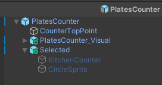

```csharp
using System;
using UnityEngine;

public class PlatesCounter : BaseCounter
{
    //负责处理碟子视觉生成效果
    public event EventHandler OnPlateSpawned;
    //负责移除
    public event EventHandler OnPlateRemoved;

    [SerializeField] private KitchenObjectSO plateKitchenObjectSO;
    //碟子的生成时间与规定时间
    private float spawnPlateTimer;
    private float spawnPlateTimerMax = 4f;
    private int platesSpawnedAmount;
    private int platesSpawnedAmountMax = 4;

    private void Update() {
        spawnPlateTimer += Time.deltaTime;
        if(spawnPlateTimer > spawnPlateTimerMax) {
            //我们不要真的生成碟子这个物体对象，而是要生成对应的视觉效果
            //这样就不会遇到我们之前规定的一个柜台只能有一个物体。
            //KitchenObject.SpawnKitchenObject(plateKitchenObjectSO,this);
            spawnPlateTimer = 0f;

            if(platesSpawnedAmount < platesSpawnedAmountMax) {
                platesSpawnedAmount++;

                OnPlateSpawned?.Invoke(this, EventArgs.Empty);
            }
        }
    }

    public override void Interact(Player player) {
        //如果玩家当前手上没物体
        if (!player.HasKitchenObject()) {
            //碟子已经有生成了
            if(platesSpawnedAmount > 0) {
                platesSpawnedAmount--;
                //那么就允许玩家交互获取这个碟子
                KitchenObject.SpawnKitchenObject(plateKitchenObjectSO, player);

                OnPlateRemoved?.Invoke(this, EventArgs.Empty);
            }
        }
    }
}
```


##### b:新建脚本`PlatesCounterVisual.cs`

```csharp
using System;
using System.Collections.Generic;
using UnityEngine;

public class PlatesCounterVisual : MonoBehaviour
{
    [SerializeField] private PlatesCounter platesCounter;
    [SerializeField] private Transform counterTopPoint;
    [SerializeField] private Transform plateVisualPrefab;

    private List<GameObject> plateVisualGameObjectList;

    private void Awake() {
        plateVisualGameObjectList = new List<GameObject>();
    }

    private void Start() {
        platesCounter.OnPlateSpawned += PlatesCounter_OnPlateSpawned;
        platesCounter.OnPlateRemoved += PlatesCounter_OnPlateRemoved;
    }

    private void PlatesCounter_OnPlateRemoved(object sender, EventArgs e) {
        //移除最后的碟子视觉
        GameObject plateGameObject = plateVisualGameObjectList[plateVisualGameObjectList.Count - 1];
        plateVisualGameObjectList.Remove(plateGameObject);
        Destroy(plateGameObject);
    }

    private void PlatesCounter_OnPlateSpawned(object sender,System.EventArgs e) {
        Transform plateVisualTransform = Instantiate(plateVisualPrefab,counterTopPoint);
        //弄个偏移+列表，以让碟子视觉做到叠起来的效果
        float plateOffsetY = .1f;
        plateVisualTransform.localPosition = new Vector3(0, plateOffsetY * plateVisualGameObjectList.Count, 0);

        plateVisualGameObjectList.Add(plateVisualTransform.gameObject);
    }
}
```

##### c:Debug


### 005 用上碟盘

> 反思：我之前图方便，把一段内容，合起来变成一个小节，实际上并不友好。
>
> 我应该是首先实现一个简陋的功能，然后在这个简陋的功能补充和修复。
>
> 这样才能把我做的东西变得通俗易懂。

#### [1]加入食物的数据

##### a:新建脚本`PlateKitchenObject.cs`

碟子是特别的厨房物品，也就是说厨房物品是父类，碟子是专门处理物体放入到碟子上的话，这个碟子就是子类了，实现特定的行为。

相应要修改挂载的脚本，然后添加数据


```csharp
using System.Collections.Generic;
//实现的思路：我先弄个存放对应厨房物品数据的列表
//子类只负责处理加物品的逻辑
public class PlateKitchenObject : KitchenObject
{
    private List<KitchenObject> kitchenObjectSOList;
    //特定的子类，负责特定的逻辑，这个碟子专门处理加东西到碟子上的行为

    private void Awake() {
        //初始化列表
        kitchenObjectSOList = new List<KitchenObjectSO>();
    }

    public void AddIngredient(KitchenObjectSO kitchenObjectSO) {
        kitchenObjectSOList.Add(kitchenObjectSO);
    }
}
```


##### b:修改脚本`ClearCounter.cs`

由于我们碟子可能会放到这个什么都没有的柜台，所以如果碟子在这个柜台上，就需要处理玩家如果接触了，该如何处理相关的逻辑。

```csharp
using UnityEngine;

public class ClearCounter : BaseCounter
{
    [SerializeField] private KitchenObjectSO kitchenObjectSO;
    public override void Interact(Player player) {
        if (!HasKitchenObject()) {          
            if (player.HasKitchenObject()) {
                player.GetKitchenObject().SetKitchenObjectParent(this);
            }
            else {

            }
        }
        else {
            if (player.HasKitchenObject()) {
                //如果玩家当前正拿着东西的情况，并且拿着的物体是碟子
                if(player.GetKitchenObject() is PlateKitchenObject) {
                    //先把玩家手上拿着的碟子类型，转换成碟子游戏对象
                    PlateKitchenObject plateKitchenObject = player.GetKitchenObject() as PlateKitchenObject;
                    //然后接触到新物体了，就加入新物体的数据，比如食物这些，就交给这个碟子游戏对象的特定行为去处理
                    plateKitchenObject.AddIngredient(GetKitchenObject().GetKitchenObjectSO());
                    //新加入的物体要拿的只是数据和视觉效果，我并不需要真变成游戏对象，而且都拿取了，原来位置的就需要销毁
                    GetKitchenObject().DestroySelf();
                }
            }
            else {
                GetKitchenObject().SetKitchenObjectParent(player);
            }
        }
    }
}
```

##### c:Debug


#### [2]改进加入食物的逻辑

> 对应的Debug就自己到检查器中查看了，列表是否加入相应的食物数据。

1. 我们不可能加入一堆重复的食物数据，所以需要特别判断是否需要加入，像下面的我放入了番茄，就不能再放入第二次同样的食物数据了。


2. 也不是所有的食物数据都可以加，需要辨别判断，比如下面的我不能加入番茄，但是可以加入我们允许的番茄片。


3. 前面我们只实现了干净柜台中的，让玩家拿着碟子去交互，实际上还应该考虑到可能是切割柜台，或者灶台呢？因此我们需要对拿着碟子去交互的相关行为进一步封装，方便使用。


4. 一开始的逻辑就是让玩家拿着碟子主动接触食物，但是有可能玩家拿着食物主动接触碟子，这个时候玩家拿着的食物应该要消失。


##### a:修改脚本`PlateKitchenObject.cs`

实现目标1和2


```csharp
using System.Collections.Generic;
using UnityEngine;
public class PlateKitchenObject : KitchenObject {

    //实现目标2：新增一个列表，确定哪些食物可以直接加入到碟子当中去
    [SerializeField] private List<KitchenObjectSO> validKitchenObjectSOList;

    private List<KitchenObjectSO> kitchenObjectSOList;

    private void Awake() {
        kitchenObjectSOList = new List<KitchenObjectSO>();
    }

    //注释掉原来的函数
    //public void AddIngredient(KitchenObjectSO kitchenObjectSO) {
    //    kitchenObjectSOList.Add(kitchenObjectSO);
    //}

    //相应也要到`ClearCounter.cs`改动
    //实现目标1：判断重复食物数据的处理
    public bool TryAddIngredient(KitchenObjectSO kitchenObjectSO) {
        //最终实现目标2：如果出现了不在允许范围内的食物数据
        if (!validKitchenObjectSOList.Contains(kitchenObjectSO)) {
            return false;
        }

        if (kitchenObjectSOList.Contains(kitchenObjectSO)) {
            return false;
        }
        else {
            kitchenObjectSOList.Add(kitchenObjectSO);
            return true;
        }
    }
}
```

##### b:修改脚本`ClearCounter.cs`

实现目标3和目标4

```csharp
using UnityEngine;

public class ClearCounter : BaseCounter
{
    [SerializeField] private KitchenObjectSO kitchenObjectSO;
    public override void Interact(Player player) {
        if (!HasKitchenObject()) {          
            if (player.HasKitchenObject()) {
                player.GetKitchenObject().SetKitchenObjectParent(this);
            }
            else {

            }
        }
        else {
            if (player.HasKitchenObject()) {
                //实现目标3：封装原来玩家拿着碟子，食物遇到碟子的处理逻辑
                //if(player.GetKitchenObject() is PlateKitchenObject) {
                if(player.GetKitchenObject().TryGetPlate(out PlateKitchenObject plateKitchenObject)) {
                    //PlateKitchenObject plateKitchenObject = player.GetKitchenObject() as PlateKitchenObject;
                    //要确认我能不能拿，再来判断是否可以销毁
                    if (plateKitchenObject.TryAddIngredient(GetKitchenObject().GetKitchenObjectSO())) {
                        GetKitchenObject().DestroySelf();
                    }
                }
                //实现目标4：玩家当前拿着食物，要放入到碟子中
                else {
                    //如果当前柜台拥有碟子，注意这里不能跟上面一样写成PlateKitchenObject plateKitchenObject，
                    //因为上面已经定义了，这里只能弄个同名的局部变量
                    if (GetKitchenObject().TryGetPlate(out plateKitchenObject)) {
                        //柜台上的碟子就需要获取到玩家手上拿着的食物数据进行判断
                        if (plateKitchenObject.TryAddIngredient(player.GetKitchenObject().GetKitchenObjectSO())) {
                            //最后销毁玩家手上拿着的食物数据
                            player.GetKitchenObject().DestroySelf();
                        }
                    }
                }
            }
            else {
                GetKitchenObject().SetKitchenObjectParent(player);
            }
        }
    }
}
```

##### c:修改脚本`KitchenObject.cs`

实现目标3需要的封装函数，才能让其他脚本可以直接调用完成目标3。

我们要注意碟子的父类就是KitchenObject，其他相关的食物也被归类到KitchenObject中

```csharp
using Unity.VisualScripting;
using UnityEngine;

public class KitchenObject : MonoBehaviour
{
    //.....省略

    //实现目标3：新增一个封装的函数，专门处理玩家拿着碟子去各自不同的柜台拿取食物的
    public bool TryGetPlate(out PlateKitchenObject plateKitchenObject) {
        //如果食物碰到的是碟子
        if(this is PlateKitchenObject) {
            //除了输出判断外，还需要输出玩家当前手上拿的是碟子这个游戏对象
            plateKitchenObject = this as PlateKitchenObject;
            return true;
        }
        //如果碰到不是，那么什么也不做，就单纯判断
        else {
            plateKitchenObject = null;
            return false;
        }
    }
}
```

##### d:修改脚本`CuttingCounter.cs`

实现目标3需要的封装函数，才能让其他脚本可以直接调用完成目标3

```csharp
using System;
using UnityEngine;


public class CuttingCounter : BaseCounter,IHasProgress {
    public event EventHandler OnCut;
    public event EventHandler<IHasProgress.OnProgressChangedEventArgs> OnProgressChanged;

    [SerializeField] private CuttingRecipeSO[] cuttingRecipeSOArray;

    private int cuttingProcess;

    public override void Interact(Player player) {
        if (!HasKitchenObject()) {          
            //...省略
        }
        else {
            if (player.HasKitchenObject()) {
                //实现目标3
                if (player.GetKitchenObject().TryGetPlate(out PlateKitchenObject plateKitchenObject)) {
                    if (plateKitchenObject.TryAddIngredient(GetKitchenObject().GetKitchenObjectSO())) {
                        GetKitchenObject().DestroySelf();
                    }
                }
            }
            else {
                GetKitchenObject().SetKitchenObjectParent(player);
            }
        }
    }
    
    //省略....
}
```


##### e:修改脚本`StoveCounter.cs`

实现目标3

```csharp
using System;
using UnityEngine;

public class StoveCounter : BaseCounter,IHasProgress
{
    //...省略

    public override void Interact(Player player) {
        if (!HasKitchenObject()) {
            //...省略
        }
        else {
            if (player.HasKitchenObject()) {
                //实现目标3
                if (player.GetKitchenObject().TryGetPlate(out PlateKitchenObject plateKitchenObject)) {
                    if (plateKitchenObject.TryAddIngredient(GetKitchenObject().GetKitchenObjectSO())) {
                        GetKitchenObject().DestroySelf();

                        state = State.Idle;

                        OnStateChanged?.Invoke(this, new OnStateChangedEventArgs {
                            state = state,
                        });

                        OnProgressChanged?.Invoke(this, new IHasProgress.OnProgressChangedEventArgs {
                            progressNormalized = 0f,
                        });
                    }
                }
            }
            else {
                //...省略
            }
        }
    }

    //...省略
}
```

#### [3]添加视觉效果

基本原理：

由于我们之前允许哪些食物的数据可以添加到碟子上对应的列表中，但是我们最终需要让食物组合成一个特别的汉堡包。

要做的原理很简单，就是提前备好一个完整的汉堡包`视觉模型/预制体`，哪些食物的数据加入上了，就启用哪些模型即可，这就需要有一个键值对的关系的数据能够记录。

最终我们要获得的效果如下：

> 当我们加入食物数据之后，可以显示出对应的视觉模型效果。


##### a:新建脚本`PlateCompleteVisual.cs`

我们要把该脚本挂载到最终需要完成的食物视觉（**汉堡包**）上，整个汉堡包的视觉模型又需要成为碟子的子对象。


```csharp
using System;
using System.Collections.Generic;
using UnityEngine;

public class PlateCompleteVisual : MonoBehaviour
{
    //解决难题：
    //就是我们怎么知道我们加入的食物数据，就对应上我们目前视觉模型对应的子模型呢？
    //如果依靠模型的名称去判断，很容易出错，该怎么处理？
    //用结构体，重新定义好我们要拿取的数据，做一个值类型中，相互对应的键值对
    //要注意序列化，不然无法序列化引用
    [Serializable]
    public struct KitchenObjectSO_GameObject {
        public KitchenObjectSO kitchenObjectSO;
        public GameObject gameObject;
    }

    [SerializeField] private PlateKitchenObject plateKitchenObject;
    [SerializeField] private List<KitchenObjectSO_GameObject> kitchenObjectSO_GameObjectList;

    //启用事件
    private void Start() {
        plateKitchenObject.OnIngredientAdded += PlateKitchenObject_OnIngredientAdded;

        foreach (KitchenObjectSO_GameObject kitchenObjectSO_GameObject in kitchenObjectSO_GameObjectList) {
            //默认一开始都不启用汉堡包模型的所有游戏对象
            kitchenObjectSO_GameObject.gameObject.SetActive(false);
        }
    }

    //这个就是OnIngredientAdded公共事件可以做到的函数功能：
    //如下逻辑
    private void PlateKitchenObject_OnIngredientAdded(object sender, PlateKitchenObject.OnIngredientAddedEventArgs e) {
        //遍历列表中的数据
        foreach(KitchenObjectSO_GameObject kitchenObjectSO_GameObject in kitchenObjectSO_GameObjectList) {
            //如果我新加入食物数据到碟子对象上，这个数据等于我记录的结构体中的食物数据，那么就启用结构体中的模型，也就是游戏对象
            if(kitchenObjectSO_GameObject.kitchenObjectSO == e.kitchenObjectSO) {
                kitchenObjectSO_GameObject.gameObject.SetActive(true);
            }
        }
    }
}

```

##### b:修改脚本`PlateKitchenObject.cs`

```csharp
using System;
using System.Collections.Generic;
using UnityEngine;

public class PlateKitchenObject : KitchenObject {

    //弄个公共的事件，这个事件接收的参数为厨房物品对象的数据
    //整个事件要做的工作就是启用哪些加进去的食物数据，最终的视觉效果要显示出来
    public event EventHandler<OnIngredientAddedEventArgs> OnIngredientAdded;
    public class OnIngredientAddedEventArgs : EventArgs {
        public KitchenObjectSO kitchenObjectSO;
    }

    [SerializeField] private List<KitchenObjectSO> validKitchenObjectSOList;

    private List<KitchenObjectSO> kitchenObjectSOList;

    private void Awake() {
        kitchenObjectSOList = new List<KitchenObjectSO>();
    }

    public bool TryAddIngredient(KitchenObjectSO kitchenObjectSO) {
        if (!validKitchenObjectSOList.Contains(kitchenObjectSO)) {
            return false;
        }

        if (kitchenObjectSOList.Contains(kitchenObjectSO)) {
            return false;
        }
        else {
            kitchenObjectSOList.Add(kitchenObjectSO);

            //调用这个公共事件，最终让汉堡包模型可以逐渐显示出对应的食物数据的模型/游戏对象
            OnIngredientAdded?.Invoke(this,new OnIngredientAddedEventArgs {
                kitchenObjectSO =kitchenObjectSO
            });
            return true;
        }
    }
}
```

#### [4]改进添加视觉效果

由于受限于屏幕大小，还有要考虑游戏性，随着我们弄的汉堡包越来越复杂，可能会因为模型之间的遮挡，有些模型我们看不到，这个时候就需要相应的UI提示，来很好帮助我们查看自己加入了哪些食物。

注意Bug:**我没有加烤熟肉饼还有烤焦肉饼同时出现的条件判断**。


##### a:制作图标UI

首先先后面可能用得上的`2DSprite`包

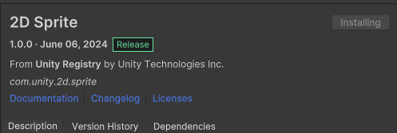

然后就能得到更多的资产，方便我们后续的使用，修改sprite

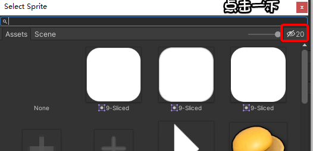

要画布在汉堡包模型的位置之上，就修改预制体，将画布从命名为`PlateIconsUI`，新建对应的脚本`PlateIconsUI.cs`，这个脚本后续再说。

我们继续设置长和宽为0.9，然后加入`Grid Layout Group`组件，后续我们最多弄出6个图标（**考虑bug**），所以要控制好小图标的长宽。

也就是接下来 接着在父对象`PlateIconsUI`下新建子空对象`IconTemplate`，这个子空对象的任务就是划定好最终图标UI能够显示的长宽大小，然后新挂载脚本`PlateIconsSingleUI.cs`，更多脚本的信息还有挂载组件的信息看后面


最后弄个Image的背景还有显示在前的`Icon`图标，需要伸展去填充到整个`IconTemplate`的长宽，主要是注意`UI-Image`游戏对象的排列顺序，还有就是修改`Source Image`


最后我们可以让其变成预制体方便使用，当然如果绝对预制体弄太多了，可能会给文件管理增加管理难度，所以下面实际的操作还是保留在层次结构当中。

#####  b:修改脚本`PlateKitchenObject.cs`

```csharp
using System;
using System.Collections.Generic;
using UnityEngine;

public class PlateKitchenObject : KitchenObject {
    //...省略

    //公开允许获取到目前食物数据列表中的食物数据
    public List<KitchenObjectSO> GetKitchenObjectSOList() {
        return kitchenObjectSOList;
    }
}
```


##### c:新建脚本`PlateIconsUI.cs`

任务：

> 我们新加入食物游戏对象，然后这个食物游戏对象被销毁，并且生成对应的图标显示在世界坐标中，位于碟子的局部坐标

看我们是否需要考虑摄像机的影响，加入我们之前实现的`Look At Camera.cs`脚本


```csharp
using UnityEngine;

public class PlateIconsUI : MonoBehaviour
{
    //碟子父对象
    [SerializeField] private PlateKitchenObject plateKitchenObject;
    //其下子对象IconTemplate，也是我们之后要生成多个的游戏对象
    [SerializeField] private Transform iconTemplate;

    private void Awake() {
        //唤醒的时候，是不能让IconTemplate游戏对象启用的，因为还没有加入新的食物
        iconTemplate.gameObject.SetActive(false);
    }

    //一开始还是启用之前的事件OnIngredientAdded
    private void Start() {
        plateKitchenObject.OnIngredientAdded += PlateKitchenObject_OnIngredientAdded;
    }

    private void PlateKitchenObject_OnIngredientAdded(object sender, PlateKitchenObject.OnIngredientAddedEventArgs e) {
        //这个事件新加入一个处理的函数，这个函数负责生成碟子上有的物体的图标
        //现在OnIngredientAdded公共事件除了处理之前弄的添加碟子出现物体的视觉效果，现在还有图标生成的视觉效果
        UpdateVisual();
    }

    private void UpdateVisual() {
        foreach(Transform child in transform) {
            //如果我们新加入的食物，已经之前有过了，跳过生成图标这一步操作
            if (child == iconTemplate) continue;

            //因为我们把食物加入到碟子当中，会保留原来食物的游戏对象，为了避免重复需要销毁掉
            Destroy(child.gameObject);
        }

        //最后遍历出目前碟子上有的所有的食物数据
        foreach(KitchenObjectSO kitchenObjectSO in plateKitchenObject.GetKitchenObjectSOList()) {
            //图标模板游戏对象iconTemplate生成的位置确定在transform也就是自己之下
            Transform iconTransform = Instantiate(iconTemplate, transform);
            //既然都生成了，那么就启用它
            iconTransform.gameObject.SetActive(true);
            //调用相应的方法，去生成图标模板下的图标图片。
            iconTransform.GetComponent<PlateIconsSingleUI>().SetKitchenObjectSO(kitchenObjectSO);
        }
    }
}
```


##### d:新建脚本`PlateIconsSingleUI.cs`

任务：提供修改`UI-Image`中图标的方法


```csharp
using UnityEngine;
using UnityEngine.UI;

public class PlateIconsSingleUI : MonoBehaviour
{
    //加入图标 Image
    [SerializeField] private Image icon;

    //提供方法：修改它子类icon的sprite，也就是修改图标
    public void SetKitchenObjectSO(KitchenObjectSO kitchenObjectSO) {
        icon.sprite = kitchenObjectSO.sprite;
    }
}
```

### 006 送货柜台

#### [1]实现柜台

弄相应的柜台预制体就是重复操作，不赘述了

##### a:新建脚本`DeliveryCounter.cs`

目标1：首先我们要限定这个送货柜台只能接受玩家送入碟子，其次送入后就销毁

```csharp
public class DeliveryCounter : BaseCounter
{
    public override void Interact(Player player) {
        //首先玩家要拿东西
        if (player.HasKitchenObject()) {
            //其次拿的是碟子游戏对象
            if(player.GetKitchenObject().TryGetPlate(out PlateKitchenObject plateKitchenObject)) {
                //实现目标1：限定销毁的就是碟子
                player.GetKitchenObject().DestroySelf();
            }
        }
    }
}
```

##### b:实现`MovingVisual.shadergraph`


注意：

双击生成的`MovingVisual.shadergraph`文件会进入相应的tab小窗口，要像让其出现预览的窗口，非常麻烦，首先要关闭这个tab，保存资产，然后运行游戏之后，关闭运行，再次打开这个tab窗口才能出现预览的效果。

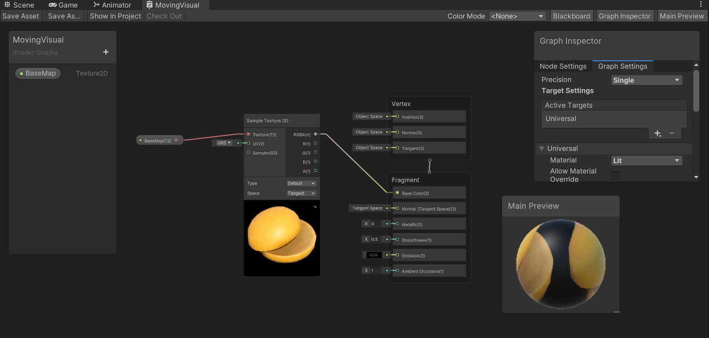

本质上实现一个移动的shader效果，就是在改变颜色值，具体只需要修改二维的UV值，按时间去改动即可，还有shadergraph窗口里面设置的default是默认值，如果我们希望可以实际修改，需要到材质球中的材质界面中进行具体的设置。

里面具体对透明度的设置，我就不啰嗦了，因为我不想变成shader的教程


##### c:最终效果


#### [2]继续改进完成交付逻辑

我们需要在命令行中可以查看到生成的食谱，然后交付柜台可以正确判断与处理玩家交付的碟子上的食物是否就符合客人要求的食谱。

首先生成了我们限制的最多四样客人需求的食谱


当我们提交给客人提出的沙拉后，会提示玩家提交正确

而当我们提交一个配对不上的食物后，就会提示没有提交正确


##### a:新建脚本`DeliveryManager.cs`

目标：负责生成食谱、交付（**销毁**）食谱

所以就需要挂载到特定的游戏对象让其单独执行生成或销毁食谱的操作。

然后这个游戏对象又需要提供`交付食谱方法`给送货柜台游戏对象单独处理，所以就要变成单例


```csharp
using System.Collections.Generic;
using UnityEngine;

public class DeliveryManager : MonoBehaviour
{
    //实现单例，以便给送货柜台调用相应的方法
    public static DeliveryManager Instance { get; private set; }

    //导入食谱清单
    [SerializeField] private RecipeListSO recipeListSO;
    //当前等待的食谱列表
    private List<RecipeSO> waitingRecipeSOList;
    private float spawnRecipeTimer;//生成食谱的计时器
    private float spawnRecipeTimerMax = 4f;//生成食谱的计时限制
    private int waitingRecipesMax = 4;//实际客人等待的食谱数目

    private void Awake() {
        Instance = this;

        //实例化当前等待的食谱列表
        waitingRecipeSOList = new List<RecipeSO>();
    }

    //更新函数里面
    private void Update() {
        //生成食谱的计时器启动
        spawnRecipeTimer -= Time.deltaTime;

        //如果计时器小于等于0
        if(spawnRecipeTimer <= 0f) {
            //那么就说明要重置计时器
            spawnRecipeTimer = spawnRecipeTimerMax;

            //当前等待的食谱列表的数目 小于 实际客人等待的食谱数目
            if(waitingRecipeSOList.Count < waitingRecipesMax) {
                //那么我们就随机抽取食谱清单里面的具体食谱，
                RecipeSO waitingRecipeSO = recipeListSO.recipeSOList[Random.Range(0,recipeListSO.recipeSOList.Count)];
                Debug.Log(waitingRecipeSO.recipeName);
                //然后把这个食谱加入到当前等待的食谱列表
                waitingRecipeSOList.Add(waitingRecipeSO);
            }
        }
    }

    //做一个配对的函数，因为这是送货柜台，所以我们碟子里面的食物，
    //是否对应上当前等待的食谱列表，里面的某个食谱
    public void DeliverRecipe(PlateKitchenObject plateKitchenObject) {
        for(int i = 0; i < waitingRecipeSOList.Count; i++) {
            //从里面单独拎出来当前等待之一的食谱
            RecipeSO waitingRecipeSO = waitingRecipeSOList[i];

            //首先配对数量
            if (waitingRecipeSO.kitchenObjectSOList.Count == plateKitchenObject.GetKitchenObjectSOList().Count) {
                //我们弄匹配flag的flag，就是一个总体的flag
                bool plateContentsMatchesRecipe = true;

                //然后迭代器获取当前等待之一的食谱里面的具体食物
                foreach (KitchenObjectSO recipeKitchenObjectSO in waitingRecipeSO.kitchenObjectSOList) {
                    //我们弄个布尔值flag，来判断是否食物一一匹配
                    bool ingredientFound = false;//默认不匹配
                    //迭代器获取碟子上具体的食物
                    foreach (KitchenObjectSO plateKitchenObjectSO in plateKitchenObject.GetKitchenObjectSOList()) {
                        //如果里面单独循环匹配一致，就中断里层循环
                        if (plateKitchenObjectSO == recipeKitchenObjectSO) {
                            ingredientFound = true;
                            break;
                        }
                    }
                    //如果出现了其中一处的不匹配，那么这个食谱，就不配对了
                    if (!ingredientFound) {
                        //就改写这个flag
                        plateContentsMatchesRecipe = false;
                    }
                }

                //最后如果全部都匹配，暴力算法，所以就说玩家给出正确的食谱配方
                if (plateContentsMatchesRecipe) {
                    Debug.Log("玩家提交了正确是食谱");
                    //需要记得移除当前等待的食谱列表里面配对的食谱
                    waitingRecipeSOList.RemoveAt(i);
                    return;
                }
            }
        }

        //最后没有配对上正确的食谱
        Debug.Log("没有配对上正确的食谱");
    }
}
```


##### b:新建脚本`RecipeSO.cs`

弄个食谱，要有名称还有对应的一系列食物

```csharp
using System.Collections.Generic;
using UnityEngine;

[CreateAssetMenu()]
public class RecipeSO : ScriptableObject
{
    public List<KitchenObjectSO> kitchenObjectSOList;
    public string recipeName;
}
```

后续我们依此SO去弄基本的食谱数据即可，比如要有基本的汉堡包


##### c:新建脚本`RecipeListSO.cs`

作为用来容纳所有的食谱的清单


最后我们处于安全性的考虑，还有菜谱清单的唯一性，可以注释掉`[CreateAssetMenu()]`这段代码

```csharp
using System.Collections.Generic;
using UnityEngine;

[CreateAssetMenu()]
public class RecipeListSO : ScriptableObject
{
    public List<RecipeSO> recipeSOList;
}
```

##### d:修改脚本`DeliveryCounter.cs`

完善送货柜台处理碟子物品的逻辑

```csharp
public class DeliveryCounter : BaseCounter
{
    public override void Interact(Player player) {
        if (player.HasKitchenObject()) {
            if(player.GetKitchenObject().TryGetPlate(out PlateKitchenObject plateKitchenObject)) {

                //现在使用单例DeliveryManager提供的交付食谱的方法
                DeliveryManager.Instance.DeliverRecipe(plateKitchenObject);
                player.GetKitchenObject().DestroySelf();
            }
        }
    }
}
```

#### [3]增加UI交付食物提示


##### a:新建脚本`DeliveryManagerUI.cs`

```csharp
using System;
using UnityEngine;

public class DeliveryManagerUI : MonoBehaviour
{
    //就是显示在世界空间里面的UI系统下的容器，这个容器装下所有食谱菜单的模板
    [SerializeField] private Transform container;
    [SerializeField] private Transform recipeTemplate;

    private void Awake() {
        recipeTemplate.gameObject.SetActive(false);
    }

    //我们一般都是在start里面加入事件处理的相关函数的
    private void Start() {
        DeliveryManager.Instance.OnRecipeSpawned += DeliveryManager_OnRecipeSpawned;
        DeliveryManager.Instance.OnRecipeCompleted += DeliveryManager_OnRecipeCompleted;

        UpdateVisual();//同样这里也要写入，避免前面的事件都没有做，出现失效
    }

    private void DeliveryManager_OnRecipeCompleted(object sender, EventArgs e) {
        UpdateVisual();
    }

    private void DeliveryManager_OnRecipeSpawned(object sender, EventArgs e) {
        UpdateVisual(); 
    }

    private void UpdateVisual() {
        //遍历获取旗下的子对象
        foreach(Transform child in container) {
            if (child == recipeTemplate) continue;
            Destroy(child.gameObject);
        }

        //接着获取当前等待的食谱列表里面具体的食谱数据
        foreach(RecipeSO recipeSO in DeliveryManager.Instance.GetWaitingRecipeSOList()) {
            //接着在container下新建子对象recipeTemplate
            Transform recipeTransform = Instantiate(recipeTemplate, container);
            recipeTransform.gameObject.SetActive(true);
            //修改具体的名称
            recipeTransform.GetComponent<DeliverManagerSingleUI>().SetRecipeSO(recipeSO);
        }
    }
}
```

##### b:修改脚本`DeliveryManager.cs`

```csharp
using System;
using System.Collections.Generic;
using UnityEngine;

public class DeliveryManager : MonoBehaviour
{
    //为了获得一个干净整洁的代码，我们用事件处理，专门负责有关于这个UI相关的函数处理
    public event EventHandler OnRecipeSpawned;
    public event EventHandler OnRecipeCompleted;

    public static DeliveryManager Instance { get; private set; }
    [SerializeField] private RecipeListSO recipeListSO;
    private List<RecipeSO> waitingRecipeSOList;
    private float spawnRecipeTimer;
    private float spawnRecipeTimerMax = 4f;
    private int waitingRecipesMax = 4;

    private void Awake() {
        Instance = this;
        waitingRecipeSOList = new List<RecipeSO>();
    }

    private void Update() {
        spawnRecipeTimer -= Time.deltaTime;
        if(spawnRecipeTimer <= 0f) {
            spawnRecipeTimer = spawnRecipeTimerMax;
            if(waitingRecipeSOList.Count < waitingRecipesMax) {
                RecipeSO waitingRecipeSO = recipeListSO.recipeSOList[UnityEngine.Random.Range(0,recipeListSO.recipeSOList.Count)];
                //Debug.Log(waitingRecipeSO.recipeName);
                waitingRecipeSOList.Add(waitingRecipeSO);

                //我们这里调用有关食谱的生成
                OnRecipeSpawned?.Invoke(this, EventArgs.Empty);
            }
        }
    }
    public void DeliverRecipe(PlateKitchenObject plateKitchenObject) {
        for(int i = 0; i < waitingRecipeSOList.Count; i++) {
            RecipeSO waitingRecipeSO = waitingRecipeSOList[i];
            if (waitingRecipeSO.kitchenObjectSOList.Count == plateKitchenObject.GetKitchenObjectSOList().Count) {
                bool plateContentsMatchesRecipe = true;
                foreach (KitchenObjectSO recipeKitchenObjectSO in waitingRecipeSO.kitchenObjectSOList) {
                    bool ingredientFound = false;
                    foreach (KitchenObjectSO plateKitchenObjectSO in plateKitchenObject.GetKitchenObjectSOList()) {
                        if (plateKitchenObjectSO == recipeKitchenObjectSO) {
                            ingredientFound = true;
                            break;
                        }
                    }
                    if (!ingredientFound) {
                        plateContentsMatchesRecipe = false;
                    }
                }

                if (plateContentsMatchesRecipe) {
                    //Debug.Log("玩家提交了正确是食谱");
                    waitingRecipeSOList.RemoveAt(i);

                    //这里相应的调用完成的情况，对UI做出相应的处理
                    OnRecipeCompleted?.Invoke(this, EventArgs.Empty);
                    return;
                }
            }
        }
        //Debug.Log("没有配对上正确的食谱");
    }

    //公开获取到当前等待的食谱列表，主要就是提供给UI
    public List<RecipeSO> GetWaitingRecipeSOList() {
        return waitingRecipeSOList;
    }
}
```

##### c:新建脚本`DeliverManagerSingleUI.cs`

这类single名称的脚本的出现，它的目的是为了让我们避免去在代码中使用find函数去找别的游戏对象的，因为用find会让代码变得混乱不堪，我们应该要做到一个游戏对象中存在符合这个游戏对象的行为，然后一个游戏对象当中会多个子对象，这些子对象的行为组合成了父对象的行为。

要注意3d物体中的text和UI-text不是一个东西，虽然新建的游戏对象都会名称为`Text(TMP)`，不过实际上我们要引用的话，就不是同一个游戏对象类型。

```csharp
using TMPro;
using UnityEngine;
using UnityEngine.UI;

public class DeliverManagerSingleUI : MonoBehaviour
{
    [SerializeField] private TextMeshProUGUI recipeNameText;
    [SerializeField] private Transform iconContainer;
    [SerializeField] private Transform iconTemplate;

    private void Awake() {
        iconTemplate.gameObject.SetActive(false);
    }

    public void SetRecipeSO(RecipeSO recipeSO) {
        //修改名称
        recipeNameText.text = recipeSO.recipeName;

        //然后就是初始化图标了
        foreach(Transform child in iconContainer) {
            if (child == iconTemplate) continue;
            Destroy(child.gameObject);
        }

        //生成图标，根据我们之前已经有的数据
        foreach(KitchenObjectSO kitchenObjectSO in recipeSO.kitchenObjectSOList) {
            Transform iconTransform = Instantiate(iconTemplate, iconContainer);
            iconTransform.gameObject.SetActive(true);
            iconTransform.GetComponent<Image>().sprite = kitchenObjectSO.sprite;
        }
    }
}
```

##### d:UI提示

基本上只要了解清楚unity的UGUI，都没什么好说的，只是需要注意一些具体的实现细节就好了。


#### [4]BG音乐_MusicManager游戏对象

MusicManager游戏对象，后续处理挂载同名的脚本`MusicManager.cs`


#### [5]音效管理

我们有四种不同的方式去获取调用音频

1. 因为存在唯一的音效管理，所以选中获取到单例提供的方法，这种方式适用于跟操作紧密关联的脚本，比如玩家移动。

2. 还有全局静态的事件处理，这适用我们如果不是很需要变成单例的柜台的情况

3. 公开的事件处理+单例，因为我们不是经常需要操作，而是让玩家指定调用，又不想find游戏对象脚本之类的，让脚本的引用出现混乱
4. 像背景音乐一样，也是需要强绑定的，适用于玩家存在多线操作，比如烤东西的一段时间内，玩家就不需要特别理会。

总之我们要在易用性、逻辑性之间互相平衡

##### a:新建脚本`SoundManager.cs`


```csharp
using System;
using UnityEngine;

public class SoundManager : MonoBehaviour
{
    //实现单例，因为这个是唯一的
    public static SoundManager Instance { get; private set; }

    //引用SO文件，这个SO文件又通过数组引用真实音频文件数据
    [SerializeField] private AudioClipRefsSO audioClipRefsSO;

    private void Awake() {
        Instance = this;
    }

    private void Start() {
        DeliveryManager.Instance.OnRecipeSuccess += DeliveryManager_OnRecipeSuccess;
        DeliveryManager.Instance.OnRecipeFailed += DeliveryManager_OnRecipeFailed;
        CuttingCounter.OnAnyCut += CuttingCounter_OnAnyCut;
        Player.Instance.OnPickedSomething += Player_OnPickedSomething;
        BaseCounter.OnAnyObjectPlacedHere += BaseCounter_OnAnyObjectPlacedHere;
        TrashCounter.OnAnyObjectTrashed += TrashCounter_OnAnyObjectTrashed;
    }

    private void TrashCounter_OnAnyObjectTrashed(object sender, EventArgs e) {
        TrashCounter trashCounter = sender as TrashCounter;
        PlaySound(audioClipRefsSO.trash, trashCounter.transform.position);
    }

    private void BaseCounter_OnAnyObjectPlacedHere(object sender, EventArgs e) {
        BaseCounter baseCounter = sender as BaseCounter;
        PlaySound(audioClipRefsSO.objectDrop, baseCounter.transform.position);
    }

    private void Player_OnPickedSomething(object sender, EventArgs e) {
        PlaySound(audioClipRefsSO.objectPickup, Player.Instance.transform.position);
    }

    private void CuttingCounter_OnAnyCut(object sender, EventArgs e) {
        //可以直接转
        CuttingCounter cuttingCounter = sender as CuttingCounter;
        PlaySound(audioClipRefsSO.chop, cuttingCounter.transform.position);
    }

    private void DeliveryManager_OnRecipeFailed(object sender, EventArgs e) {
        DeliveryCounter deliveryCounter = DeliveryCounter.Instance;
        PlaySound(audioClipRefsSO.deliveryFail, deliveryCounter.transform.position);
    }

    private void DeliveryManager_OnRecipeSuccess(object sender, EventArgs e) {
        DeliveryCounter deliveryCounter = DeliveryCounter.Instance;
        PlaySound(audioClipRefsSO.deliverySuccess, deliveryCounter.transform.position);
    }


    //这里提供一个基于方位，大小，音频文件的函数
    private void PlaySound(AudioClip audioClip,Vector3 position,float volume = 1f) {
        AudioSource.PlayClipAtPoint(audioClip,position,volume);
    }

    private void PlaySound(AudioClip[] audioClipArray, Vector3 position, float volume = 1f) {
        PlaySound(audioClipArray[UnityEngine.Random.Range(0,audioClipArray.Length)],position,volume);
    }

    //这是公开给玩家的方法
    public void PlayFootstepsSound(Vector3 position,float volume) {
        PlaySound(audioClipRefsSO.footstep,position,volume);
    }
}
```

##### b:修改脚本`DeliveryManager.cs`

```csharp
using System;
using System.Collections.Generic;
using UnityEngine;

public class DeliveryManager : MonoBehaviour
{
    public event EventHandler OnRecipeSpawned;
    public event EventHandler OnRecipeCompleted;
    //专门处理音频的事件处理
    public event EventHandler OnRecipeSuccess;
    public event EventHandler OnRecipeFailed;

    ///...省略
    public void DeliverRecipe(PlateKitchenObject plateKitchenObject) {
        for(int i = 0; i < waitingRecipeSOList.Count; i++) {
            RecipeSO waitingRecipeSO = waitingRecipeSOList[i];
            if (waitingRecipeSO.kitchenObjectSOList.Count == plateKitchenObject.GetKitchenObjectSOList().Count) {
                bool plateContentsMatchesRecipe = true;
                foreach (KitchenObjectSO recipeKitchenObjectSO in waitingRecipeSO.kitchenObjectSOList) {
                    bool ingredientFound = false;
                    foreach (KitchenObjectSO plateKitchenObjectSO in plateKitchenObject.GetKitchenObjectSOList()) {
                        if (plateKitchenObjectSO == recipeKitchenObjectSO) {
                            ingredientFound = true;
                            break;
                        }
                    }
                    if (!ingredientFound) {
                        plateContentsMatchesRecipe = false;
                    }
                }

                if (plateContentsMatchesRecipe) {
                    waitingRecipeSOList.RemoveAt(i);

                    OnRecipeCompleted?.Invoke(this, EventArgs.Empty);
                    //成功调用
                    OnRecipeSuccess?.Invoke(this, EventArgs.Empty);
                    return;
                }
            }
        }
        //失败调用
        OnRecipeFailed?.Invoke(this, EventArgs.Empty);
    }

    public List<RecipeSO> GetWaitingRecipeSOList() {
        return waitingRecipeSOList;
    }
}
```


##### c:新建脚本`AudioClipRefsSO.cs`


```csharp
using UnityEngine;

[CreateAssetMenu()]

public class AudioClipRefsSO : ScriptableObject
{
    public AudioClip[] chop;
    public AudioClip[] deliveryFail;
    public AudioClip[] deliverySuccess;
    public AudioClip[] footstep;
    public AudioClip[] objectDrop;
    public AudioClip[] objectPickup;
    public AudioClip stoveSizzle;
    public AudioClip[] trash;
    public AudioClip[] warning;
}
```

##### d:修改脚本`DeliveryCounter.cs`

```csharp
public class DeliveryCounter : BaseCounter
{
    //修改成单例
    public static DeliveryCounter Instance { get; private set; }

    private void Awake() {
        Instance = this;
    }

    public override void Interact(Player player) {
        if (player.HasKitchenObject()) {
            if(player.GetKitchenObject().TryGetPlate(out PlateKitchenObject plateKitchenObject)) {
                DeliveryManager.Instance.DeliverRecipe(plateKitchenObject);
                player.GetKitchenObject().DestroySelf();
            }
        }
    }
}
```

##### e:修改脚本`CuttingCounter.cs`

```csharp
using System;
using UnityEngine;
public class CuttingCounter : BaseCounter,IHasProgress {
    //弄个静态全局的一个事件处理？
    //这样就不需要变成单例了
    public static event EventHandler OnAnyCut;

    //...省略

    public override void InteractAlternate(Player player) {
        if (HasKitchenObject() && HasRecipeWithInput(GetKitchenObject().GetKitchenObjectSO())) {
            cuttingProcess++;

            OnCut?.Invoke(this, EventArgs.Empty);
            //调用
            OnAnyCut?.Invoke(this, EventArgs.Empty);
            CuttingRecipeSO cuttingRecipeSO = GetCuttingRecipeSOWithInput(GetKitchenObject().GetKitchenObjectSO());

            OnProgressChanged?.Invoke(this, new IHasProgress.OnProgressChangedEventArgs {
                progressNormalized = (float)cuttingProcess / cuttingRecipeSO.cuttingProgressMax
            });

            if (cuttingProcess >= cuttingRecipeSO.cuttingProgressMax) {
                KitchenObjectSO outputKitchenObjectSO = GetOutputForInput(GetKitchenObject().GetKitchenObjectSO());

                GetKitchenObject().DestroySelf();

                KitchenObject.SpawnKitchenObject(outputKitchenObjectSO, this);
            }
        }
    }

    //省略。。。
}
```

##### f:修改脚本`Player.cs`

```csharp
using System;
using UnityEngine;

public class Player : MonoBehaviour,IKitchenObjectParent {
    public static Player Instance { get; private set; }

    //弄个全局的事件处理
    public event EventHandler OnPickedSomething;

    //...省略

    public void SetKitchenObject(KitchenObject kitchenObject) {
        this.KitchenObject = kitchenObject;

        //如果现在设置了玩家手拿的物品，那么就相应意思就是捡起东西了
        if(kitchenObject != null) {
            OnPickedSomething?.Invoke(this, EventArgs.Empty);
        }
    }

    //...省略
}
```

##### g:修改脚本`BaseCounter.cs`

```csharp
using System;
using UnityEngine;

public class BaseCounter : MonoBehaviour,IKitchenObjectParent
{
    //新建静态全局的事件处理
    public static event EventHandler OnAnyObjectPlacedHere;
    
    //...省略

    public void SetKitchenObject(KitchenObject kitchenObject) {
        this.kitchenObject = kitchenObject;
        //一样类似的操作
        if(kitchenObject != null) {
            OnAnyObjectPlacedHere?.Invoke(this, EventArgs.Empty);
        }
    }
}
```

##### h:修改脚本`TrashCounter.cs`

```csharp
using System;

public class TrashCounter : BaseCounter
{
    //一样
    public static event EventHandler OnAnyObjectTrashed;
    public override void Interact(Player player) {
        if (player.HasKitchenObject()) {
            player.GetKitchenObject().DestroySelf();

            OnAnyObjectTrashed?.Invoke(this,EventArgs.Empty);
        }
    }
}
```

##### i:新建脚本`StoveCounterSound.cs`

就是让其自动播放声音，根据烤炉的状态进行判断是否启动。


```csharp
using UnityEngine;

public class StoveCounterSound : MonoBehaviour
{
    [SerializeField] private StoveCounter stoveCounter;

    private AudioSource audioSource;

    private void Awake() {
        audioSource = GetComponent<AudioSource>();
    }

    private void Start() {
        stoveCounter.OnStateChanged += StoveCounter_OnStateChanged;
    }

    private void StoveCounter_OnStateChanged(object sender, StoveCounter.OnStateChangedEventArgs e) {
        bool playSound = e.state == StoveCounter.State.Frying || e.state == StoveCounter.State.Fried;
        if (playSound)
        {
            audioSource.Play();
        }
        else {
            audioSource.Pause();
        }
    }
}
```

##### j:新建脚本`PlayerSounds.cs`


```csharp
using UnityEngine;

public class PlayerSounds : MonoBehaviour
{
    //就是隔一段时间，就让脚步声音播放
    private Player player;
    private float footstepTimer;
    private float footstepTimerMax = .1f;

    private void Awake() {
        player = GetComponent<Player>();
    }

    private void Update() {
        //计时器启动
        footstepTimer -= Time.deltaTime;
        if(footstepTimer < 0f) {
            //重置
            footstepTimer = footstepTimerMax;

            if (player.IsWalking()) {
                //使用音效管理的单例相关的方法，
                //不过不建议滥用单例，这里因为跟角色绑定在一起了，
                //所以我们可以这样搞，也不会影响很大。
                float volume = 1f;
                SoundManager.Instance.PlayFootstepsSound(player.transform.position, volume);
            }
        }
    }
}
```

### 007 游戏开始和结束

因为胡闹厨房的游戏循环是让玩家一开始就是在限定时间内多提交完成订单，所以我们相应要有对应的UI提示。

相应的也就是弄个UI-Image改下里面的具体设置，然后就是Text(Tmp)就懒得说明了。


最终效果：

> 除非我们正在游戏进行阶段，否则其他阶段，我们都不能进行任何的交互操作。


#### [1]具体实现

##### a:新建脚本`KitchenGameManager.cs`

弄个管理器去管理游戏中的各种状态

```csharp
using System;
using UnityEngine;


public class KitchenGameManager : MonoBehaviour
{
    //弄单例
    public static KitchenGameManager Instance { get; private set; }
    //搞游戏中的状态
    private enum State {
        WaitingToStart,
        CountdownToStart,
        GamePlaying,
        GameOver,
    }

    //事件
    public event EventHandler OnStateChanged;

    private State state;
    //弄个计时器
    private float waitingToStartTimer = 1f;
    private float countdownToStartTimer = 3f;
    private float gamePlayingTimer;
    private float gamePlayingTimerMax = 10f;

    private void Awake() {
        Instance = this;
        //一开始设置初始状态，准备开始状态
        state = State.WaitingToStart;
    }

    private void Update() {
        //切换状态
        switch (state) {
            //一开始准备开始状态，经过计时器计数，就切换到确定开始状态
            case State.WaitingToStart:
                waitingToStartTimer -= Time.deltaTime; 
                if(waitingToStartTimer < 0f) {
                    state = State.CountdownToStart;
                    OnStateChanged?.Invoke(this,EventArgs.Empty);
                }
                break;
            case State.CountdownToStart:
                countdownToStartTimer -= Time.deltaTime;
                if(countdownToStartTimer < 0f) {
                    state = State.GamePlaying;
                    gamePlayingTimer = gamePlayingTimerMax;
                    OnStateChanged?.Invoke(this, EventArgs.Empty);
                }
                break;
            case State.GamePlaying:
                gamePlayingTimer -= Time.deltaTime;
                if(gamePlayingTimer < 0f) {
                    state = State.GameOver;
                    OnStateChanged?.Invoke(this, EventArgs.Empty);
                }
                break;
            case State.GameOver:
                break;
        }
        Debug.Log(state);
    }


    //返回状态判断
    public bool IsGamePlaying() {
        return state == State.GamePlaying;
    }

    public bool IsCountdownToStartActive() {
        return state == State.CountdownToStart;
    }

    public bool IsGameOver() {
        return state == State.GameOver;
    }

    public float GetCountdownToStartTimer() {
        return countdownToStartTimer;
    }

    public float GetGamePlayingTimerNormalized() {
        return 1-(gamePlayingTimer / gamePlayingTimerMax);
    }
}
```

##### b:修改脚本`player.cs`

```csharp
using System;
using UnityEngine;

public class Player : MonoBehaviour,IKitchenObjectParent {
    //省略，，。

    private void GameInput_OnInteractAlternateAction(object sender, EventArgs e) {
        //如果玩家当前的管理器状态处于游戏运行中，才能允许玩家进行任何交互操作
        if (!KitchenGameManager.Instance.IsGamePlaying()) return;
        
        if(selectedCounter != null) {
            selectedCounter.InteractAlternate(this);
        }
    }

    private void GameInput_OnInteractAction(object sender, EventArgs e) {
        //如果玩家当前的管理器状态处于游戏运行中，才能允许玩家进行任何交互操作
        if (!KitchenGameManager.Instance.IsGamePlaying()) return;

        if (selectedCounter != null) {
            selectedCounter.Interact(this);
        }
    }

    //...省略
}
```

##### c:新建脚本`GameStartCountdownUI.cs`


```csharp
using System;
using TMPro;
using UnityEngine;

public class GameStartCountdownUI : MonoBehaviour
{
    [SerializeField] private TextMeshProUGUI countdownText;

    private void Start() {
        KitchenGameManager.Instance.OnStateChanged += KitchenGameManager_OnStateChanged;

        //默认隐藏
        Hide();
    }

    private void KitchenGameManager_OnStateChanged(object sender, EventArgs e) {
        if (KitchenGameManager.Instance.IsCountdownToStartActive()) {
            Show();
        }
        else {
            Hide();
        }
    }

    //获取计时的数据文本
    private void Update() {
        //不想要小数，要整数
        countdownText.text = Mathf.Ceil(KitchenGameManager.Instance.GetCountdownToStartTimer()).ToString();
    }

    private void Show() {
        gameObject.SetActive(true);
    }

    private void Hide() {
        gameObject.SetActive(false);
    }
}
```

##### d:新建脚本`GameOverUI.cs`


```csharp
using System;
using TMPro;
using UnityEngine;

public class GameOverUI : MonoBehaviour
{
    [SerializeField] private TextMeshProUGUI recipesDeliveredText;

    private void Start() {
        KitchenGameManager.Instance.OnStateChanged += KitchenGameManager_OnStateChanged;
        Hide();
    }

    private void KitchenGameManager_OnStateChanged(object sender, EventArgs e) {
        if (KitchenGameManager.Instance.IsGameOver()) {
            Show();

            //结束画面的数字不会发生变化。
            recipesDeliveredText.text = DeliveryManager.Instance.GetSuccessfulRecipesAmount().ToString();
        }
        else {
            Hide();
        }
    }

    private void Show() {
        gameObject.SetActive(true);
    }

    private void Hide() {
        gameObject.SetActive(false);
    }
}
```

##### e:修改脚本`DeliveryManager.cs`

```csharp
using System;
using System.Collections.Generic;
using UnityEngine;

public class DeliveryManager : MonoBehaviour
{
    public event EventHandler OnRecipeSpawned;
    public event EventHandler OnRecipeCompleted;
    public event EventHandler OnRecipeSuccess;
    public event EventHandler OnRecipeFailed;

    public static DeliveryManager Instance { get; private set; }
    [SerializeField] private RecipeListSO recipeListSO;
    private List<RecipeSO> waitingRecipeSOList;
    private float spawnRecipeTimer;
    private float spawnRecipeTimerMax = 4f;
    private int waitingRecipesMax = 4;
    //新增一个计数
    private int successfulRecipesAmount = 0;

    //...省略
    public void DeliverRecipe(PlateKitchenObject plateKitchenObject) {
        for(int i = 0; i < waitingRecipeSOList.Count; i++) {
            RecipeSO waitingRecipeSO = waitingRecipeSOList[i];
            if (waitingRecipeSO.kitchenObjectSOList.Count == plateKitchenObject.GetKitchenObjectSOList().Count) {
                bool plateContentsMatchesRecipe = true;
                foreach (KitchenObjectSO recipeKitchenObjectSO in waitingRecipeSO.kitchenObjectSOList) {
                    bool ingredientFound = false;
                    foreach (KitchenObjectSO plateKitchenObjectSO in plateKitchenObject.GetKitchenObjectSOList()) {
                        if (plateKitchenObjectSO == recipeKitchenObjectSO) {
                            ingredientFound = true;
                            break;
                        }
                    }
                    if (!ingredientFound) {
                        plateContentsMatchesRecipe = false;
                    }
                }

                if (plateContentsMatchesRecipe) {
                    //计数
                    successfulRecipesAmount++;

                    waitingRecipeSOList.RemoveAt(i);

                    OnRecipeCompleted?.Invoke(this, EventArgs.Empty);
                    OnRecipeSuccess?.Invoke(this, EventArgs.Empty);
                    return;
                }
            }
        }
        OnRecipeFailed?.Invoke(this, EventArgs.Empty);
    }

    public List<RecipeSO> GetWaitingRecipeSOList() {
        return waitingRecipeSOList;
    }
	
    //最后公开获取
    public int GetSuccessfulRecipesAmount() {
        return successfulRecipesAmount;
    }
}
```

##### f:新建脚本`GamePlayingClockUI.cs`


```csharp
using UnityEngine;
using UnityEngine.UI;

public class GamePlayingClockUI : MonoBehaviour
{
    [SerializeField] private Image timerImage;

    private void Update() {
        timerImage.fillAmount = KitchenGameManager.Instance.GetGamePlayingTimerNormalized();
    }
}
```

## 04 系统界面与优化

### 001 系统界面UI相关

#### [1]游戏开始、退出、加载

##### a:UGUI实现主菜单场景的UI

首先新建场景，命名为`MainMenuScene`，进入相应的层次结构中。

新建Canvas画布，canvas scaler中的UI Scale Mode选为Scale With Screen Size，分辨率改为1920*1080，match设为1


在Canvas父游戏对象之下，新建子空游戏对象，命名为`MainMenuUI`，挂载同名的脚本`MainMenuUI.cs`，`MainMenuUI`的操作就是占据整个矩形屏幕。


在`MainMenuUI`父游戏对象，新建子游戏对象`UI-Button`，重命名为`PlayButton`，`PlayButton`的长宽为450 * 150，挂载同名脚本

`UI-Button`被新建之后，会附带`Text(TMP)`子对象，我们修改文字为粗体、大小70，垂直居中

后面我们直接复制`PlayButton`，成为`MainMenuUI`父对象下的子对象，冲命名为`QuitButton`，然后修改Text字体

在`MainMenuUI`父对象下，新建子对象`UI-Image`贴上我们的游戏标题图标，其中Preserve Aspect属性可以保存图片的显示比例。

层次结构中新建空对象`ResetStaticDataManager`，挂载同名的脚本`ResetStaticDataManager.cs`

把GameScene场景中的Global Volume和floor放入到这个层次结构中，我们再修饰一下就行了，比如加个小人物之类的。

如果用cinemachine的虚拟相机对象改一下镜头，并且有些小摇晃修饰一下会更好。


最终我们的层次结果如下：


需要注意的是，由于我们是在调试模式下，进行游戏的测试的，所以用程序自带的退出执行函数，那么就会不能直接看到效果。

##### b:UGUI实现加载场景的UI

新建场景`LoadingScene`，进入层次结构中。

给`Main Camera`游戏对象中的`Environment`的`Background Type`选为`Solid Color`纯色背景。


新建Canvas画布，canvas scaler中的UI Scale Mode选为Scale With Screen Size，分辨率改为1920*1080，match设为1

在Canvas父对象下新建`UI-Text`子对象，接着如常设置，设置Text为Loading文字。

在层次结构中新建空对象`LoaderCallback`，挂载同名脚本`LoaderCallback.cs`

效果如下：


最终的层次结构：


##### 注意事项：

不要忘记把场景加载到Build Settings中的Scenes In Build中。

后面我们默认是从mainmenu场景开始测试。


##### c:新建脚本`MainMenuUI.cs`


```csharp
using UnityEngine;
using UnityEngine.UI;
public class MainMenuUI : MonoBehaviour {
    //挂载相应的button游戏对象
    [SerializeField] private Button playButton;
    [SerializeField] private Button quitButton;

    //一开始就给按钮绑定点击之后监听的函数逻辑
    private void Awake() {
        playButton.onClick.AddListener(() => {
            /*
             * 加载场景的方式，第一种：简单加载
             * 1. 我们在buildsettings里面上侧会有加入场景的设置，
             * 右侧数字是场景的下标，所以如果我们要加载对应场景的话，就输入数字
             * 
             * 2. SceneManager.LoadScene(1);//比如游戏场景的下标是1
             * 
             * 缺点：如果我们游戏开始变成复杂，那么加载需要时间，这种加载方式是
             * 立刻加载，但是界面的逻辑可能还没加载好，这时候就会让游戏像卡住一样
             */
            //SceneManager.LoadScene();
            Loader.Load(Loader.Scene.GameScene);
        });

        quitButton.onClick.AddListener(() => {
            //退出程序就直接用unity提供的就行了
            //游戏编辑器是没有的
            Application.Quit();
        });
        
        //默认初始时间流速开始，以防止后续回到菜单再重开游戏出问题，也就是重置游戏状态。
        Time.timeScale = 1f;
    }
}
```


##### d:新建脚本`Loader.cs`

自己封装一个加载场景的静态方法

```csharp
public static class Loader {
    //对场景进行状态枚举，对应上我们对场景的命名
    public enum Scene {
        MainMenuScene,
        GameScene,
        LoadingScene
    }

    public static Scene targetScene;

    public static void Load(Scene targetScene) {
        Loader.targetScene = targetScene;//保存到全局变量中，以便给后续的LoaderCallback()用

        //加载中间的临时场景——加载场景
        SceneManager.LoadScene(Scene.LoadingScene.ToString());
    }

    public static void LoaderCallback() {
        //加载到最终的目标场景
        SceneManager.LoadScene(targetScene.ToString());
    }
}
```

##### e:新建脚本`LoaderCallback.cs`

```csharp
using UnityEngine;
public class LoaderCallback : MonoBehaviour {

    private bool isFirstUpdate = true;

    private void Update() {
        if (isFirstUpdate) {
            isFirstUpdate = false;
            //加载对应的静态，以做到中间跳转
            Loader.LoaderCallback();

        }
    }
}
```

##### g:Debug

退出功能就不测试了


#### [2]游戏暂停

新增暂停的按钮先


##### a:修改脚本`GameInput.cs`

```csharp
using UnityEngine;
using System;
using UnityEngine.InputSystem;

public class GameInput : MonoBehaviour {
    //变成单例
    public static GameInput Instance { get; private set; }

    public event EventHandler OnInteractAction;
    public event EventHandler OnInteractAlternateAction;
    //新增事件处理
    public event EventHandler OnPauseAction;

    private PlayerInputActions playerInputActions;

    private void Awake() {
        Instance = this;

        playerInputActions = new PlayerInputActions();
        playerInputActions.Player.Enable();
        playerInputActions.Player.Interact.performed += Interact_Performed;
        playerInputActions.Player.InteractAlternate.performed += InteractAlternate_performed;

        //处理
        playerInputActions.Player.Pause.performed += Pause_performed;
    }

    //我们多次退出暂停操作会有问题，就是多次绑定了事件，所以要销毁
    //所以我们重开菜单再重新进入游戏，就退订事件，同时要释放相关的内存
    private void OnDestroy() {
        playerInputActions.Player.Interact.performed -= Interact_Performed;
        playerInputActions.Player.InteractAlternate.performed -= InteractAlternate_performed;
        playerInputActions.Player.Pause.performed -= Pause_performed;

        playerInputActions.Dispose();
    }

    private void Pause_performed(InputAction.CallbackContext context) {
        OnPauseAction?.Invoke(this, EventArgs.Empty);
    }
    //...省略
}
```

##### b:修改脚本`KitchenGameManager.cs`

```csharp
using System;
using UnityEngine;


public class KitchenGameManager : MonoBehaviour {

    //...省略

    //新增有关于暂停处理相关的事件
    public event EventHandler OnGamePaused;
    public event EventHandler OnGameUnpaused;

    //弄个布尔标志
    private bool isGamePaused = false;

    private void Awake() {
        Instance = this;
        state = State.WaitingToStart;
    }

    //在start里面搞事件的调用
    private void Start() {
        GameInput.Instance.OnPauseAction += GameInput_OnPauseAction;
    }

    //这个处理暂停相关的操作
    private void GameInput_OnPauseAction(object sender, EventArgs e) {
        //这个再调用相关的逻辑
        TogglePauseGame();
    }

    //暂停的操作就是让游戏的时间的流速为0
    public void TogglePauseGame() {
        isGamePaused = !isGamePaused;
        if (isGamePaused) {
            Time.timeScale = 0f;
            //调用
            OnGamePaused?.Invoke(this, EventArgs.Empty);
        }
        else {
            Time.timeScale = 1f;
            OnGameUnpaused?.Invoke(this, EventArgs.Empty);
        }

    }
}
```

##### c:UGUI新建暂停UI界面

回到游戏`GameScene`场景，到Canvas父对象下，新建子空对象`GamePauseUI`，挂载同名脚本`GamePauseUI.cs`

`GamePauseUI`对象要占据整个矩形屏幕

在`GamePauseUI`父对象下新建子对象`UI-Image`，重命名为`Background`，占据整个矩形屏幕，半透明黑色

在`GamePauseUI`父对象下新建子对象`UI-Text(TMP)`，重命名为`PausedText`，如常设置。

在`GamePauseUI`父对象下新建子对象`UI-Button`，重命名为`MainMenuButton`，如常设置，这个按钮的功能负责回到主菜单

在`GamePauseUI`父对象下新建子对象`UI-Button`，重命名为`OptionsButton`，如常设置，这个按钮负责调后续的音效声音大小管理

在`GamePauseUI`父对象下新建子对象`UI-Button`，重命名为`ResumeButton`，如常设置，这个按钮的功能负责继续游戏

##### d:新建脚本`GamePauseUI.cs`


```csharp
public class GamePauseUI : MonoBehaviour {

    //引用相应的对象
    [SerializeField] private Button resumeButton;
    [SerializeField] private Button mainMenuButton;
    [SerializeField] private Button optionsButton;

    private void Awake() {
        //给按钮绑定逻辑
        resumeButton.onClick.AddListener(() => {
            KitchenGameManager.Instance.TogglePauseGame();
        });
        mainMenuButton.onClick.AddListener(() => {
            Loader.Load(Loader.Scene.MainMenuScene);
        });
        
        optionsButton.onClick.AddListener(() => {
    OptionsUI.Instance.Show();
});
    }

    private void Start() {
        KitchenGameManager.Instance.OnGamePaused += KitchenGameManager_OnGamePaused;
        KitchenGameManager.Instance.OnGameUnpaused += KitchenGameManager_OnGameUnpaused;

        //默认隐藏
        Hide();
    }

    private void KitchenGameManager_OnGameUnpaused(object sender, System.EventArgs e) {
        Hide();
    }

    private void KitchenGameManager_OnGamePaused(object sender, System.EventArgs e) {
        Show();
    }

    private void Show() {
        gameObject.SetActive(true);
    }
    private void Hide() {
        gameObject.SetActive(false);
    }
}
```

##### e:新建脚本`ResetStaticDataManager.cs`


```csharp
public class ResetstaticDataManager : MonoBehaviour {

    private void Awake() {
        CuttingCounter.ResetStaticData();
        BaseCounter.ResetStaticData();
        TrashCounter.ResetStaticData();
    }
}
```

由于我们涉及到回到主菜单场景中，之后就是退订和释放内存，但是也只是释放那些临时变量，像静态变量的事件是不会释放的，他们是唯一的，存在于内存中，所以我们要专门处理这类的静态全局事件。

首先进入到脚本`CuttingCounter.cs`中，其实解决方式就是套娃

```csharp
//我们弄多一个静态方法，专门处理静态事件
new public static void ResetStaticData(){
    OnAnyCut = null;
}
```

进入脚本`BaseCounter.cs`也一样

```csharp
//新建，但不需要new隐藏，因为它是所有柜台的父类
public static void ResetStaticData(){
    OnAnyObjectPlacedHere = null;
}
```

脚本`TrashCounter.cs`一样

```csharp
//新建
new public static void ResetStaticData(){
    OnAnyObjectTrashed = null;
}
```

##### f:Debug


然后就是回到游戏


#### [3]音效声音大小管理

##### a:UGUI实现UI界面

到游戏场景中

到Canvas父对象下，新建子空对象`OptionsUI`，挂载同名脚本`OptionsUI.cs`

`OptionsUI`对象要占据整个矩形屏幕

在`OptionsUI`父对象下新建子对象`UI-Image`，重命名为`Background`，占据整个矩形屏幕，半透明黑色

在`OptionsUI`父对象下新建子对象`UI-Text(TMP)`，重命名为`OptionsText`，如常设置。

在`OptionsUI`父对象下新建子对象`UI-Button`，重命名为`SoundEffectsButton`，如常设置

在`OptionsUI`父对象下新建子对象`UI-Button`，重命名为`MusicButton`，如常设置

在`OptionsUI`父对象下新建子对象`UI-Button`，重命名为`CloseButton`，如常设置

##### b:修改脚本`SoundManager.cs`

```csharp
using System;
using UnityEngine;

public class SoundManager : MonoBehaviour {

    //新增常量
    private const string PLAYER_PREFS_SOUND_EFFECTS_VOLUME = "SoundEffectsVolume";
    
    //新增变量
    private float volume = 1f;

    //...省略
    
    private void Awake() {
        Instance = this;
        
        //我们设置默认值
        volume = PlayerPrefs.GetFloat(PLAYER_PREFS_SOUND_EFFECTS_VOLUME,1f);
    }

    //改动这里
    private void PlaySound(AudioClip audioClip, Vector3 position, float volumeMultiplier = 1f) {
        AudioSource.PlayClipAtPoint(audioClip, position, volumeMultiplier*volume);
    }
    //看是否需要改动这里
    private void PlaySound(AudioClip[] audioClipArray, Vector3 position, float volume = 1f) {
        PlaySound(audioClipArray[UnityEngine.Random.Range(0, audioClipArray.Length)], position, volume);
    }
    //看是否需要改动这里
    public void PlayFootstepsSound(Vector3 position, float volume) {
        PlaySound(audioClipRefsSO.footstep, position, volume);
    }

    //新增公开的可以修改的方法
    public void ChangeVolume() {
        volume += .1f;
        if(volume > 1f) {
            volume = 0f;
        }
        //我们要保存我们对声音的设置，不然后续重新开始就会重置
        PlayerPrefs.SetFloat(PLAYER_PREFS_SOUND_EFFECTS_VOLUME,volume);
        PlayerPrefs.Save();
    }
    
    //获取音量的方法
    public float GetVolume(){
        return volume;
    }
}
```

##### c:新建脚本`OptionsUI.cs`


```csharp
using TMPro;
using UnityEngine;
using UnityEngine.UI;

public class OptionsUI : MonoBehaviour {
    //变成单例，毕竟不是场景
    public static OptionsUI Instance { get; private set; }

    //不要忘记引用
    [SerializeField] private Button soundEffectsButton;
    [SerializeField] private TextMeshProUGUI soundEffectsText;
    [SerializeField] private Button musicButton;
    [SerializeField] private TextMeshProUGUI musicText;

    [SerializeField] private Button closeButton;

    private void Awake() {
        Instance = this;

        soundEffectsButton.onClick.AddListener(() => {
            SoundManager.Instance.ChangeVolume();
            UpdateVisual();
        });

        musicButton.onClick.AddListener(() => {
            MusicManager.Instance.ChangeVolume();
            UpdateVisual();
        });

        closeButton.onClick.AddListener(() => {
            Hide();
        });
    }

    private void Start() {
        //不要忘记我们由于是要进入到暂停界面的，才能有三个按钮选项设置，所以事件不要忘记处理非静止的情况
        KitchenGameManager.Instance.OnGameUnpaused += KitchenGameManager_OnGameUnpaused;

        UpdateVisual();//一开始就更新视觉效果

        //默认隐藏
        Hide();
    }

    private void KitchenGameManager_OnGameUnpaused(object sender, System.EventArgs e) {
        Hide();
    }

    private void UpdateVisual() {
        //这里调大了数值是希望让界面操作更明显一些
        soundEffectsText.text = "Sound Effects : " + Mathf.Round(SoundManager.Instance.GetVolume() * 10f);
        musicText.text = "Music: " + Mathf.Round(MusicManager.Instance.GetVolume() * 10f);
    }

    public void Show() {
        gameObject.SetActive(true);
    }

    public void Hide() {
        gameObject.SetActive(false);
    }
}
```

##### d:新建脚本`MusicManager.cs`


```csharp
using UnityEngine;

public class MusicManager : MonoBehaviour {

    private const string PLAYER_PREFS_MUSIC_VOLUME = "MusicVolume";

    public static MusicManager Instance { get; private set; }

    private AudioSource audioSource;
    private float volume = .3f;

    private void Awake() {
        Instance = this;
        audioSource = GetComponent<AudioSource>();

        //初始化我们的声音
        volume = PlayerPrefs.GetFloat(PLAYER_PREFS_MUSIC_VOLUME, .3f);
        //由于我们不能保证其他函数是否是先等这里awake，再调用GetVolume()修改相关声音的初始化设置
        audioSource.volume = volume;

    }

    public void ChangeVolume() {
        volume += .1f;
        if (volume > 1f) {
            volume = 0f;
        }
        audioSource.volume = volume;

        //保存声音的相关设置
        PlayerPrefs.SetFloat(PLAYER_PREFS_MUSIC_VOLUME, volume);
        PlayerPrefs.Save();
    }

    public float GetVolume() {
        return volume;
    }
}
```

##### e:Debug


#### [4]按键切换

##### a:UGUI

最终效果就是在原来上面的音效声音管理大小上加，也就是`OptionsUI`游戏对象下新建一系列的子对象


为了避免我们跟提示的text出现混淆，最好实际上在层次结构中重命名相关按钮的text命名


所以根据分析，就是我们先在如图的左侧加入`UI-Text(TMP)`，右侧就是相应要有对应的按钮`UI-Button`，没什么好说的

接着我们要考虑后续按键换绑的更改，所以要有相应的UI提示，所以在`OptionsUI`下新增子空对象`PressToRebindKey`，占据整个屏幕

在`PressToRebindKey`下新建子对象`UI-Image`，占据整个屏幕

在`PressToRebindKey`下新建子对象`UI-text`，只写提示玩家经过换绑操作了。

最后默认这个`PressToRebindKey`不启用，当然我们后续也可以直接在脚本上写上隐藏的逻辑。


##### b:修改脚本`OptionsUI.cs`

要做的工作就是添加新的引用，并做好UI的提示逻辑。


```csharp
using TMPro;
using UnityEngine;
using UnityEngine.UI;

public class OptionsUI : MonoBehaviour {
    public static OptionsUI Instance { get; private set; }
    [SerializeField] private Button soundEffectsButton;
    [SerializeField] private TextMeshProUGUI soundEffectsText;
    [SerializeField] private Button musicButton;
    [SerializeField] private TextMeshProUGUI musicText;
    [SerializeField] private Button closeButton;
    [SerializeField] private Button moveUpButton;
    [SerializeField] private Button moveDownButton;
    [SerializeField] private Button moveLeftButton;
    [SerializeField] private Button moveRightButton;
    [SerializeField] private Button interactButton;
    [SerializeField] private Button interactAlternateButton;
    [SerializeField] private Button pauseButton;


    [SerializeField] private TextMeshProUGUI moveUpButtonText;
    [SerializeField] private TextMeshProUGUI moveDownButtonText;
    [SerializeField] private TextMeshProUGUI moveLeftButtonText;
    [SerializeField] private TextMeshProUGUI moveRightButtonText;
    [SerializeField] private TextMeshProUGUI interactButtonText;
    [SerializeField] private TextMeshProUGUI interactAlternateButtonText;
    [SerializeField] private TextMeshProUGUI pauseButtonText;
    [SerializeField] private Transform pressToRebindKeyTransform;

    private void Awake() {
        Instance = this;

        soundEffectsButton.onClick.AddListener(() => {
            SoundManager.Instance.ChangeVolume();
            UpdateVisual();
        });

        musicButton.onClick.AddListener(() => {
            MusicManager.Instance.ChangeVolume();
            UpdateVisual();
        });

        closeButton.onClick.AddListener(() => {
            Hide();
        });

        //这里测试按键换绑的效果
        moveUpButton.onClick.AddListener(() => { RebindBinding(GameInput.Binding.Move_Up); });
        moveDownButton.onClick.AddListener(() => { RebindBinding(GameInput.Binding.Move_Down); });
        moveLeftButton.onClick.AddListener(() => { RebindBinding(GameInput.Binding.Move_Left); });
        moveRightButton.onClick.AddListener(() => { RebindBinding(GameInput.Binding.Move_Right); });
        interactButton.onClick.AddListener(() => { RebindBinding(GameInput.Binding.Interact); });
        interactAlternateButton.onClick.AddListener(() => { RebindBinding(GameInput.Binding.InteractAlternate); });
        pauseButton.onClick.AddListener(() => { RebindBinding(GameInput.Binding.Pause); });
    }

    private void Start() {
        KitchenGameManager.Instance.OnGameUnpaused += KitchenGameManager_OnGameUnpaused;
        UpdateVisual();

        //默认隐藏
        HidePressToRebindKey();
        Hide();
    }

    private void KitchenGameManager_OnGameUnpaused(object sender, System.EventArgs e) {
        Hide();
    }

    private void UpdateVisual() {
        soundEffectsText.text = "Sound Effects : " + Mathf.Round(SoundManager.Instance.GetVolume() * 10f);
        musicText.text = "Music: " + Mathf.Round(MusicManager.Instance.GetVolume() * 10f);

        //然后结合输入单例，获取到枚举的值输入进去，从而指定更改按钮的文本
        moveUpButtonText.text = GameInput.Instance.GetBindingText(GameInput.Binding.Move_Up);
        moveDownButtonText.text = GameInput.Instance.GetBindingText(GameInput.Binding.Move_Down);
        moveLeftButtonText.text = GameInput.Instance.GetBindingText(GameInput.Binding.Move_Left);
        moveRightButtonText.text = GameInput.Instance.GetBindingText(GameInput.Binding.Move_Right);
        interactButtonText.text = GameInput.Instance.GetBindingText(GameInput.Binding.Interact);
        interactAlternateButtonText.text = GameInput.Instance.GetBindingText(GameInput.Binding.InteractAlternate);
        pauseButtonText.text = GameInput.Instance.GetBindingText(GameInput.Binding.Pause);
    }

    public void Show() {
        gameObject.SetActive(true);
    }

    public void Hide() {
        gameObject.SetActive(false);
    }

    private void ShowPressToRebindKey() {
        pressToRebindKeyTransform.gameObject.SetActive(true);
    }

    private void HidePressToRebindKey() {
        pressToRebindKeyTransform.gameObject.SetActive(false);
    }

    //进一步封装换绑操作
    private void RebindBinding(GameInput.Binding binding) {
        ShowPressToRebindKey();
        GameInput.Instance.RebindBinding(binding, () => {
            HidePressToRebindKey();
            UpdateVisual();//最后更新显示的换绑的ui字符提示
        });
    }
}
```

##### c:修改脚本`GameInput.cs`

对应新输入系统的换绑和获取按钮绑定的封装，并且有着把换绑后存为json永存的操作。

```csharp
using UnityEngine;
using System;
using UnityEngine.InputSystem;

public class GameInput : MonoBehaviour
{
    public static GameInput Instance { get; private set; }
    public event EventHandler OnInteractAction;
    public event EventHandler OnInteractAlternateAction;
    public event EventHandler OnPauseAction;

    private PlayerInputActions playerInputActions;

    //我们要保存我们的输入设置，所以我们像之前那样，弄个字符串常量，把东西存入json
    private const string PLAYER_PREFS_BINDINGS = "InputBindings";

    //对我们的按钮操作枚举
    public enum Binding {
        Move_Up,
        Move_Down,
        Move_Left,
        Move_Right,
        Interact,
        InteractAlternate,
        Pause,
    }

    private void Awake() {
        Instance = this;
        playerInputActions = new PlayerInputActions();

        //我们要注意加载我们的json保存好的输入设置时，要在enable前执行
        if (PlayerPrefs.HasKey(PLAYER_PREFS_BINDINGS)) {
            playerInputActions.LoadBindingOverridesFromJson(PlayerPrefs.GetString(PLAYER_PREFS_BINDINGS));
        }

        playerInputActions.Player.Enable();
        playerInputActions.Player.Interact.performed += Interact_Performed;
        playerInputActions.Player.InteractAlternate.performed += InteractAlternate_performed;
        playerInputActions.Player.Pause.performed += Pause_performed;
    }

    private void OnDestroy() {
        playerInputActions.Player.Interact.performed -= Interact_Performed;
        playerInputActions.Player.InteractAlternate.performed -= InteractAlternate_performed;
        playerInputActions.Player.Pause.performed -= Pause_performed;

        playerInputActions.Dispose();
    }

    private void Pause_performed(InputAction.CallbackContext context) {
        OnPauseAction?.Invoke(this, EventArgs.Empty);
    }

    private void InteractAlternate_performed(InputAction.CallbackContext context) {
        OnInteractAlternateAction?.Invoke(this, EventArgs.Empty);
    }

    private void Interact_Performed(InputAction.CallbackContext context) {
        OnInteractAction?.Invoke(this, EventArgs.Empty);
    }


    public Vector2 GetMovementVectorNormalized() {
        Vector2 inputVector = playerInputActions.Player.Move.ReadValue<Vector2>();

        inputVector = inputVector.normalized;

        return inputVector;
    }

    //输入我们的输入枚举，然后返回对应的新输入系统的来的绑定按键字符串
    //新输入系统的下标规律是，我们按一个目录区分，每个最终目录下有多个下标组合而成
    //其中我们不要看到有些折叠就错认为下标会不一样，实际上是从上往下按顺序排列下标的
    //比如我们的move，move下折叠是上下左右按键操作
    //所以move这个父是bindings[0]
    //上是bindings[1]依此类推。
    public string GetBindingText(Binding binding) {
        switch (binding) {
            default:
            case Binding.Move_Up:
                return playerInputActions.Player.Move.bindings[1].ToDisplayString();
            case Binding.Move_Down:
                return playerInputActions.Player.Move.bindings[2].ToDisplayString();
            case Binding.Move_Left:
                return playerInputActions.Player.Move.bindings[3].ToDisplayString();
            case Binding.Move_Right:
                return playerInputActions.Player.Move.bindings[4].ToDisplayString();
            case Binding.Interact:
                return playerInputActions.Player.Interact.bindings[0].ToDisplayString();
            case Binding.InteractAlternate:
                return playerInputActions.Player.InteractAlternate.bindings[0].ToDisplayString();
            case Binding.Pause:
                return playerInputActions.Player.Pause.bindings[0].ToDisplayString();
        }
    }

    //提供可以修改按键绑定的函数
    public void RebindBinding(Binding binding, Action onActionRebound) {
        //要注意换绑按键，我们需要暂时停住输入系统的启用。
        playerInputActions.Player.Disable();

        InputAction inputAction;
        int bindingIndex;
        switch (binding) {
            default:
            case Binding.Move_Up:
                inputAction = playerInputActions.Player.Move;
                bindingIndex = 1;
                break;
            case Binding.Move_Down:
                inputAction = playerInputActions.Player.Move;
                bindingIndex = 2;
                break;
            case Binding.Move_Left:
                inputAction = playerInputActions.Player.Move;
                bindingIndex = 3;
                break;
            case Binding.Move_Right:
                inputAction = playerInputActions.Player.Move;
                bindingIndex = 4;
                break;
            case Binding.Interact:
                inputAction = playerInputActions.Player.Interact;
                bindingIndex = 0;
                break;
            case Binding.InteractAlternate:
                inputAction = playerInputActions.Player.InteractAlternate;
                bindingIndex = 0;
                break;
            case Binding.Pause:
                inputAction = playerInputActions.Player.Pause;
                bindingIndex = 0;
                break;
        }

        inputAction.PerformInteractiveRebinding(bindingIndex).OnComplete(callback => {
            //测试输入字符
            //Debug.Log(callback.action.bindings[1].path);
            //测试覆盖后的按键输入字符
            //Debug.Log(callback.action.bindings[1].overridePath);
            callback.Dispose();//换绑要避免内存错误
            playerInputActions.Player.Enable();
            //通过委托，这样我们就不用把OptionsUI里面的逻辑函数调用到这里了，我们可以用委托包裹住别人的函数，然后直接使用。
            onActionRebound();

            //存为json格式
            PlayerPrefs.SetString(PLAYER_PREFS_BINDINGS, playerInputActions.SaveBindingOverridesAsJson());
            PlayerPrefs.Save();
        }).Start();
    }
}
```

##### d:Debug

首先我们测试换绑效果，看看游戏运行是否就是进入一个中间页面`PressToRebindKey`后，点击任意按键，就能改了我们的按钮，当我们重启游戏之后，是否是新换绑的操作，如果是，那么就说明测试成功了。


#### [5]手柄输入

##### a:输入映射和UI

要有对应的手柄输入，还有死区之类的


UI，相应如果希望我们可以有个明显的点击效果，可以继续调button里面的选中点击这些选项。

因为后续我们需要做的就是默认每个界面的首选项，这样按键的时候才能一开始就能上下选择，而不是还需要鼠标移到特定的位置。


修复相应的问题，注意开始场景和游戏场景都有


##### b:修改脚本`Player.cs`

因为用手柄，可能输入的浮点数数值很小的问题，所以我们要修改之前的移动操作判断。

```csharp
private void HandleMovement() {
    Vector2 inputVector = gameInput.GetMovementVectorNormalized();
    Vector3 moveDir = new Vector3(inputVector.x, 0, inputVector.y);
    float playerRadius = .7f;
    float playerHeight = 2f;
    float moveDistance = moveSpeed * Time.deltaTime;
    bool canMove = !Physics.CapsuleCast(transform.position, transform.position + Vector3.up * playerHeight, playerRadius, moveDir, moveDistance);
    if (!canMove) {
        Vector3 moveDirX = new Vector3(moveDir.x, 0, 0).normalized;
        //修改判断
        canMove = (moveDir.x < -.5f || moveDir.x > +.5f) && !Physics.CapsuleCast(transform.position, transform.position + Vector3.up * playerHeight, playerRadius, moveDirX, moveDistance);
        if (canMove) {
            moveDir = moveDirX;
        }
        else {
            Vector3 moveDirZ = new Vector3(0, 0, moveDir.z).normalized;
            //修改判断
            canMove = (moveDir.z < -.5f || moveDir.z > +.5f) && !Physics.CapsuleCast(transform.position, transform.position + Vector3.up * playerHeight, playerRadius, moveDirZ, moveDistance);
            if (canMove) {
                moveDir = moveDirZ;
            }
            else {
            }
        }
    }

    if (canMove) {
        transform.position += moveDir * moveDistance;
    }

    isWalking = moveDir != Vector3.zero;
    float rotateSpeed = 10f;
    transform.forward = Vector3.Slerp(transform.forward, moveDir, Time.deltaTime * rotateSpeed);
}
```

##### c:修改脚本`GameInput.cs`

```csharp
using UnityEngine;
using System;
using UnityEngine.InputSystem;

public class GameInput : MonoBehaviour {
    private const string PLAYER_PREFS_BINDINGS = "InputBindings";

    public static GameInput Instance { get; private set; }

    public event EventHandler OnInteractAction;
    public event EventHandler OnInteractAlternateAction;
    public event EventHandler OnPauseAction;
    public event EventHandler OnBindingRebind;//这里补充后面优化操作会用到的事件处理

    private PlayerInputActions playerInputActions;

    public enum Binding {
        Move_Up,
        Move_Down,
        Move_Left,
        Move_Right,
        Interact,
        InteractAlternate,
        Pause,
        //这里补充手柄的
        Gamepad_Interact,
        Gamepad_InteractAlternate,
        Gamepad_Pause,
    }

    private void Awake() {
        Instance = this;

        playerInputActions = new PlayerInputActions();
        if (PlayerPrefs.HasKey(PLAYER_PREFS_BINDINGS)) {
            playerInputActions.LoadBindingOverridesFromJson(PlayerPrefs.GetString(PLAYER_PREFS_BINDINGS));
        }

        playerInputActions.Player.Enable();

        playerInputActions.Player.Interact.performed += Interact_Performed;
        playerInputActions.Player.InteractAlternate.performed += InteractAlternate_performed;
        playerInputActions.Player.Pause.performed += Pause_performed;
    }

    private void OnDestroy() {
        playerInputActions.Player.Interact.performed -= Interact_Performed;
        playerInputActions.Player.InteractAlternate.performed -= InteractAlternate_performed;
        playerInputActions.Player.Pause.performed -= Pause_performed;

        playerInputActions.Dispose();
    }

    private void Pause_performed(InputAction.CallbackContext context) {
        OnPauseAction?.Invoke(this, EventArgs.Empty);
    }

    public string GetBindingText(Binding binding) {
        switch (binding) {
            default:
            case Binding.Move_Up:
                return playerInputActions.Player.Move.bindings[1].ToDisplayString();
            case Binding.Move Down:
                return playerInputActions.PlayerIMove.bindings[2].ToDisplayString();
            case Binding.Move_Left:
                return playerInputActions.Player.Move.bindings[3].ToDisplayString()
            case Binding.Move Right:
                return playerInputActions.Player.Move.bindings[4].ToDisplayString();
            case Binding.Interact:
                return playerInputActions.Player.Interact.bindings[0].ToDisplayString();
            case Binding.InteractAlternate:
                return playerInputActions.Player.InteractAlternate.bindings[0].ToDisplayString();
            case Binding.Pause:
                return playerInputActions.Player.Pause.bindings[0].ToDisplayString();

            //补充
            case Binding.Gamepad_Interact:
                return playerInputActions.Player.Interact.bindings[1].ToDisplayString();
            case Binding.Gamepad_InteractAlternate:
                return playerInputActions.Player.InteractAlternate.bindings[1].ToDisplayString();
            case Binding.Gamepad_Pause:
                return playerInputActions.Player.Pause.bindings[1].ToDisplayString();
        }
    }

    public void RebindBinding(Binding binding, Action onActionRebound) {
        playerInputActions.Player.Disable();

        InputAction inputAction;
        int bindingIndex;
        switch (binding) {
            default:
            case Binding.Move Up:
                inputAction = playerInputActions.Player.Move;
                bindingIndex = 1;
                break;
            case Binding.Move_Down:
                inputAction = playerInputActions.Player.Move;
                bindingIndex = 2;
                break;
            case Binding.Move Left:
                inputAction = playerInputActions.Player.Move;
                bindingIndex = 3;
                break;
            case Binding.Move Right:
                inputAction = playerInputActions.Player.Move;
                bindingIndex = 4;
                break;
            case Binding.Interact:
                inputAction = playerInputActions.Player.Interact;
                bindingIndex = 0;
                break;
            case Binding.InteractAlternate:
                inputAction = playerInputActions.Player.InteractAlternate;
                bindingIndex = 0;
                break;
            case Binding.Pause:
                inputAction = playerInputActions.Player.Pause;
                bindingIndex = 0;
                break;
            //补充，注意输入映射也要有相应的手柄输入
            case Binding.Gamepad_Interact:
                inputAction = playerInputActions.Player.Interact;
                bindingIndex = 1;
                break;
            case Binding.Gamepad_InteractAlternate:
                inputAction = playerInputActions.Player.InteractAlternate;
                bindingIndex = 1;
                break;
            case Binding.Gamepad_Pause:
                inputAction = playerInputActions.Player.Pause;
                bindingIndex = 1;
                break;
        }

        inputAction.PerformInteractiveRebinding(bindingIndex).OnComplete(callback => {
            callback.Dispose();
            playerInputActions.Player.Enable();
            onActionRebound();

            PlayerPrefs.SetString(PLAYER_PREFS_BINDINGS, playerInputActions.SaveBindingOverridesAsJson());
            P1ayerPrefs.Save();
            //这里调用事件
            OnBindingRebind?.Invoke(this,EventArgs.Empty);
        }).Start();
    }

    //...省略
}
```

##### d:修改脚本`OptionsUI.cs`


```csharp
public class OptionsUI : MonoBehaviour {
    //...省略
    [SerializeField] private Button gamepadInteractButton;
    [SerializeField] private Button gamepadInteractAlternateButton;
    [SerializeField] private Button gamepadPauseButton;
    
    [SerializeField] private TextMeshProUGUI gamepadInteractButtonText;
    [SerializeField] private TextMeshProUGUI gamepadInteractAlternateButtonText;
    [SerializeField] private TextMeshProUGUI gamepadPauseButtonText;

    private void Awake() {
        //....
        
        gamepadInteractButton.onClick.AddListener(() => { RebindBinding(GameInput.Binding.Gamepad_Interact); });
        gamepadInteractAlternateButton.onClick.AddListener(() => { RebindBinding(GameInput.Binding.Gamepad_InteractAlternate); });
        gamepadPauseButton.onClick.AddListener(() => { RebindBinding(GameInput.Binding.Gamepad_Pause); });
    }

    private void UpdateVisual() {
        //....
        
        gamepadInteractButtonText.text = GameInput.Instance.GetBindingText(GameInput.Binding.Gamepad_Interact);
        gamepadInteractAlternateButtonText.text = GameInput.Instance.GetBindingText(GameInput.Binding.Gamepad_InteractAlternate);
        gamepadPauseButtonText.text = GameInput.Instance.GetBindingText(GameInput.Binding.Gamepad_Pause);
    }
}
```

##### e:修改脚本`GamePauseUI.cs`

```csharp
    private void Show() {
        gameObject.SetActive(true);

        //让其默认选择首选项
        resumeButton.Select();
    }
```

##### f:Debug

主要测试手柄可用不？

#### [6]自动导航

前面实现的操作，因为我们允许了新输入系统可以对eventsystem有效，并且我们后续的窗口打开，都设置了默认选中对应的首选项按钮，因此才能上下移动选择按键操作。

不过这有个问题，就是这上下的判断实际上依赖UI-button里面的自动导航操作，是因为有它，我们才能判断选择对应的选项。

如果我们的按钮变得复杂，多样，那么这个自动导航就不好用了。

尤其是当出现多个UI界面互相重叠的情况出现。

比如我暂停了，那么键盘移动操作，有可能会选择到了主菜单的选项，要处理的话，有如下两种方式。

另外我们要注意对开始界面的默认设置，让用户交互更友好


##### a:第一种处理方式

visualize可以方便我们查看顺序


我们可以自己修改成手动的方式处理，专门上下顺序的对应，不过这种手动的处理太麻烦了，如果后续我们要改动也不方便。


##### b:第二种处理方式

实际上我们利用委托，直接不让UI界面重叠的情况出现，还是如上的主菜单->暂停界面

进入暂停界面了，就不让主菜单界面的选项出现。

修改`GamePauseUI.cs`

```csharp
    private void Awake() {
        resumeButton.onclick.AddListener(() => {
            KitchenGameManager.Instance.TogglePauseGame();
        });
        mainMenuButton.onClick.AddListener(() => {
            Loader.Load(Loader.Scene.MainMenuScene);
        });

        //意思就是进入到设置界面，把自己GamePauseUI隐藏，接着把show写入它的委托当中，以便后续关闭设置界面，可以正常显示自己GamePauseUI这个主菜单界面
        optionsButton.onClick.AddListener(() => {
            Hide();
            //利用委托，传入GamePauseUI.Show
            OptionsUI.Instance.Show(Show);
        })
    }
```

修改`OptionsUI.cs`

```csharp
private void Awake() {
    Instance = this;

    soundEffectsButton.onClick.AddListener(() => {
        SoundManager.Instance.ChangeVolume();
        UpdateVisual();
    });

    musicButton.onclick.AddListener(() => {
        MusicManager.Instance.ChangeVolume();
        UpdateVisual();
    });

    //关闭设置界面，那么就显示主菜单界面
    closeButton.onClick.AddListener(() => {
        Hide();
        onCloseButtonAction();//调用委托
    });

    moveUpButton.onClick.AddListener(() => { RebindBinding(GameInput.Binding.Move_Up); });
    //...省略
}

private Action onCloseButtonAction;
//改动成输入委托
public void Show(Action onCloseButtonAction) {
    this.onCloseButtonAction = onCloseButtonAction;

    gameObject.SetActive(true);

    soundEffectsButton.Select();
}
```

##### c:Debug

总而言之，我们处理的操作就是不让多个包含按钮的UI界面互相重叠，这样自动导航本身就能满足我们的需求了。


### 002 小优化

#### [1] 地图优化

给我们的小场景加个墙面+漆黑的立方体遮挡，不让游戏变得很空


#### [2] 移动优化

给移动后面加个粒子效果，比如codemonkey提供的`PlayerMovingParticles`预制体，我们可以直接用


实际上的游戏效果


#### [3] 游戏引导

像按键提示这些，具体可以在UGUI中补充。


##### a:新建挂载的脚本`TutorialUI.cs`


跟我们前面搞输入换绑的逻辑一致

```csharp
using System;
using TMPro;
using UnityEngine;

class TutorialUI : MonoBehaviour {
    [SerializeField] private TextMeshProUGUI keyMoveUpText;
    [SerializeField] private TextMeshProUGUI keyMoveDownText;
    [SerializeField] private TextMeshProUGUI keyMoveLeftText;
    [SerializeField] private TextMeshProUGUI keyMoveRightText;
    [SerializeField] private TextMeshProUGUI keyInteractText;
    [SerializeField] private TextMeshProUGUI keyInteractAlternateText;
    [SerializeField] private TextMeshProUGUI keyPauseText;
    [SerializeField] private TextMeshProUGUI keyGamepadInteractText;
    [SerializeField] private TextMeshProUGUI keyGamepadInteractAlternateText;
    [SerializeField] private TextMeshProUGUI keyGamepadPauseText;

    private void Start() {
        //事件加入更新显示的按钮的逻辑，调用是其他脚本看情况需要的
        GameInput.Instance.OnBindingRebind += GameInput_OnBindingRebind;
        //这里就是管理器里面用fsm管理游戏运行的状态，所以这里加入
        KitchenGameManager.Instance.OnStateChanged += KitchenGameManager_OnStateChanged;
        UpdateVisual();//为了避免事件有可能不更新显示的按钮，所以这里要直接调用

        Show();//默认开始的时候就显示新手引导图片
    }

    private void KitchenGameManager_OnStateChanged(object sender, EventArgs e) {
        //如果我们游戏状态已经到开始了，那么我们也相应要隐藏掉这个新手引导图片
        if (KitchenGameManager.Instance.IsCountdownToStartActive()) {
            Hide();
        }
    }

    private void GameInput_OnBindingRebind(object sender, System.EventArgs e) {
        UpdateVisual();
    }

    private void UpdateVisual() {
        keyMoveUpText.text = GameInput.Instance.GetBindingText(GameInput.Binding.Move_Up);
        keyMoveDownText.text = GameInput.Instance.GetBindingText(GameInput.Binding.Move_Down);
        keyMoveLeftText.text = GameInput.Instance.GetBindingText(GameInput.Binding.Move_Left);
        keyMoveRightText.text = GameInput.Instance.GetBindingText(GameInput.Binding.Move_Right);
        keyInteractText.text = GameInput.Instance.GetBindingText(GameInput.Binding.Interact);
        keyInteractAlternateText.text = GameInput.Instance.GetBindingText(GameInput.Binding.InteractAlternate);
        keyPauseText.text = GameInput.Instance.GetBindingText(GameInput.Binding.Pause);
        keyGamepadInteractText.text = GameInput.Instance.GetBindingText(GameInput.Binding.Gamepad_Interact);
        keyGamepadInteractAlternateText.text = GameInput.Instance.GetBindingText(GameInput.Binding.Gamepad_InteractAlternate);
        keyGamepadPauseText.text = GameInput.Instance.GetBindingText(GameInput.Binding.Gamepad_Pause);
    }

    private void Show() {
        gameObject.SetActive(true);
    }

    private void Hide() {
        gameObject.SetActive(false);
    }
}
```

##### b:修改脚本`KitchenGameManager.cs`

像教程这类引导提示，一般会在游戏一开始就弄好，这里就是对应之前`KitchenGameManager.cs`中设置的几个状态，之前图方便就通过计时器再到游戏开始节点，这次应该插入游戏引导，让玩家可以自主选择怎么开始。

```csharp
using System;
using UnityEngine;


public class KitchenGameManager : MonoBehaviour
{
    public static KitchenGameManager Instance { get; private set; }

    private enum State {
        WaitingToStart,
        CountdownToStart,
        GamePlaying,
        GameOver,
    }

    public event EventHandler OnStateChanged;
    public event EventHandler OnGamePaused;
    public event EventHandler OnGameUnpaused;

    private State state;
    //[SerializeField] private float waitingToStartTimer = 1f;
    [SerializeField] private float countdownToStartTimer = 3f;
    [SerializeField] private float gamePlayingTimer;
    [SerializeField] private float gamePlayingTimerMax = 10f;

    private bool isGamePaused = false;

    private void Awake() {
        Instance = this;
        state = State.WaitingToStart;
    }

    private void Start() {
        GameInput.Instance.OnPauseAction += GameInput_OnPauseAction;
        //增加事件处理，这样当我们碰到了新手引导图片，按下交互键之后，我们才能正式进入游戏倒数计时阶段
        GameInput.Instance.OnInteractAction += GameInput_OnInteractAction;
    }

    private void GameInput_OnInteractAction(object sender, EventArgs e) {
        //如果当前状态是准备开始进入游戏
        if(state == State.WaitingToStart) {
            state = State.CountdownToStart;
            OnStateChanged?.Invoke(this, EventArgs.Empty);
        }
    }

    private void Update() {
        switch (state) {
            case State.WaitingToStart:
                //我们把逻辑的处理交给了事件，因为教程相关的脚本不在
                //游戏管理器中，所以只拿个状态作为判断
                //同时也不再需要计时器做一个缓冲了
                //直接就是进入到新手引导图片，卡住，直到我们交互
                //waitingToStartTimer -= Time.deltaTime; 
                //if(waitingToStartTimer < 0f) {
                //    state = State.CountdownToStart;
                //    OnStateChanged?.Invoke(this,EventArgs.Empty);
                //}
                //就进入到游戏进行时前的倒数阶段。
                break;
            case State.CountdownToStart:
                countdownToStartTimer -= Time.deltaTime;
                if(countdownToStartTimer < 0f) {
                    state = State.GamePlaying;
                    gamePlayingTimer = gamePlayingTimerMax;
                    OnStateChanged?.Invoke(this, EventArgs.Empty);
                }
                break;
            case State.GamePlaying:
                gamePlayingTimer -= Time.deltaTime;
                if(gamePlayingTimer < 0f) {
                    state = State.GameOver;
                    OnStateChanged?.Invoke(this, EventArgs.Empty);
                }
                break;
            case State.GameOver:
                break;
        }
        Debug.Log(state);
    }


    //。。。省略
}
```

##### c:修改脚本`DeliveryManager.cs`

修补一下逻辑的bug

```csharp
using System;
using System.Collections.Generic;
using UnityEngine;

public class DeliveryManager : MonoBehaviour
{
    private void Update() {
        spawnRecipeTimer -= Time.deltaTime;
        if(spawnRecipeTimer <= 0f) {
            spawnRecipeTimer = spawnRecipeTimerMax;
            //我们要确保的是交付的前提是游戏还在进行中
            if(KitchenGameManager.Instance.IsGamePlaying() && waitingRecipeSOList.Count < waitingRecipesMax) {
                RecipeSO waitingRecipeSO = recipeListSO.recipeSOList[UnityEngine.Random.Range(0,recipeListSO.recipeSOList.Count)];
                waitingRecipeSOList.Add(waitingRecipeSO);
                OnRecipeSpawned?.Invoke(this, EventArgs.Empty);
            }
        }
    }
    //...省略
}
```

##### d:修改脚本`PlatesCounter.cs`

修补一下逻辑的bug

```csharp
using System;
using UnityEngine;

public class PlatesCounter : BaseCounter
{
    private void Update() {
        spawnPlateTimer += Time.deltaTime;
        if(spawnPlateTimer > spawnPlateTimerMax) {
            spawnPlateTimer = 0f;
            //我们要确保的是交付的前提是游戏还在进行中
            if (KitchenGameManager.Instance.IsGamePlaying() && platesSpawnedAmount < platesSpawnedAmountMax) {
                platesSpawnedAmount++;

                OnPlateSpawned?.Invoke(this, EventArgs.Empty);
            }
        }
    }
    
    //...省略
}
```

##### e:Debug

现在经过改动，我们开始游戏，首先进入的是游戏引导UI，接着交互操作之后，才能进入游戏倒计时，然后正式开始游戏时间，最后游戏结束

在正式开始游戏时间才会生成交付菜谱的需求，生成碟子物体。


#### [4] 改进游戏开始前倒计时

##### a:动画控制器

在动画中利用帧录制实现效果。


对应的检查器


动画控制器相应的设置


##### b:修改脚本`GameStartCountdownUI.cs`

```csharp
using System;
using TMPro;
using UnityEngine;

public class GameStartCountdownUI : MonoBehaviour
{
    private const string NUMBER_POPUP = "NumberPopup";

    [SerializeField] private TextMeshProUGUI countdownText;

    //补充动画组件
    private Animator animator;
    private int previousCountdownNumber;

    private void Awake() {
        animator = GetComponent<Animator>();
    }

    private void Start() {
        KitchenGameManager.Instance.OnStateChanged += KitchenGameManager_OnStateChanged;

        Hide();
    }

    private void KitchenGameManager_OnStateChanged(object sender, EventArgs e) {
        if (KitchenGameManager.Instance.IsCountdownToStartActive()) {
            Show();
        }
        else {
            Hide();
        }
    }

    private void Update() {
        int countdownNumber = Mathf.CeilToInt(KitchenGameManager.Instance.GetCountdownToStartTimer());
        countdownText.text = countdownNumber.ToString();

        //启动动画的逻辑就是更新数字
        if(previousCountdownNumber != countdownNumber) {
            previousCountdownNumber = countdownNumber;
            animator.SetTrigger(NUMBER_POPUP);
            SoundManager.Instance.PlayCountdownSound();
        }
    }

    private void Show() {
        gameObject.SetActive(true);
    }

    private void Hide() {
        gameObject.SetActive(false);
    }
}
```

##### c:修改脚本`SoundManager.cs`

补充多一个声音播放

```csharp
    public void PlayCountdownSound() {
        PlaySound(audioClipRefsSO.warning, Vector3.zero);
    }

    public void PlayWarningSound(Vector3 position) {
        PlaySound(audioClipRefsSO.warning, position);
    }
```

##### d:Debug


#### [5]改进烤炉的视觉提示

##### a:UGUI


其实动画控制器没什么好说的，具体也就是在代码里面加个trigger或者bool值的修改，然后改变了动画。

改了什么动画？也就是让我们的警告符号闪烁、让进度条红温，最后加点警告的声音，总之丰富了原来的游戏。

最终效果如下：


##### b:修改脚本`StoveCounter.cs`

```csharp
    //公开那个正在烤的状态
    public bool IsFried() {
        return state == State.Fried;
    }
```


##### c:修改脚本`StoveBurnWarningUI.cs`

```csharp
using UnityEngine;

public class StoveBurnWarningUI : MonoBehaviour
{
    [SerializeField] private StoveCounter stoveCounter;

    private void Start() {
        stoveCounter.OnProgressChanged += StoveCounter_OnProgressChanged;

        Hide();
    }

    private void StoveCounter_OnProgressChanged(object sender, IHasProgress.OnProgressChangedEventArgs e) {
        //就是因为传入了正则化处理的滚条值，所以我们可以直接判断是否显示警告标志
        float burnShowProgressAmount = .5f;
        //要注意是正在烤的情况
        bool show = stoveCounter.IsFried() && e.progressNormalized >= burnShowProgressAmount;
    
        if (show) {
            Show();
        }
        else {
            Hide();
        }
    }

    private void Show() {
        gameObject.SetActive(true);
    }
    private void Hide() {
        gameObject.SetActive(false);
    }
}

```

##### d:修改脚本`StoveCounterSound.cs`

```csharp
using System;
using UnityEngine;

public class StoveCounterSound : MonoBehaviour
{
    [SerializeField] private StoveCounter stoveCounter;

    private AudioSource audioSource;
    //弄个相应的警告声计时器
    private float warningSoundTimer;
    private bool playWarningSound;

    private void Awake() {
        audioSource = GetComponent<AudioSource>();
    }

    private void Start() {
        stoveCounter.OnStateChanged += StoveCounter_OnStateChanged;
        //添加多一条事件处理，专门处理流程发生变换，就修改相关的音效
        stoveCounter.OnProgressChanged += StoveCounter_OnProgressChanged;
    }

    private void StoveCounter_OnProgressChanged(object sender, IHasProgress.OnProgressChangedEventArgs e) {
        float burnShowProgressAmount = .5f;
        //这里设立了全局布尔，以影响update
        playWarningSound = stoveCounter.IsFried() && e.progressNormalized >= burnShowProgressAmount;
    }

    private void StoveCounter_OnStateChanged(object sender, StoveCounter.OnStateChangedEventArgs e) {
        bool playSound = e.state == StoveCounter.State.Frying || e.state == StoveCounter.State.Fried;
        if (playSound)
        {
            audioSource.Play();
        }
        else {
            audioSource.Pause();
        }
    }
    private void Update() {
        if (playWarningSound) {
            //修改计时器
            warningSoundTimer -= Time.deltaTime;
            if (warningSoundTimer <= 0f) {
                float warningSoundTimerMax = .2f;
                warningSoundTimer = warningSoundTimerMax;

                //播放特定位置下的声源
                SoundManager.Instance.PlayWarningSound(stoveCounter.transform.position);
            }
        }
    }
}

```


##### e:修改脚本`StoveBurnFlashingBarUI.cs`

```csharp
using UnityEngine;

public class StoveBurnFlashingBarUI : MonoBehaviour
{
    private const string IS_FLASHING = "IsFlashing";

    [SerializeField] private StoveCounter stoveCounter;

    private Animator animator;

    private void Awake() {
        animator = GetComponent<Animator>();
    }

    private void Start() {
        stoveCounter.OnProgressChanged += StoveCounter_OnProgressChanged;

        animator.SetBool(IS_FLASHING, false);
    }

    private void StoveCounter_OnProgressChanged(object sender, IHasProgress.OnProgressChangedEventArgs e) {
        float burnShowProgressAmount = .5f;
        bool show = stoveCounter.IsFried() && e.progressNormalized >= burnShowProgressAmount;

        animator.SetBool(IS_FLASHING, show);
    }
}
```

#### [6]改进交付的视觉提示

##### a:UGUI


要注意我们旋转相应的游戏对象，会跟摄像机对向我们的有冲突的，所以要拆开来


注意动画播放不要循环


我为了节省麻烦，直接在动画帧，帧录制的时候，让画布通过修改alpha值消失掉了，也就是看起来消失了。

另外不要忘记给动画控制器加入trigger，不需要设置过渡时间，不用exittime


##### b:`DeliveryResultUI.cs`


```csharp
using System;
using TMPro;
using UnityEngine;
using UnityEngine.UI;

public class DeliveryResultUI : MonoBehaviour
{
    private const string POPUP = "Popup";

    [SerializeField] private Image backgroundImage;
    [SerializeField] private Image iconImage;
    [SerializeField] private TextMeshProUGUI messageText;
    [SerializeField] private Color successColor;
    [SerializeField] private Color failedColor;
    [SerializeField] private Sprite successSprite;
    [SerializeField] private Sprite failedSprite;

    private Animator animator;

    private void Awake() {
        animator = GetComponent<Animator>();
    }

    private void Start() {
        DeliveryManager.Instance.OnRecipeSuccess += DeliveryManager_OnRecipeSuccess;
        DeliveryManager.Instance.OnRecipeFailed += DeliveryManager_OnRecipeFailed;
    
        gameObject.SetActive(false);
    }

    private void DeliveryManager_OnRecipeFailed(object sender, EventArgs e) {
        gameObject.SetActive(true);
        animator.SetTrigger(POPUP);
        backgroundImage.color = failedColor;
        iconImage.sprite = failedSprite;
        messageText.text = "DELIVERY\nFAILED";
    }

    private void DeliveryManager_OnRecipeSuccess(object sender, EventArgs e) {
        gameObject.SetActive(true);
        animator.SetTrigger(POPUP);
        backgroundImage.color = successColor;
        iconImage.sprite = successSprite;
        messageText.text = "DELIVERY\nSUCCESS";
    }
}
```

##### c:最终的debug效果：


## 05 联机实现

### 001 准备

#### [1]安装下载包与试用

##### a:Netcode

https://github.com/Unity-Technologies/com.unity.netcode.gameobjects


需要注意的是现在是最新的1.9.1版本，而视频中是1.2.0，所以要留意有什么改变，具体的部分看下面的链接

[Releases · Unity-Technologies/com.unity.netcode.gameobjects · GitHub](https://github.com/Unity-Technologies/com.unity.netcode.gameobjects/releases?page=2)

如果是要添加特定版本的话，有四种方式，这里主要通过命名。


另外还可以看看依赖项


##### b:新建脚本`NetworkManager.cs`

层次结构中新增空游戏对象`NetworkManager`，然后挂载包管理提供的脚本`NetworkManager.cs`，一开始有`Select transport...`选项，选择`UnityTransport`选项。

一般是默认本地的地址选项，方便我们调试。


##### c:Mono变成Network

然后在`NetworkManager.cs`脚本中可管理基于预制件的联网游戏对象生成，主要通过**Player Prefab** 字段设置，让我们的玩家在游戏世界中可以联网生成，所以要到层次结构中把我们之前的`Player`预制体化，然后相应的单机游戏对象也不再需要了。


但是只是引用该预制体是没有用的，还需要相应的预制体成为可以联网的游戏对象，所以相应操作就是到检查器中添加`Network Object`组件


修改脚本`Player.cs`

让相关的脚本行为也是作为一个联网上的行为。

修改脚本行为之后，如果我们忘记到检查器中给玩家预制体添加`NetworkObject`组件，network插件会自动在unity中弹窗提示。

```csharp
//MonoBehaviour变成NetworkBehaviour
public class Player : NetworkBehaviour,IKitchenObjectParent {
	...
}
```

##### d:Debug首次尝试体验联机与单机的区别


我们具体分析为什么会报null错误？

> 前提：单人模式+单例实现XX功能
>
> 默认开始情况下，在场景中的功能会一出现表示已加载状态，这意味着实例参考已经设置，所以我们随便用单例方法
>
> 但是联机就不确定了，仅可在连接建立时才能创建我们的玩家实例，而刚启动游戏我们可能还没建，所以自然报错空引用。


最终我们能做的结果就是把之前的单例做法舍弃掉。

因此我到`Player.cs`脚本中右键查看引用，然后注释掉这些单例的做法，而不是删除，因为后续我们仍旧需要保留单机的玩法。


当我们再次debug下，就再也不会到控制台中出现报错了，同时可以看到`NetworkManager.cs`会提供三个只有当我们运行时才会有的选项。


它们的意思其实很直接，其中host即作为服务器也作为客户端，所以我们目前受限于条件，先选择host。

然后命令行又出错了！


主要是因为我们的游戏输入中，在player脚本中的是通过引用来获取到游戏输入的相关游戏对象的，但是变成预制体中这种操作就不方便了，所以我们要修改`gameInput`成`GameInput.Instance`变成单例，好方便实操。

当我们再次点击host操作，这次将不会报错，而且检查器的界面设置也发生改变。


##### e:UGUI封装`NetworkManager`界面操作

一直需要到检查器中这些host、client的设置操作并不方便，所以我们通过UGUI封装一下。


##### f:新建脚本`TestingNetcodeUI.cs`


```csharp
using Unity.Netcode;
using UnityEngine;
using UnityEngine.UI;

public class TestingNetcodeUI : MonoBehaviour
{
    [SerializeField] private Button startHostButton;
    [SerializeField] private Button startClientButton;

    private void Awake() {
        startHostButton.onClick.AddListener(() => {
            Debug.Log("HOST");
            NetworkManager.Singleton.StartHost();
            Hide();
        });

        startClientButton.onClick.AddListener(() => {
            Debug.Log("CLIENT");
            NetworkManager.Singleton.StartClient();
            Hide();
        });
    }

    private void Hide() {
        gameObject.SetActive(false);
    }
}
```

相应由于我们需要频繁需要在联机情况下进行测试，所以需要调整，让我们可以直接进入到游戏场景中。


同时调整游戏打包出来后的游戏窗口，最后在Buildsettings打包即可。


后续这个打包出来的文件就方便作为客户端进行测试，而unity中debug，我们也可以进行服务端的测试，查看具体的实现效果。


这就说明了，我们其实已经实现了连接效果，虽然目前我们还并没有让两者客户端可以有着同步操作，不过暂时先不管。

##### g:专门的联机Debug操作

首先是要修改我们的启动游戏逻辑，因为是要测试联机效果，所以要减少一些无用的操作，比如我们一开始为了让游戏效果好些，就搞了个游戏启动计时器。

所以修改`KitchenGameManager.cs`


同时不要忘记修改相关变量，延长我们可以操作的时长，还有减少等待的时长，这些操作都完成后，当我们一进入游戏就自动开始了，唯一要做的也就是选择成为服务端还是客户端。

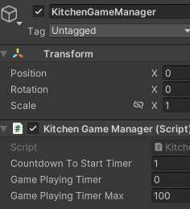

接着如果是在Unity中，因为我们之前debug了状态切换，所以相应unity引擎的控制台也只会显示这些debug内容，我们以此作为测试部分。

如果是到了打包的程序运行，我们要查看debug日志的部分的话，那么也很麻烦需要具体看下面我们的打包设置


然后根据[Unity - Manual: Log files](https://docs.unity.cn/2022.3/Documentation/Manual/LogFiles.html)的内容，


最后找到debug日志的位置，具体查看debug的信息。


上面的两种方式其实调试都不方便，建议用下面的包。

[Quantum Console | 实用工具 工具 | Unity Asset Store](https://assetstore.unity.com/packages/tools/utilities/quantum-console-211046)

然后直接导入，拉到层次结构中就可以直接使用


当然如果你的需求不是很高，其实可以找些免费的替代，当然这个要你自己去找，毕竟我们要实现的需求也只是让debug的信息可以显示到游戏屏幕当中。

[console - Asset Store (unity.com)](https://assetstore.unity.com/?free=true&q=console&orderBy=1)

也可以看我推荐的[Command Terminal | GUI 工具 | Unity Asset Store](https://assetstore.unity.com/packages/tools/gui/command-terminal-123344)

或者麻烦一下自己写个脚本的事情，直接嫖[Unity将调试信息输出到屏幕上_unity打包windows屏幕实时显示debug信息-CSDN博客](https://blog.csdn.net/qq_44284055/article/details/134973492)，下述脚本创建后，挂个空对象就够了。

再复杂一些你想搞个作弊控制台这些，喜欢diy的快乐，建议看[【unity教程】在unity中创建作弊控制台_哔哩哔哩_bilibili](https://www.bilibili.com/video/BV1gQ4y1q7m4/?spm_id_from=333.337.search-card.all.click&vd_source=1b4bedc9a40f7ef5916c246b866fc93e)

```csharp
using System;
using System.Collections.Generic;
using UnityEngine;

/// <summary>
/// 用于把Debug.Log的信息输出到游戏窗口中
/// </summary>
public class ConsoleToScreen : MonoBehaviour
{
    /// <summary>一页展示多少行</summary>
    private const int maxLines = 50;
    /// <summary>一行有多少个字</summary>
    private const int maxLineLength = 80;
    /// <summary>输出的字体大小</summary>
    private const int fontSize = 20;
    /// <summary>字体颜色</summary>
    private readonly Color fontColor = Color.red;

    private string _logStr = "";
    private readonly List<string> _lines = new List<string>();

    void OnEnable() { Application.logMessageReceived += Log; }
    void OnDisable() { Application.logMessageReceived -= Log; }

    public void Log(string logString, string stackTrace, LogType type)
    {
        foreach (var line in logString.Split('\n'))
        {
            if (line.Length <= maxLineLength)
            {
                _lines.Add(line);
                continue;
            }
            var lineCount = line.Length / maxLineLength + 1;
            for (int i = 0; i < lineCount; i++)
            {
                if ((i + 1) * maxLineLength <= line.Length)
                {
                    _lines.Add(line.Substring(i * maxLineLength, maxLineLength));
                }
                else
                {
                    _lines.Add(line.Substring(i * maxLineLength, line.Length - i * maxLineLength));
                }
            }
        }
        if (_lines.Count > maxLines)
        {
            _lines.RemoveRange(0, _lines.Count - maxLines);
        }
        _logStr = string.Join("\n", _lines);
    }

    private void OnGUI()
    {
        GUI.matrix = Matrix4x4.TRS(Vector3.zero, Quaternion.identity,
           new Vector3(1f, 1f, 1.0f));
        GUI.Label(new Rect(10, 10, 600, 370), _logStr, new GUIStyle() { fontSize = Math.Max(10, fontSize), normal = new GUIStyleState() { textColor = fontColor } });
    }
}
```

#### [2]Netcode的问题和bug解决方式

##### a:错误日志1

建议跟着后面的步骤弄了一些，遇到问题再回来这里看。

首先是第一个错误日志：

> Exception: ClearCounter_6 tried to registered with ScenePlacedObjects which already contains the same GlobalObjectIdHash value 3839932073 for ClearCounter_2! Unity.Netcode.NetworkSceneManager.PopulateScenePlacedObjects (UnityEngine.SceneManagement.Scene sceneToFilterBy, System.Boolean clearScenePlacedObjects)

基本意思就是因为我们需要复用多个柜台，每个柜台是唯一的网络对象，而不幸的是netcode1.2.0有概率会认为我们重复弄了同一个哈希值的物体，而网络对象本身要求是唯一存在的，那么怎么解决这个问题呢？

参考[Scene objects assigned same GlobalObjectIdHash value - Unity Engine - Unity Discussions](https://discussions.unity.com/t/scene-objects-assigned-same-globalobjectidhash-value/882913/13)

##### b:错误日志2

先看下面的错误日志：

> [Netcode] NetworkPrefab hash was not found! In-Scene placed NetworkObject soft synchronization failure for Hash: 595666966!
>
> [Netcode] Failed to spawn NetworkObject for Hash 595666966.

参考[[LogError\] NetworkPrefab hash was not found! - Unity Engine - Unity Discussions](https://discussions.unity.com/t/logerror-networkprefab-hash-was-not-found/908745/16)

解决方式就是不要管他，因为相关的报错基本不会影响到客户端

##### c:错误日志3

属于1.3.1的问题：

> [Netcode] Runtime Network Prefabs was not empty at initialization time. Network Prefab registrations made before initialization will be replaced by NetworkPrefabsList.

方式也是不管他，而是对netcode进行一些无用的设置，比如在networkmanager加多个用不上的配置，然后重启项目，因为这个问题解决不了。

##### d:错误日志4

> [Netcode] Deferred messages were received for a trigger of type OnSpawn with key 6, but that trigger was not received within within 1 second(s).

首先我们要确保生成的物体是网络对象，而不仅仅是游戏对象

接着参考[Terrain Collider don´t work for clients after update to Netcode 1.4.0 - Unity Engine - Unity Discussions](https://discussions.unity.com/t/terrain-collider-don-t-work-for-clients-after-update-to-netcode-1-4-0/919662/5)里面的内容。

#### [3]总结

Netcode不同版本之间存在差异，有些错误的红日志这些可能处理不了，也没必要处理。

### 002 简单接触

#### [1]同步移动

##### a:`server authoritative`

前面的添加networkobject和networktransform组件，就已经让带有移动脚步的玩家可以同步位置了，一般情况下，都是用的**服务器权威**这种方式做**位置同步**，具体表现就是使用networktransform组件，而不是我们自己手搓一个服务器同步的脚本。

下述唯一修改脚本`Player.cs`做的也只是让特定客户端针对他们特定可以控制的操作，只在本地进行移动操作。

[Property IsOwner | Netcode for GameObjects | 1.7.1 (unity3d.com)](https://docs.unity3d.com/Packages/com.unity.netcode.gameobjects@1.7/api/Unity.Netcode.NetworkObject.IsOwner.html)

```csharp
    private void Update() {
        //如果不是本地的玩家进行操作的话，那么就不能进行任何的交互或移动操作
        if (!IsOwner) {
            return;
        }

        HandleMovement();
        HandleInteractions();
    }
```

##### b:第1种方式`client authoritative`

基本上要实现联机同步的操作，本质其实都是在同步相关的变量数值，所以要做的基操就是找出要同步的变量加上相关的限制。

在移动这一块，netcode也提供了相关的组件给我们使用[NetworkTransform | Unity Multiplayer Networking (unity3d.com)](https://docs-multiplayer.unity3d.com/netcode/1.3.0/components/networktransform/)，不过这个组件同步的操作是给服务器，不是给客户端的。

如果我们要让双端可以使用这个同步移动的操作功能，有一种方式就是让服务端可以默许客户端也能拥有相应的权力，具体如下参考这个内容


所以我们新建脚本`ClientNetworkTransform.cs`挂载到player预制体即可。


```csharp
using Unity.Netcode.Components;
using UnityEngine;

namespace Unity.Multiplayer.Samples.Utilities.ClientAuthority {
    /// <summary>
    /// Used for syncing a transform with client side changes. This includes host. Pure server as owner isn't supported by this. Please use NetworkTransform
    /// for transforms that'll always be owned by the server.
    /// </summary>
    [DisallowMultipleComponent]
    public class ClientNetworkTransform : NetworkTransform {
        /// <summary>
        /// Used to determine who can write to this transform. Owner client only.
        /// This imposes state to the server. This is putting trust on your clients. Make sure no security-sensitive features use this transform.
        /// </summary>
        protected override bool OnIsServerAuthoritative() {
            return false;
        }
    }
}
```

这时候Debug的话，我们就能实现同步移动操作了，需要注意是先启动服务器，才能有客户端，不先启动服务端或者中途关闭了服务端，都会影响到客户端的。


##### c:第2种方式`服务端同步位置`

不过如果我们希望让服务端专门辨别，那么最好的做法就是不给客户端太多权力，从而可以做到安全和反外挂。

所以是客户端向服务端申请移动，交给服务端具体判断，如果选择第2种方式，就不再需要让玩家预制体挂载`ClientNetworkTransform.cs`脚本，而是挂载`NetworkTransform`组件，因为我们具体交给服务端判断就好了，所有同步的权力自然交给服务端去。


修改脚本`Player.cs`，主要做的工作就是参考[ServerRpc | Unity Multiplayer Networking (unity3d.com)](https://docs-multiplayer.unity3d.com/netcode/1.3.0/advanced-topics/message-system/serverrpc/)

其中远程过程调用（RPC），让我们能够将信息从客户端调用，接着发送到服务器，具体在在服务器/主机上接收和执行相关函数的调用，就像是我们之前从类中调用方法一样。

在代码中加上`[ServerRpc]`属性设置，该设置只允许客户端所有者（拥有与包含该方法相关联的客户端）调用权限。任何非所有者的客户端都不允许调用.

> 就是允许客户端调用服务器上的方法，这是用于客户端与服务器进行通信的常见方式。

下面看到有一个参数`RequireOwnership = false`

> 默认情况下，`ServerRpc` 只允许对象的所有者（owner）调用。如果 `RequireOwnership` 设置为 `true`（默认设置），只有该对象的所有者才能调用这个 `ServerRpc`。
>
> 设置 `RequireOwnership = false`，表示**任何客户端**都可以调用这个方法，而不需要是该对象的所有者。

```csharp
using System;
using Unity.Netcode;
using UnityEngine;

public class Player : NetworkBehaviour,IKitchenObjectParent {
    //...省略
    private void Update() {
        if (!IsOwner) {
            return;
        }
        HandleMovementServerAuth();
        //HandleMovement();
        HandleInteractions();
    }

    private void HandleMovementServerAuth() {
        //本地操作输入
        Vector2 inputVector = GameInput.Instance.GetMovementVectorNormalized();
        //传到rpc上看是否要同步
        HandleMovementServerRpc(inputVector);
    }

    //允许任何客户端调用此方法，而不要求客户端拥有该对象
    [ServerRpc(RequireOwnership = false)]
    private void HandleMovementServerRpc(Vector2 inputVector) {
        //下面的都是执行服务器端的逻辑，直接抄之前的移动控制操作
        Vector3 moveDir = new Vector3(inputVector.x, 0, inputVector.y);
        float playerRadius = .7f;
        float playerHeight = 2f;
        float moveDistance = moveSpeed * Time.deltaTime;
        bool canMove = !Physics.CapsuleCast(transform.position, transform.position + Vector3.up * playerHeight, playerRadius, moveDir, moveDistance);
        if (!canMove) {
            Vector3 moveDirX = new Vector3(moveDir.x, 0, 0).normalized;
            canMove = (moveDir.x < -.5f || moveDir.x > +.5f) && !Physics.CapsuleCast(transform.position, transform.position + Vector3.up * playerHeight, playerRadius, moveDirX, moveDistance);
            if (canMove) {
                moveDir = moveDirX;
            }
            else {
                Vector3 moveDirZ = new Vector3(0, 0, moveDir.z).normalized;
                canMove = (moveDir.z < -.5f || moveDir.z > +.5f) && !Physics.CapsuleCast(transform.position, transform.position + Vector3.up * playerHeight, playerRadius, moveDirZ, moveDistance);
                if (canMove) {
                    moveDir = moveDirZ;
                }
                else {
                }
            }
        }

        if (canMove) {
            transform.position += moveDir * moveDistance;
        }

        isWalking = moveDir != Vector3.zero;
        float rotateSpeed = 10f;
        transform.forward = Vector3.Slerp(transform.forward, moveDir, Time.deltaTime * rotateSpeed);
    }
}
```

需要特别说明的是这个对象通常指的是 **NetworkObject**，这是一个具有网络功能的游戏对象，它允许游戏对象在网络上的多个客户端之间同步。

那么`允许任何客户端调用此方法，而不要求客户端拥有该对象`这句话的意思，我还是举例说明：

就是假设我拥有一个`女友`的游戏对象，拥有`把玩`的函数功能，添加 `NetworkObject` 组件，使其成为一个可以在网络上同步的对象，这些游戏对象在客户端A的ID可能为1.

每个客户端都有属于他们自己的`女友`，不同的客户端BCD，拥有的`女友`ID都是唯一的，不会出现同样的ID，其他客户端只负责接收同步的数据，也就是

默认情况下，这个ID为1的`女友`，只能给客户端A使用，现在加上了`[ServerRpc(RequireOwnership = false)]`，其他客户端BCD现在就能随时`把玩`客户端A的`女友`了，快跑！客户端A！他们是潜在的NTR狂魔。


遇到问题：**客户端的移动速度跟服务端的移动速度不一致。**

> 实际上并不是我们的操作有问题，而是因为fps默认是不设限制的，所以自然会遇到如下两种情况。
>
> 如果unity引擎开启作为服务器，那么本地打包的游戏作为客户端会出现玩家移动缓慢的情况，而如果是反过来，那么就是unity引擎debug的玩家移动过快。
>
> 总之就跟`float moveDistance = moveSpeed * Time.deltaTime;`这段代码有关系，尽管我们用了`NetworkTransform`组件，却因为时间步长，如下图这样不能做到速度一致。
>
> 而第1种方式授权给了客户端，让客户端拥有跟服务端有着一样的权力可以同步移动物体，虽然他们的fps不一致，但`NetworkTransform` 组件能够通过时间同步、插值/外推、帧率无关的物理计算等机制，确保客户端和服务器之间的移动速度和位置同步，因为SC有着一样的权力，可以同步操作了，而不是C向S申请。

具体的处理方式很简单，就是不处理，只需要玩两个打包好的游戏就可以了，别用unity引擎debug联机游戏，尤其是遇到很多动作跟动画是相关的逻辑。


如果依旧坚持使用Unity引擎进行`debug`的话，也可以直接勾选如下的选项，这样我们就能维持住在60fps。

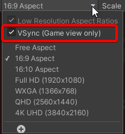

要是希望查看FPS，可以使用如下的基本代码：

```csharp
using UnityEngine;

public class FPSDisplay : MonoBehaviour {
    private float deltaTime = 0.0f;

    private void Update() {
        deltaTime += (Time.unscaledDeltaTime - deltaTime) * 0.1f;
    }

    private void OnGUI() {
        float fps = 1.0f / deltaTime;
        GUI.Label(new Rect(10, 10, 100, 20), $"FPS: {fps}");
    }
}
```

我知道你是个好学的人，真是没办法呢！其实有个重复做轮子的方法具体如下，直接挂载脚本`PlayerTransformSync.cs`到player预制体，而不是挂载`Network Transform`组件。

它的处理逻辑就是，就是我们不需要保证客户端与服务端在帧率上同步，只需要保证位置和旋转的这些跟变换有关的数值可以做到及时同步即可，而更新这些数据本身不会有多耗费服务端要处理的时间。

当然我一般我们做小游戏，还是用服务端授权的方式，而不是自己写一个中间代码，告诉服务端哪些是我目前要更新的变量。

参考教程[Unity之NetCode多人网络游戏联机对战教程(8)--玩家位置同步_unity netcode 玩家只会出生到原点-CSDN博客](https://blog.csdn.net/a924282761/article/details/134298180)分享的脚本。

```csharp
using Unity.Netcode;
using UnityEngine;

public class PlayerTransformSync : NetworkBehaviour {
    //通过NetworkVariable创建两个网络同步的字段，一个同步position，另一个同步rotation
    private NetworkVariable<Vector3> _syncPos = new();
    private NetworkVariable<Quaternion> _syncRota = new();

    //在Update()与FixedUpdate()可以确保优先级，先同步自己的，在同步他人的。
    private void Update() {
        if (IsLocalPlayer) {
            UploadTransform();
        }
    }

    private void FixedUpdate() {
        if (!IsLocalPlayer) {
            SyncTransform();
        }
    }

    //我自己上传位置就是在同步，别人就把位置信息同步到transform。
    private void SyncTransform() {
        transform.position = _syncPos.Value;
        transform.rotation = _syncRota.Value;
    }

    //如果是服务端主机，直接同步变换，
    //如果是客户，就需要向服务端发送信息，请求同步变换
    private void UploadTransform() {
        if (IsServer) {
            _syncPos.Value = transform.position;
            _syncRota.Value = transform.rotation;
        }
        else {
            UploadTransformServerRpc(transform.position, transform.rotation);
        }
    }

    [ServerRpc]
    private void UploadTransformServerRpc(Vector3 position, Quaternion rotation) {
        _syncPos.Value = position;
        _syncRota.Value = rotation;
    }
}
```

#### [2]同步动画

##### a:第1种方式`服务端授权给客户端`

[ServerRpc | Unity Multiplayer Networking (unity3d.com)](https://docs-multiplayer.unity3d.com/netcode/1.3.0/components/networkanimator/)


需要特别注意`Animator`的`Trigger`属性类型基本上不过是一个布尔值，当设置为`true`时，在`Animator`组件处理完触发器后将自动重置为`false`。通常，触发器用于启动`Animator`层状态之间的过渡。从这个意义上说，可以将`Trigger`看作是信号"事件的开始"的一种方式。由于`Trigger`属性具有这种独特的行为，因此要通过`NetworkAnimator.SetTrigger`方法设置触发器值。

> 注意： 如果使用`Animator.SetTrigger`设置`Trigger`属性，那么这**不会**与非所有者客户端**同步**。

修改脚本`PlayerAnimator.cs`

```csharp
using Unity.Netcode;
using UnityEngine;

public class PlayerAnimator : NetworkBehaviour
{
    private const string IS_WALKING = "IsWalking";

    [SerializeField] private Player player;

    private Animator animator;

    private void Awake() {
        animator = GetComponent<Animator>();
    }

    private void Update() {
        if (!IsOwner) {
            return;
        }
        animator.SetBool(IS_WALKING, player.IsWalking());
    }

    public static string GetPlayerAnimatorName() {
        return IS_WALKING;
    }
}
```

基本会遇到跟前面同步移动的问题，一样是服务端可以同步动画，而客户端不行，最简便的解决方式是前面类似做法，就是授权给客户端。

另外由于我们的player预制体已经挂好了对象，所以也就不需要专门在视觉层面上挂载`NetworkObject`组件了，具体参考如下。


所以我们修改挂载的组件为`OwnerNetworkAnimator.cs`即可。


```csharp
using Unity.Netcode.Components;

public class OwnerNetworkAnimator : NetworkAnimator {
    protected override bool OnIsServerAuthoritative() {
        return false;
    }
}
```

最终我们就能同步客户端和服务端的动画播放了。


**需要留意的点是**：同步动画如果选择了授权给客户端，那么前提是同步变换也一样选择授权给客户端，没有实现这个前提，一样会造成只有服务端同步动画，而客户端不会。

##### b:第2种方式`服务端权威`

需要注意服务端权威，为了确保可以动画同步，我们是要给处理视觉动画的游戏对象上，挂载相应的networkanimator组件。

参考[Unity之NetCode多人网络游戏联机对战教程(10)--玩家动画同步_unity多人联机游戏-CSDN博客](https://blog.csdn.net/a924282761/article/details/134424996)分享的脚本，直接根据自己的情况需要，拿来改改就可以了。

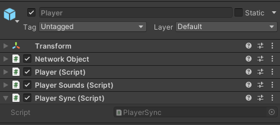

```csharp
using Unity.Netcode;
using UnityEngine;

public class PlayerSync : NetworkBehaviour {
    private NetworkVariable<Vector3> _syncPos = new();
    private NetworkVariable<Quaternion> _syncRota = new();
    private Transform _syncTransform;
    private NetworkVariable<bool> _syncisWalking = new();
    private Animator _syncAnimator;
    private string isWalking_Anim;

    private void Awake() {
        SetTarget(this.transform);
    }

    private void Start() {
        isWalking_Anim = PlayerAnimator.GetPlayerAnimatorName();
    }

    private void SetTarget(Transform player) {
        _syncTransform = player;
        _syncAnimator = player.GetComponentInChildren<Animator>();
    }

    private void Update() {
        if (IsLocalPlayer) {
            UploadTransform();
            UploadAnimation();
        }
    }

    private void FixedUpdate() {
        if (!IsLocalPlayer) {
            SyncTransform();
            SyncAnimation();
        }
    }

    private void SyncTransform() {
        _syncTransform.position = _syncPos.Value;
        _syncTransform.rotation = _syncRota.Value;
    }

    private void SyncAnimation() {
        _syncAnimator.SetBool(isWalking_Anim, _syncisWalking.Value);
    }

    private void UploadTransform() {
        if (IsServer) {
            _syncPos.Value = transform.position;
            _syncRota.Value = transform.rotation;
        }
        else {
            UploadTransformServerRpc(transform.position, transform.rotation);
        }
    }

    [ServerRpc]
    private void UploadTransformServerRpc(Vector3 position, Quaternion rotation) {
        _syncPos.Value = position;
        _syncRota.Value = rotation;
    }

    private void UploadAnimation() {
        if (IsServer) {
            _syncisWalking.Value = _syncAnimator.GetBool(isWalking_Anim);
        }
        else {
            UploadAnimationServerRpc();
        }
    }

    [ServerRpc]
    private void UploadAnimationServerRpc() {
        _syncisWalking.Value = _syncAnimator.GetBool(isWalking_Anim);
    }
}
```

总而言之，在本机测试的情况下，为了不避免出现不同步的问题出现。

> 如果是授权给客户端的，就使用授权给客户端的写法；如果是选择服务端权威的方式实现的那么就保证后续都是相应的用rpc申请上传同步变量的写法。
>
> 不要混用这两种方式。

#### [3]总结与区分不同Rpc

利用netcode分别通过两种方式实现了同步动画操作。

需要注意的是如果选择了服务端权威，也就是服务端管同步，而客户端申请同步的这种做法，与授权给客户端做法不要出现任何混用的情况，不然也容易会在本机上出现不同步的问题。

搞明白了相关的写法，其实netcode还是很方便使用的。

前面说过，如果服务端权威的做法自己把移动的逻辑交给了服务端处理，而不是上传最终同步变量结果，会因为fps差异出现移动速度不一致的情况。

需要注意这个移动速度不一致是看起来不一致，而不是真的值不一致，因为影响移动的是时间步长，处理的做法除了本地打包开两个游戏，还可以在game窗口开启vSync，就能维持fps稳定发挥了。

##### a:`[ServerRpc]`

- **定义**: `[ServerRpc]`用于从客户端向服务端发送请求。
- **调用**: 只能由客户端调用，服务端接收并执行。
- **用途**: 常用于客户端需要通知服务端某些事件或请求服务端执行某些操作。例如，客户端玩家移动时通知服务端更新位置。

```csharp
public class Example : NetworkBehaviour
{
    [ServerRpc]
    public void SendDataToServerRpc(int data)
    {
        // 这个方法在服务端执行
        Debug.Log("Received data on server: " + data);
    }
}
```

##### b:`[ClientRpc]`

- **定义**: `[ClientRpc]`用于从服务端向客户端发送请求。
- **调用**: 只能由服务端调用，客户端接收并执行。
- **用途**: 常用于服务端需要通知所有或特定客户端某些事件或更新。例如，服务端生成新的游戏对象时通知所有客户端更新显示。

```csharp
public class Example : NetworkBehaviour
{
    [ClientRpc]
    public void SendDataToClientRpc(int data)
    {
        // 这个方法在客户端执行
        Debug.Log("Received data on client: " + data);
    }
}
```


- **通信方向**: `[ServerRpc]`是从客户端到服务端的通信，而`[ClientRpc]`是从服务端到客户端的通信。
- **调用权限**: `[ServerRpc]`只能由客户端调用，`[ClientRpc]`只能由服务端调用。
- **同步数据**: 通过这两种RPC，可以实现客户端和服务端之间的数据同步和事件通知，确保游戏状态的一致性。

假设你有一个多人游戏，客户端需要通知服务端玩家的移动，而服务端需要通知所有客户端新的游戏对象生成：

所以我们的做法就是让`MovePlayerServerRpc`包裹住`UpdatePlayerPositionClientRpc`

```csharp
public class GameManager : NetworkBehaviour
{
    [ServerRpc]
    public void MovePlayerServerRpc(Vector3 newPosition)
    {
        // 服务端更新玩家位置
        transform.position = newPosition;
        // 通知所有客户端更新位置
        UpdatePlayerPositionClientRpc(newPosition);
    }

    [ClientRpc]
    private void UpdatePlayerPositionClientRpc(Vector3 newPosition)
    {
        // 客户端更新玩家位置
        transform.position = newPosition;
    }
}
```

通过这种方式，可以确保所有客户端和服务端的游戏状态保持一致。

### 003 修改交互

#### [1]交付柜台

##### a:修改脚本`DeliveryManager.cs`

修改成`NetworkBehaviour`后，netcode会提示我们相应要给对应挂载的游戏对象变成可以联网的对象。


```csharp
using System;
using System.Collections.Generic;
using Unity.Netcode;
using UnityEngine;

//修改继承
public class DeliveryManager : NetworkBehaviour
{
    
    //同步产生菜谱，
    //不过使用rpc，
    //之后加入联网的玩家可能会跟服务端出现菜谱不一致的情况
    private void Update() {
        //确保是服务端提供交付的计时
        if (!IsServer) {
            return;
        }

        spawnRecipeTimer -= Time.deltaTime;
        if(spawnRecipeTimer <= 0f) {
            spawnRecipeTimer = spawnRecipeTimerMax;
            if(KitchenGameManager.Instance.IsGamePlaying() && waitingRecipeSOList.Count < waitingRecipesMax) {
                int waitingRecipeSOIndex = UnityEngine.Random.Range(0, recipeListSO.recipeSOList.Count);
                
                SpawnNewWaitingRecipeClientRpc(waitingRecipeSOIndex);
            }
        }
    }

    //补充rpc
    [ClientRpc]
    private void SpawnNewWaitingRecipeClientRpc(int waitingRecipeSOIndex) {
        RecipeSO waitingRecipeSO = recipeListSO.recipeSOList[waitingRecipeSOIndex];
        waitingRecipeSOList.Add(waitingRecipeSO);
        OnRecipeSpawned?.Invoke(this, EventArgs.Empty);
    }

    public void DeliverRecipe(PlateKitchenObject plateKitchenObject) {
        for(int i = 0; i < waitingRecipeSOList.Count; i++) {
            RecipeSO waitingRecipeSO = waitingRecipeSOList[i];
            if (waitingRecipeSO.kitchenObjectSOList.Count == plateKitchenObject.GetKitchenObjectSOList().Count) {
                bool plateContentsMatchesRecipe = true;
                foreach (KitchenObjectSO recipeKitchenObjectSO in waitingRecipeSO.kitchenObjectSOList) {
                    bool ingredientFound = false;
                    foreach (KitchenObjectSO plateKitchenObjectSO in plateKitchenObject.GetKitchenObjectSOList()) {
                        if (plateKitchenObjectSO == recipeKitchenObjectSO) {
                            ingredientFound = true;
                            break;
                        }
                    }
                    if (!ingredientFound) {
                        plateContentsMatchesRecipe = false;
                    }
                }

                if (plateContentsMatchesRecipe) {
                    //修改
                    DeliverCorrectRecipeServerRpc(i);
                    return;
                }
            }
        }
        //修改
        DeliverIncorrectRecipeServerRpc();
    }

    //补充
    [ServerRpc(RequireOwnership = false)]
    private void DeliverIncorrectRecipeServerRpc() {
        DeliverIncorrectRecipeClientRpc();
    }

    [ClientRpc]
    private void DeliverIncorrectRecipeClientRpc() {
        OnRecipeFailed?.Invoke(this, EventArgs.Empty);
    }

    //(RequireOwnership = false)可以让客户端没有这个对象，也能使用
    //具体表现就是交付柜台本来默认就是服务器拥有的
    //现在客户端没有限制，可以使用这个物品了
    [ServerRpc(RequireOwnership = false)]
    private void DeliverCorrectRecipeServerRpc(int waitingRecipeSOListIndex) {
        DeliverCorrectRecipeClientRpc(waitingRecipeSOListIndex);
    }

    //补充
    [ClientRpc]
    private void DeliverCorrectRecipeClientRpc(int waitingRecipeSOListIndex) {
        successfulRecipesAmount++;

        waitingRecipeSOList.RemoveAt(waitingRecipeSOListIndex);

        OnRecipeCompleted?.Invoke(this, EventArgs.Empty);
        OnRecipeSuccess?.Invoke(this, EventArgs.Empty);
    }

    //...省略
}
```

这段代码使用了Unity的Netcode来实现一个多人游戏中的交付管理系统。以下是一些关键点和原因：

1. **继承NetworkBehaviour**:
   - `DeliveryManager`类继承自`NetworkBehaviour`，这意味着它可以使用Netcode提供的网络功能，如RPC（远程过程调用）。
2. **服务端逻辑**:
   - 在`Update`方法中，首先检查`IsServer`，确保只有服务端执行生成菜谱的逻辑。这是因为在多人游戏中，通常只有服务端负责游戏状态的主要更新，以确保所有客户端的一致性。
3. **RPC调用**:
   - `SpawnNewWaitingRecipeClientRpc`是一个客户端RPC方法，用于在所有客户端上生成新的等待菜谱。使用RPC可以确保所有客户端都能同步更新菜谱列表。
   - `DeliverCorrectRecipeServerRpc`和`DeliverIncorrectRecipeServerRpc`是服务端RPC方法，用于处理正确和错误的菜谱交付。这些方法使用`RequireOwnership = false`，允许客户端调用这些方法，即使它们不拥有该对象。
4. **客户端和服务端的分工**:
   - 服务端负责主要的游戏逻辑和状态更新（如生成菜谱和验证交付），而客户端负责显示和用户交互（如显示新的菜谱和交付结果）。
   - 通过使用`ServerRpc`和`ClientRpc`，可以确保服务端和客户端之间的通信和状态同步。
5. **事件触发**:
   - 在客户端RPC方法中，如`DeliverCorrectRecipeClientRpc`和`DeliverIncorrectRecipeClientRpc`，使用事件（如`OnRecipeCompleted`和`OnRecipeFailed`）来通知其他系统或UI更新。这种方式可以解耦逻辑和显示，使代码更模块化和易于维护。

这些设计和实现方式确保了游戏在多人环境下的同步和一致性，同时也提供了灵活性和扩展性。

##### b:使用netcode的注意事项

如果我们一开始不了解netcode，而改动成如下来实现同步菜谱的操作。


Unity会显示的错误日志报告，而VS不会显示：

> 基本意思就是不知道如何序列化RecipeSO。RPC参数类型必须实现INetworkSerializeByMemcpy或INetworkSerializable。
>

要想解决这个问题其实不需要用错误日志建议的方式，而是我们把自己的输入参数类型改为最基本的C#变量类型即可。

```bash
Unity.Netcode.Editor.CodeGen.NetworkBehaviourILPP: Assets\Scripts\Counter\DeliveryManager.cs(46,9): error  - SpawnNewWaitingRecipeClientRpc - Don't know how to serialize RecipeSO. RPC parameter types must either implement INetworkSerializeByMemcpy or INetworkSerializable. If this type is external and you are sure its memory layout makes it serializable by memcpy, you can replace RecipeSO with ForceNetworkSerializeByMemcpy`1<RecipeSO>, or you can create extension methods for FastBufferReader.ReadValueSafe(this FastBufferReader, out RecipeSO) and FastBufferWriter.WriteValueSafe(this FastBufferWriter, in RecipeSO) to define serialization for this type.

PostProcessing failed: Unity.ILPP.Runner.ILPostProcessorDiagnosticsException: Unity.Netcode.Editor.CodeGen.NetworkBehaviourILPP: Assets\Scripts\Counter\DeliveryManager.cs(46,9): error  - SpawnNewWaitingRecipeClientRpc - Don't know how to serialize RecipeSO. RPC parameter types must either implement INetworkSerializeByMemcpy or INetworkSerializable. If this type is external and you are sure its memory layout makes it serializable by memcpy, you can replace RecipeSO with ForceNetworkSerializeByMemcpy`1<RecipeSO>, or you can create extension methods for FastBufferReader.ReadValueSafe(this FastBufferReader, out RecipeSO) and FastBufferWriter.WriteValueSafe(this FastBufferWriter, in RecipeSO) to define serialization for this type.

Assets\Scripts\Counter\DeliveryManager.cs(46,9): error  - SpawnNewWaitingRecipeClientRpc - Don't know how to deserialize RecipeSO. RPC parameter types must either implement INetworkSerializeByMemcpy or INetworkSerializable. If this type is external and you are sure its memory layout makes it serializable by memcpy, you can replace RecipeSO with ForceNetworkSerializeByMemcpy`1<RecipeSO>, or you can create extension methods for FastBufferReader.ReadValueSafe(this FastBufferReader, out RecipeSO) and FastBufferWriter.WriteValueSafe(this FastBufferWriter, in RecipeSO) to define serialization for this type.
at Unity.ILPP.Runner.PostProcessingPipeline.HandleDiagnosticMessages(String ilppName, List`1 messageList, LoggerAndProgressSink& combinedLogger)
at Unity.ILPP.Runner.PostProcessingPipeline.PostProcessAssemblyAsync(PostProcessAssemblyRequest request, Action`2 progressSink)
at Unity.ILPP.Runner.PostProcessingService.PostProcessAssembly(PostProcessAssemblyRequest request, IServerStreamWriter`1 responseStream, ServerCallContext context)
Unhandled Exception: System.InvalidOperationException: Post processing failed
at Unity.ILPP.Trigger.TriggerApp.<ProcessArgumentsAsync>d__1.MoveNext() + 0xf74
--- End of stack trace from previous location ---
at System.Runtime.ExceptionServices.ExceptionDispatchInfo.Throw() + 0x20
at Unity.ILPP.Trigger.TriggerApp.<ProcessArgumentsAsync>d__1.MoveNext() + 0x1149
--- End of stack trace from previous location ---
at System.Runtime.ExceptionServices.ExceptionDispatchInfo.Throw() + 0x20
at System.Runtime.CompilerServices.TaskAwaiter.ThrowForNonSuccess(Task) + 0xb6
at System.Runtime.CompilerServices.TaskAwaiter.HandleNonSuccessAndDebuggerNotification(Task) + 0x42
at Unity.ILPP.Trigger.TriggerApp.<RunAsync>d__0.MoveNext() + 0xc7
--- End of stack trace from previous location ---
at System.Runtime.ExceptionServices.ExceptionDispatchInfo.Throw() + 0x20
at System.Runtime.CompilerServices.TaskAwaiter.ThrowForNonSuccess(Task) + 0xb6
at System.Runtime.CompilerServices.TaskAwaiter.HandleNonSuccessAndDebuggerNotification(Task) + 0x42
at Program.<<Main>$>d__0.MoveNext() + 0x1a3
--- End of stack trace from previous location ---
at System.Runtime.ExceptionServices.ExceptionDispatchInfo.Throw() + 0x20
at System.Runtime.CompilerServices.TaskAwaiter.ThrowForNonSuccess(Task) + 0xb6
at System.Runtime.CompilerServices.TaskAwaiter.HandleNonSuccessAndDebuggerNotification(Task) + 0x42
at Program.<Main>(String[]) + 0x20
at Unity.ILPP.Trigger!<BaseAddress>+0x47849b



```

##### c:使用rpc的问题：

就是客户端以服务端为标准，如果客户端是后续加入到房间中的，那么服务端先生成了菜谱，客户端因为太迟加入，最终无法同步成跟服务端一样数量的菜谱。

#### [2]修复交互提示功能

前面我们之所以能实现交互，在于player.cs中变成单例，通过这个单例基础才实现了后续的交互柜台这些具体的功能，现在我们是联网环境，所以就不能直接用，而是要变成本地的单例来实现功能。

我们要做出如下的效果：


##### a:修改脚本`Player.cs`


```csharp
using System;
using Unity.Netcode;
using UnityEngine;

public class Player : NetworkBehaviour, IKitchenObjectParent {
    //...省略
    
    //public static Player Instance { get; private set; }
    public static Player LocalInstance { get; private set; }

    public static event EventHandler OnAnyPlayerSpawned;//为什么要搞这个？
    public static event EventHandler OnAnyPickedSomething;
    public static void ResetStaticData() {
        OnAnyPlayerSpawned = null;
    }

    //private void Awake() {
    //    //Instance = this;
    //    Debug.Log("");
    //}

    //现在我们不再需要在唤醒中实现本地玩家，而是交给专门的网络环境
    public override void OnNetworkSpawn() {

        if (IsOwner) {
            LocalInstance = this;

        }
        //因为我联网要用上预制体，为了避免忘记玩家可以物理射线检测碰撞的是有着counter掩码层的物体，那么这里直接设置
        countersLayerMask = LayerMask.GetMask("Counters");//需要注意是联网中对变量的改变，不会显示在预制体的检查器设置中。
        //此外我们要传入未来物体要跟随的父级对象，所以这里要传入变换位置，也就是kitchenObjectHoldPoint，或者改变引用，我这里选择改变引用
        OnAnyPlayerSpawned?.Invoke(this, EventArgs.Empty);
    }

    public void SetKitchenObject(KitchenObject kitchenObject) {
        this.KitchenObject = kitchenObject;

        if (kitchenObject != null) {
            OnPickedSomething?.Invoke(this, EventArgs.Empty);
            //这里相应的增加调用
            OnAnyPickedSomething?.Invoke(this, EventArgs.Empty);
        }
    }
}
```

1. `OnAnyPlayerSpawned` 事件

这个事件的目的是在任何玩家实例化（或生成）时，通知其他组件玩家已经生成了。在网络游戏中，当玩家生成时，可能需要做一些全局处理，比如更新UI、设置玩家数据、同步玩家状态等。

- **避免耦合**：通过使用事件，你可以避免将生成后的逻辑耦合到玩家类本身。其他需要知道玩家生成的组件可以通过订阅这个事件，在玩家生成时自动执行相应的逻辑，而不需要直接修改玩家类。
- **扩展性**：在未来，如果你想在玩家生成时执行更多的操作（例如播放音效、通知服务器等），你只需要订阅这个事件，而不必修改现有代码。

2. `OnAnyPickedSomething` 事件

类似地，`OnAnyPickedSomething` 事件是在玩家拾取物品时触发的事件。这样做的好处包括：

- **灵活性**：不同的组件可能对玩家拾取物品有不同的反应，比如更新玩家的背包UI，或者触发某种成就系统。通过事件，所有这些组件都可以独立地订阅这个事件并作出反应。
- **解耦**：通过事件机制，你避免了在玩家类中直接处理所有这些逻辑，从而使代码更清晰且更易于维护。

##### b:修改脚本`SelectedCounterVisual.cs`

```csharp
using System;
using UnityEngine;

public class SelectedCounterVisual : MonoBehaviour {
    private void Start() {
        //Player.Instance.OnSelectedCounterChanged += Player_OnSelectedCounterChanged;
        if(Player.LocalInstance != null) {
            //本地玩家已经生成并且可以立即订阅，主要判断是否有选中柜台的视觉效果。
            Player.LocalInstance.OnSelectedCounterChanged += Player_OnSelectedCounterChanged;
        }
        else {
            //因为本地玩家没有，所以判断其他玩家
            //当有其他玩家包括本地玩家的生成，这个方法会被调用
            Player.OnAnyPlayerSpawned += Player_OnAnyPlayerSpawned;
        }
        
    }
    
    //避免重复订阅事件
    private void Player_OnAnyPlayerSpawned(object sender, EventArgs e) {
        //本地玩家是否已经生成
        if (Player.LocalInstance != null) {
            //确保不会因为重复生成玩家而多次订阅同一个事件。
            Player.LocalInstance.OnSelectedCounterChanged -= Player_OnSelectedCounterChanged;
            Player.LocalInstance.OnSelectedCounterChanged += Player_OnSelectedCounterChanged;
        }
    }
    
    //...省略
}
```


##### c:修改脚本`ResetstaticDataManager.cs`

添加清空全局静态的事件处理

```csharp
using UnityEngine;

public class ResetstaticDataManager : MonoBehaviour {

    private void Awake() {
        CuttingCounter.ResetStaticData();
        BaseCounter.ResetStaticData();
        TrashCounter.ResetStaticData();
        Player.ResetStaticData();//
    }
}
```

##### d:修改脚本`SoundManager`

同步声音产生的位置

```csharp
using System;
using UnityEngine;

public class SoundManager : MonoBehaviour
{
    //...省略
    private void Start() {
        DeliveryManager.Instance.OnRecipeSuccess += DeliveryManager_OnRecipeSuccess;
        DeliveryManager.Instance.OnRecipeFailed += DeliveryManager_OnRecipeFailed;
        CuttingCounter.OnAnyCut += CuttingCounter_OnAnyCut;
        //Player.Instance.OnPickedSomething += Player_OnPickedSomething;
        //Player.LocalInstance.OnPickedSomething += Player_OnPickedSomething;
        Player.OnAnyPickedSomething += Player_OnPickedSomething;
        BaseCounter.OnAnyObjectPlacedHere += BaseCounter_OnAnyObjectPlacedHere;
        TrashCounter.OnAnyObjectTrashed += TrashCounter_OnAnyObjectTrashed;
    }

    private void Player_OnPickedSomething(object sender, EventArgs e) {
        //PlaySound(audioClipRefsSO.objectPickup, Player.Instance.transform.position);
        Player player = sender as Player;
        PlaySound(audioClipRefsSO.objectPickup, player.transform.position);
    }
}
```

#### [3]同步玩家拾取物品


##### a:将厨房物品都变成联网对象

修改脚本`KitchenObject.cs`

在这个脚本当中，我们有生成物品的静态方法`SpawnKitchenObject`，因为单机考虑的是预制体生成，而联机不同，我们要使用rpc的话，就不能是静态方法，那么为了避免混乱，后续新建脚本`KitchenGameMultiplayer`处理这个问题。

即专门区分单机与联机的生成操作。

```csharp
using Unity.Netcode;
using UnityEngine;

//修改成NetworkBehaviour
public class KitchenObject : NetworkBehaviour
{
    public void SetKitchenObjectParent(IKitchenObjectParent kitchenObjectParent) {
        if(this.kitchenObjectParent != null) {
            this.kitchenObjectParent.ClearKitchenObject();
        }

        this.kitchenObjectParent = kitchenObjectParent;

        if (kitchenObjectParent.HasKitchenObject()) {
            Debug.LogError("IKitchenObjectParent already has a KitchenObject!");
        }

        kitchenObjectParent.SetKitchenObject(this);
        
        //涉及到父类改变这些在联网环境下容易出问题
        //transform.parent = kitchenObjectParent.GetKitchenObjectFollowTransform();
        //transform.localPosition = Vector3.zero;
    }

    //改动封装
    public static void SpawnKitchenObject(KitchenObjectSO kitchenObjectSO,IKitchenObjectParent kitchenObjectParent) {
        KitchenGameMultiplayer.Instance.SpawnKitchenObject(kitchenObjectSO, kitchenObjectParent);
    }
}
```

给这些脚本挂载上`NetworkObject`组件


接着要告诉`NetworkManager`这些预制体是要同步的对象，注意是预制体实时生成的才需要如此操作，另外注意不同版本下networkmanager中的设置操作也会有略微的差异。

比如1.9版本只允许SO输入，要特别处理。

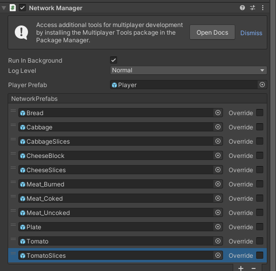

##### b:新建脚本`KitchenGameMultiplayer.cs`


```csharp
using Unity.Netcode;
using UnityEngine;

public class KitchenGameMultiplayer : NetworkBehaviour
{
    //要将其作为一个联网上的单例
    public static KitchenGameMultiplayer Instance { get; private set; }

    //引用那个统一记录所有同步食物预制体SO的SO清单
    [SerializeField] private KitchenObjectListSO kitchenObjectListSO;

    private void Awake() {
        Instance = this;
    }

    public void SpawnKitchenObject(KitchenObjectSO kitchenObjectSO, IKitchenObjectParent kitchenObjectParent) {
        //我们需要注意netcode它是不能知道我们自己弄了什么类型的，它只接受一些默认的
        SpawnKitchenObjectServerRpc(GetKitchenObjectSOIndex(kitchenObjectSO), kitchenObjectParent.GetNetworkObject());
    }

    
    //为了让客户端可以生成，所以需要rpc
    [ServerRpc(RequireOwnership = false)]
    //private void SpawnKitchenObjectServerRpc(KitchenObjectSO kitchenObjectSO, IKitchenObjectParent kitchenObjectParent)
    private void SpawnKitchenObjectServerRpc(int kitchenObjectSOIndex, NetworkObjectReference kitchenObjectParentNetworkObjectReference) {
        //要转换类型，避免netcode 的问题
        KitchenObjectSO kitchenObjectSO = GetKitchenObjectSOFromIndex(kitchenObjectSOIndex);


        Transform kitchenObjectTransform = Instantiate(kitchenObjectSO.prefab);

        //获取厨房食物这些预制体联网对象，然后为了方便测试，在KitchenObject取消了涉及切换父类对象的操作
        //这里当初的只生成测试
        NetworkObject kitchenObjectNetworkObject = kitchenObjectTransform.GetComponent<NetworkObject>();
        kitchenObjectNetworkObject.Spawn(true);

        KitchenObject kitchenObject = kitchenObjectTransform.GetComponent<KitchenObject>();

        //先判断能不能获取netcode支持的这个类型的变量
        kitchenObjectParentNetworkObjectReference.TryGet(out NetworkObject kitchenObjectParentNetworkObject);
        IKitchenObjectParent kitchenObjectParent = kitchenObjectParentNetworkObject.GetComponent<IKitchenObjectParent>();

        kitchenObject.SetKitchenObjectParent(kitchenObjectParent);
    }
    
    //获取对应食物SO的index
    public int GetKitchenObjectSOIndex(KitchenObjectSO kitchenObjectSO) {
        return kitchenObjectListSO.kitchenObjectSOList.IndexOf(kitchenObjectSO);
    }

    public KitchenObjectSO GetKitchenObjectSOFromIndex(int kitchenObjectSOIndex) {
        return kitchenObjectListSO.kitchenObjectSOList[kitchenObjectSOIndex];
    }
}
```

##### c:新建脚本`KitchenObjectListSO.cs`


所以我们的做法就是进一步封装这些SO数据，不专门单一处理，而是统一处理，避免netcode自身的局限性。

```csharp
using System.Collections.Generic;
using UnityEngine;

//这算是一个唯一的SO，所以后续要注释掉
//[CreateAssetMenu()]
public class KitchenObjectListSO : ScriptableObject
{
    public List<KitchenObjectSO> kitchenObjectSOList;
}
```

##### d:修改脚本`IKitchenObjectParent.cs`

```csharp
using Unity.Netcode;
using UnityEngine;

public interface IKitchenObjectParent
{
    //...省略

    //加这接口，目的是为了获取网络对象
    public NetworkObject GetNetworkObject();
}
```

##### e:修改脚本`BaseCounter.cs`

```csharp
using System;
using Unity.Netcode;
using UnityEngine;

public class BaseCounter : MonoBehaviour,IKitchenObjectParent
{
    //...省略

    //实现接口
    public NetworkObject GetNetworkObject() {
        return null;
    }
}
```

##### f:修改脚本`Player.cs`

```csharp
using System;
using Unity.Netcode;
using UnityEngine;

public class Player : NetworkBehaviour, IKitchenObjectParent {
    //...

    //实现接口，返回相应的网络对象
    public NetworkObject GetNetworkObject() {
        return NetworkObject;
    }
}
```

#### [4]同步父级对象

最终效果就是让物体可以跟随物体，并且可以转移到其他物体的父级对象身上。


##### a:为什么联网对象最好不要有涉及父类修改的操作？

首先是联网对象是不能被移动到非网络对象的父对象身上的，而移动到非网络对象的父对象身上，这种做法是因为我们之前需要生成厨房物品成为某些对象的子类，以便让这个子类视觉上跟着父类对象一同移动。

其次涉及到联网操作，是不会让联网对象变得过于复杂的，比如我们的玩家预制体的层次结构组成，是player游戏对象下游视觉对象，有多个空对象，有专门的特效对象。

对于这些相关联的子对象，我们本身不需要让它们变成联网对象，而是选择交给player游戏对象中的联网对象进行处理，或者经过一些简单的操作变成联网的变量。

当然最主要的原因是不能将网络对象设置为将动态生成的网络对象的子对象，就比如player预制体，它是动态生成的联网对象。

总之：

- 动态生成的联网对象不能作为子对象用
- 根据实际的需求，没必要真修改父级对象的操作，只需要完成视觉上的效果。

所以做法就是改变物体变换就可以了。

##### b:新建脚本`FollowTransform.cs`

这个脚本挂载到那些厨房物品的预制体当中


```csharp
using UnityEngine;

public class FollowTransform : MonoBehaviour
{
    private Transform targetTransform;

    public void SetTargetTransform(Transform targetTransform) {
        this.targetTransform = targetTransform;
    }

    private void LateUpdate() {
        if(targetTransform == null) {
            return;
        }

        transform.position = targetTransform.position;
        transform.rotation = targetTransform.rotation;
    }
}
```

##### c:修改脚本`KitchenObject.cs`

需要注意，无论我们实现什么功能，本质就是在改变引擎中物品的数据。

后续要注意的就是要同步好客户端与服务端的数据，无论是同步拾取物品，还是其他什么功能，这里的做法都是在嵌套rpc以实现同步好客户端与服务端的数据，后面我们会涉及到更复杂的嵌套操作。

下面注释的例子然后进行转换就是很好的诠释。

```csharp
using Unity.Netcode;
using UnityEngine;

public class KitchenObject : NetworkBehaviour
{
    [SerializeField] private KitchenObjectSO kitchenObjectSO;

    private IKitchenObjectParent kitchenObjectParent;
    //专门获取这个脚本组件
    private FollowTransform followTransform;
    
    //为什么要改动这个？
    //修改成保护类并且可以被子类继承使用
    protected virtual void Awake() {
        followTransform = GetComponent<FollowTransform>();
    }

    public KitchenObjectSO GetKitchenObjectSO() { return kitchenObjectSO; }

    /*
    public void SetKitchenObjectParent(IKitchenObjectParent kitchenObjectParent) {
        if(this.kitchenObjectParent != null) {
            this.kitchenObjectParent.ClearKitchenObject();
        }

        this.kitchenObjectParent = kitchenObjectParent;

        if (kitchenObjectParent.HasKitchenObject()) {
            Debug.LogError("IKitchenObjectParent already has a KitchenObject!");
        }

        kitchenObjectParent.SetKitchenObject(this);

        //涉及到父类改变这些在联网环境下容易出问题
        //transform.parent = kitchenObjectParent.GetKitchenObjectFollowTransform();
        //transform.localPosition = Vector3.zero;
        followTransform.SetTargetTransform(kitchenObjectParent.GetKitchenObjectFollowTransform());
    }
    */
    public void SetKitchenObjectParent(IKitchenObjectParent kitchenObjectParent) {
        SetKitchenObjectParentServerRpc(kitchenObjectParent.GetNetworkObject());
    }

    [ServerRpc(RequireOwnership = false)]
    private void SetKitchenObjectParentServerRpc(NetworkObjectReference kitchenObjectParentNetworkObjectReference) {
        SetKitchenObjectParentClientRpc(kitchenObjectParentNetworkObjectReference);
    }

    [ClientRpc]
    private void SetKitchenObjectParentClientRpc(NetworkObjectReference kitchenObjectParentNetworkObjectReference) {
        kitchenObjectParentNetworkObjectReference.TryGet(out NetworkObject kitchenObjectParentNetworkObject);
        IKitchenObjectParent kitchenObjectParent = kitchenObjectParentNetworkObject.GetComponent<IKitchenObjectParent>();
        if (this.kitchenObjectParent != null) {
            this.kitchenObjectParent.ClearKitchenObject();
        }

        this.kitchenObjectParent = kitchenObjectParent;

        if (kitchenObjectParent.HasKitchenObject()) {
            Debug.LogError("IKitchenObjectParent already has a KitchenObject!");
        }
        kitchenObjectParent.SetKitchenObject(this);
        Debug.Log(kitchenObjectParent);
        followTransform.SetTargetTransform(kitchenObjectParent.GetKitchenObjectFollowTransform());
    }
    
    //...省略
}
```

##### d:修改脚本`BaseCounter.cs`

```csharp
using System;
using Unity.Netcode;
using UnityEngine;

//改动继承
public class BaseCounter : NetworkBehaviour,IKitchenObjectParent
{
    //...省略
    //改动
    public NetworkObject GetNetworkObject() {
        return NetworkObject;
    }
}
```

##### e:修改脚本`PlateKitchenObject.cs`

```csharp
using System;
using System.Collections.Generic;
using UnityEngine;

public class PlateKitchenObject : KitchenObject {
    //...

    //改动这里，为什么就能同步盘子物体？
    //因为继承了父类跟随父级物体，所以获取盘子自然也能一同跟随了，这是很简单的处理。
    protected override void Awake() {
        base.Awake();
        kitchenObjectSOList = new List<KitchenObjectSO>();
    }
}
```

##### f:修改脚本`ContainerCounter.cs`

```csharp
using System;
using Unity.Netcode;
using UnityEngine;

public class ContainerCounter : BaseCounter
{
    public event EventHandler OnPlayerGrabbedObject;

    [SerializeField] private KitchenObjectSO kitchenObjectSO;
    /*
    public override void Interact(Player player) {
        if (!player.HasKitchenObject()) {
            KitchenObject.SpawnKitchenObject(kitchenObjectSO, player);
            OnPlayerGrabbedObject?.Invoke(this, EventArgs.Empty);
        }
        else {
            Debug.Log("手上有东西，这里debug一下");
        }
    }
    */

    public override void Interact(Player player) {
        if (!player.HasKitchenObject()) {
            KitchenObject.SpawnKitchenObject(kitchenObjectSO, player);
            InteractLogicServerRpc();
        }
    }

    [ServerRpc(RequireOwnership = false)]
    private void InteractLogicServerRpc() {
        InteractLogicClientRpc();
    }
    //同步动画的操作
    [ClientRpc]
    private void InteractLogicClientRpc() {
        OnPlayerGrabbedObject?.Invoke(this, EventArgs.Empty);
    }
}
```

#### [5]总结

**Netcode的使用**：

- 将`DeliveryManager`和`Player`等关键类继承自`NetworkBehaviour`，使其能够使用Netcode提供的网络功能，如远程过程调用（RPC）。
- 使用`ServerRpc`和`ClientRpc`方法来实现服务器与客户端之间的通信，确保所有客户端和服务器的数据同步。

**同步逻辑的设计**：

- 服务端负责主要的游戏逻辑和状态更新，例如生成菜谱和验证交付。客户端通过RPC接收并展示这些信息。
- 需要注意的是，客户端如果晚于服务端加入游戏，可能会出现数据不同步的情况，如菜谱数量不一致。

**序列化问题**：

- 使用RPC时，需要确保参数类型可以被序列化。如果参数类型（如自定义的`RecipeSO`）无法直接序列化，需要使用基本类型或者实现`INetworkSerializable`接口。

**单例模式调整**：

- 原本用于单机游戏的全局单例模式在联网环境下需要调整为本地单例模式，以确保每个客户端都有自己的玩家实例。

**事件机制**：

- 为了避免耦合，玩家生成和拾取物品时使用事件机制通知其他系统（如UI）进行相应的更新，这样可以使代码更加模块化和易于维护。

**物品的联网同步**：

- 为了同步生成和管理物品（如菜谱），将`KitchenObject`等类变为网络对象，并通过专门的脚本（如`KitchenGameMultiplayer`）来处理物品的生成和管理逻辑。

**需要留意的内容和知识**：

- **Netcode for GameObjects (NGO)**的基本概念和使用方法，尤其是`ServerRpc`、`ClientRpc`的工作原理和序列化要求。
- **单例模式**在单机和联网环境下的不同实现方式。
- **事件驱动编程**在解耦代码中的应用，尤其是在联网环境下的复杂交互场景中。
- **物品管理**的联网处理，包括如何在服务器和客户端之间同步物品状态和生成过程。

### 004 同步客户端与服务端的数据

#### [1]同步盘子的生成数量

Debug时确实让服务端与客户端的盘子数量同步生成或减少了。

当然如果出现客户很久才加入服务端的情况，客户端与服务端中显示的盘子数量依旧不会是相同的，这是rpc的问题。

测试的关键：

> 多次重启本地计算机，然后测试！！！，如果其中一次出现了客户端未能正确生成盘子，那么就说明我写的下面代码也是有问题的。
>
> 最好两个测试的方式都是本地打包好的问题，而不是选择其中一个是unity引擎debug，至少不用看烦人的红日志
>
> 因为影响盘子数量不能同步的，是RTT。


##### a:修改脚本`PlatesCounter.cs`

```csharp
using System;
using Unity.Netcode;
using UnityEngine;

public class PlatesCounter : BaseCounter
{
    public event EventHandler<OnPlateSpawnedPlateVisualEventArgs> OnPlateSpawned;
    //设定哪些是可以传入的参数
    public class OnPlateSpawnedPlateVisualEventArgs : EventArgs {
        public PlateVisualSO plateVisualSO;
    }

    [SerializeField] private PlateVisualSO plateVisualSO;

    public event EventHandler OnPlateRemoved;

    [SerializeField] private KitchenObjectSO plateKitchenObjectSO;
    private float spawnPlateTimer;
    private float spawnPlateTimerMax = 4f;
    private int platesSpawnedAmount;
    private int platesSpawnedAmountMax = 4;

    private void Awake() {
        // 从Resources文件夹中加载ScriptableObject
        plateVisualSO = Resources.Load<PlateVisualSO>("ScriptableObjects/PlateVisualSO");

        // 检查是否成功加载，只是对服务端有效果，客户端是不保证的，所以可写可不写，看自己喜欢
        if (plateVisualSO != null) {
            Debug.Log("Successfully loaded PlateVisualSO.");
        }
        else {
            Debug.LogError("Failed to load PlateVisualSO. Check the path and ensure the file exists in the Resources folder.");
        }
    }

    //利用rpc同步生成的逻辑
    private void Update() {
        if (!IsServer) {
            return;
        }

        if (!IsSpawned) {
            return;
        }

        spawnPlateTimer += Time.deltaTime;
        if(spawnPlateTimer > spawnPlateTimerMax) {
            spawnPlateTimer = 0f;
            if (KitchenGameManager.Instance.IsGamePlaying() && platesSpawnedAmount < platesSpawnedAmountMax) {
                SpawnPlateServerRpc();
            }
        }
    }

    [ServerRpc]
    private void SpawnPlateServerRpc() {
        //
        //    GameObject plateVisualTF = Instantiate(plateVisualSO.plateVisualPrefab);
        //    NetworkObject plateVisualNetworkObject = plateVisualTF.GetComponent<NetworkObject>();
        //    plateVisualNetworkObject.Spawn(true);
        //
        
        SpawnPlateClientRpc();
    }
    [ClientRpc]
    private void SpawnPlateClientRpc() {
        platesSpawnedAmount++;
        OnPlateSpawned?.Invoke(this, new OnPlateSpawnedPlateVisualEventArgs {
            plateVisualSO = plateVisualSO
        });
    }

    //参考交互的rpc同步方式，考虑减少的逻辑
    public override void Interact(Player player) {
        if (!player.HasKitchenObject()) {
            if(platesSpawnedAmount > 0) {
                KitchenObject.SpawnKitchenObject(plateKitchenObjectSO, player);
                InteractLogicServerRpc();
            }
        }
    }

    [ServerRpc(RequireOwnership = false)]
    private void InteractLogicServerRpc() {
        InteractLogicClientRpc();
    }

    [ClientRpc]
    private void InteractLogicClientRpc() {
        platesSpawnedAmount--;
        OnPlateRemoved?.Invoke(this, EventArgs.Empty);
    }
}
```

##### b:新建脚本`PlateVisualSO.cs`

这个SO就是对我们之前的Plate视觉模型做多一个封装

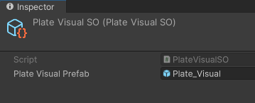

```csharp
using UnityEngine;

[CreateAssetMenu(fileName = "PlateVisualSO", menuName = "ScriptableObjects/PlateVisualSO", order = 1)]
public class PlateVisualSO : ScriptableObject {
    public GameObject plateVisualPrefab;
}
```

##### c:修改脚本`PlatesCounterVisual.cs`

如果遇到客户端无法同步跟服务端的盘子生成，这个问题根本原因在于netcode它自身的问题，而不是很直觉的认为

> 使用 `Transform` 进行 `Instantiate` 时，在多玩家网络环境中（尤其是客户端-服务器模型下），这个对象可能无法在客户端正确同步生成，导致客户端无法看到生成的物体。

如果我们要真正的解决这个问题，该怎么做？

为了避免这个问题，可以考虑使用 `ScriptableObject` (SO) 或通过网络对象引用的预制体（Prefab）来确保对象**在网络中**正确实例化并同步。

同时我们要**确保SO文件是真的能够同步于客户端与服务端**。

注意，是满足上述两个条件，缺一不可，因此解决的方案具体看`PlatesCounter`：

> 我的做法就是改动事件处理器，让其拥有参数传入有关于SO封装好的视觉模型Plate_visual。

为什么这样就可以了呢？

> 我也不知道为什么！！！我能想到的解释也许是因为PlatesCounter这类柜台都是继承了networkbehaviour，而我们之前生成盘子视觉模型都是默认在monobehaviour类下处理的，也就是`PlatesCounterVisual.cs`脚本，也许是因为这样才能让RTT不会延迟出问题。
>
> 具体错误原因看错误日志4.

我的另一个解决思路：是干脆把视觉模型也变成网络对象。

> 不够我觉得太麻烦了，而且也只是希望改变视觉效果

当然也许你想到了，`NetworkVariable`，但它是 (NGO) 中用来同步基础数据类型（如 `int`, `float`, `bool` 等）和一些 Unity 内置类型（如 `Vector3`, `Quaternion` 等）在客户端和服务器之间的一个工具。然而，`NetworkVariable` 不直接支持同步复杂类型，如 `ScriptableObject` 或用户自定义的类。

> rpc和NetworkVariable做法其实没太大区别。

如果要同步，也是同步id这种取巧的方式（**前面的很多同步数据的操作都是这种方式处理，比如`KitchenGameMultiplayer.cs`脚本**）获取到SO中相应的自定义数据，所以这个解决方式我就不用了。

```csharp
using System;
using System.Collections.Generic;
using Unity.Netcode;
using UnityEngine;

public class PlatesCounterVisual : MonoBehaviour
{
    [SerializeField] private PlatesCounter platesCounter;
    [SerializeField] private Transform counterTopPoint;

    private List<GameObject> plateVisualGameObjectList;

    private void Awake() {
        plateVisualGameObjectList = new List<GameObject>();
        
    }

    private void Start() {
        platesCounter.OnPlateSpawned += PlatesCounter_OnPlateSpawned;
        platesCounter.OnPlateRemoved += PlatesCounter_OnPlateRemoved;
    }

    private void PlatesCounter_OnPlateRemoved(object sender, EventArgs e) {
        //移除最后的碟子视觉
        GameObject plateGameObject = plateVisualGameObjectList[plateVisualGameObjectList.Count - 1];
        plateVisualGameObjectList.Remove(plateGameObject);
        Destroy(plateGameObject);
    }

    //我这里改动成了全局坐标，看需要自己修改
    private void PlatesCounter_OnPlateSpawned(object sender, PlatesCounter.OnPlateSpawnedPlateVisualEventArgs e) {
        GameObject plateVisualTransform = Instantiate(e.plateVisualSO.plateVisualPrefab);
        //Debug.Log("counterTopPoint" + gameObject.transform.position);
        
        float plateOffsetY = .1f;
        //Debug.Log("plate"+ plateVisualTransform);
        Vector3 plateVisualBornPoint = new Vector3(gameObject.transform.position.x,counterTopPoint.transform.position.y, gameObject.transform.position.z);
        plateVisualTransform.transform.position = new Vector3(0, plateOffsetY * plateVisualGameObjectList.Count, 0)+ plateVisualBornPoint;

        plateVisualGameObjectList.Add(plateVisualTransform.gameObject);
    }
    
    /*
    private void PlatesCounter_OnPlateSpawned(object sender, System.EventArgs e) {
        Transform plateVisualTransform = Instantiate(plateVisualPrefab, counterTopPoint);
        float plateOffsetY = .1f;
        plateVisualTransform.localPosition = new Vector3(0, plateOffsetY * plateVisualGameObjectList.Count, 0);

        plateVisualGameObjectList.Add(plateVisualTransform.gameObject);
    }
    */
}
```

#### [2]销毁网络对象

Debug：


##### a:修改脚本`KitchenObject.cs`

```csharp
using Unity.Netcode;
using UnityEngine;

public class KitchenObject : NetworkBehaviour
{
    //...省略

    //改动原销毁的方法
    public void DestroySelf() {
        Destroy(gameObject);
    }
    //将父类与厨房物品的关系清除并分割开原来的销毁方法
    public void ClearKitchenObjectOnParent() {
        kitchenObjectParent.ClearKitchenObject();
    }

    //独属于厨房物体的销毁方法
    public static void DestroyKitchenObject(KitchenObject kitchenObject) {
        KitchenGameMultiplayer.Instance.DestroyKitchenObject(kitchenObject);
    }
}
```

##### b:修改脚本`DeliveryCounter.cs`

```csharp
public class DeliveryCounter : BaseCounter
{
    public static DeliveryCounter Instance { get; private set; }

    private void Awake() {
        Instance = this;
    }

    public override void Interact(Player player) {
        if (player.HasKitchenObject()) {
            if(player.GetKitchenObject().TryGetPlate(out PlateKitchenObject plateKitchenObject)) {
                DeliveryManager.Instance.DeliverRecipe(plateKitchenObject);
                //player.GetKitchenObject().DestroySelf();
                KitchenObject.DestroyKitchenObject(player.GetKitchenObject());
            }
        }
    }
}
```

##### c:修改脚本`TrashCounter.cs`

```csharp
using System;
using Unity.Netcode;

public class TrashCounter : BaseCounter
{
    public static event EventHandler OnAnyObjectTrashed;

    new public static void ResetStaticData() {
        OnAnyObjectTrashed = null;
    }

    public override void Interact(Player player) {
        if (player.HasKitchenObject()) {
            //player.GetKitchenObject().DestroySelf();
            //改动原来的方法
            KitchenObject.DestroyKitchenObject(player.GetKitchenObject());

            InteractLogicServerRpc();
        }
    }
    //弄rpc，不过还要改动服务端销毁对象的方式。
    [ServerRpc(RequireOwnership = false)]
    private void InteractLogicServerRpc() {
        InteractLogicClientRpc();
    }
    [ClientRpc]
    private void InteractLogicClientRpc() {
        OnAnyObjectTrashed?.Invoke(this, EventArgs.Empty);
    }
}
```

##### d:修改脚本`KitchenGameMultiplayer.cs`

```csharp
using Unity.Netcode;
using UnityEngine;

public class KitchenGameMultiplayer : NetworkBehaviour
{
    //...省略

    //弄专门销毁网络对象的方式
    public void DestroyKitchenObject(KitchenObject kitchenObject) {
        DestroyKitchenObjectServerRpc(kitchenObject.NetworkObject);
    }

    [ServerRpc(RequireOwnership = false)]
    private void DestroyKitchenObjectServerRpc(NetworkObjectReference kitchenObjectNetworkObjectReference) {
        kitchenObjectNetworkObjectReference.TryGet(out NetworkObject kitchenObjectNetworkObject);
        KitchenObject kitchenObject = kitchenObjectNetworkObject.GetComponent<KitchenObject>();
        ClearKitchenObjectOnParentClientRpc(kitchenObjectNetworkObjectReference);
        kitchenObject.DestroySelf();
    }

    //要注意销毁厨房物品是一个方法，然后同步，这交给服务端处理
    //清除与父类也就是我们的player关系的也是一个方法/功能，所以同步，交给客户端处理
    [ClientRpc]
    private void ClearKitchenObjectOnParentClientRpc(NetworkObjectReference kitchenObjectNetworkObjectReference) {
        kitchenObjectNetworkObjectReference.TryGet(out NetworkObject kitchenObjectNetworkObject);
        KitchenObject kitchenObject = kitchenObjectNetworkObject.GetComponent<KitchenObject>();

        kitchenObject.ClearKitchenObjectOnParent();
    }
}
```

#### [3]同步切割柜台进度

Debug：

像切割涉及的操作就多了，比如玩家A切了一点，然后玩家B接手，或者玩家A切完，玩家B用同一个切割柜台，总之我们切割要穷尽两人会有什么组合操作，然后测试是否会出现问题。


##### a:修改脚本`CuttingCounter.cs`

```csharp
using System;
using Unity.Netcode;
using UnityEngine;
public class CuttingCounter : BaseCounter, IHasProgress {
    public static event EventHandler OnAnyCut;

    public event EventHandler OnCut;
    public event EventHandler<IHasProgress.OnProgressChangedEventArgs> OnProgressChanged;

    [SerializeField] private CuttingRecipeSO[] cuttingRecipeSOArray;

    private int cuttingProcess;

    //E键
    public override void Interact(Player player) {
        if (!HasKitchenObject()) {
            if (player.HasKitchenObject()) {
                if (HasRecipeWithInput(player.GetKitchenObject().GetKitchenObjectSO())) {
                    //这里改动一下
                    //原先单机情况因为涉及到父级改变，所以立即就清空掉了
                    //在联机情况下，不同player有可能会给不同柜台不同物品
                    //也可能是多个player同时操作一个柜台，这时候不应该纠结是不是这个父级对象的
                    //我们不要急着情况处理，而是保存好在柜台中唯一的物品kitchenObject。
                    KitchenObject kitchenObject = player.GetKitchenObject();
                    kitchenObject.SetKitchenObjectParent(this);
                    //这里调用，交给服务端重置切割进度数据
                    InteractLogicPlaceObjectOnCounterServerRpc();
                }
            }
            else {

            }
        }
        else {
            if (player.HasKitchenObject()) {
                if (player.GetKitchenObject().TryGetPlate(out PlateKitchenObject plateKitchenObject)) {
                    if (plateKitchenObject.TryAddIngredient(GetKitchenObject().GetKitchenObjectSO())) {
                        //GetKitchenObject().DestroySelf();
                        KitchenObject.DestroyKitchenObject(GetKitchenObject());
                    }
                }
            }
            else {
                GetKitchenObject().SetKitchenObjectParent(player);
            }
        }
    }

    //像同步进度数据，也一样通过rpc或者同步变量操作
    [ServerRpc(RequireOwnership = false)]
    private void InteractLogicPlaceObjectOnCounterServerRpc() {
        InteractLogicPlaceObjectOnCounterClientRpc();
    }
    
    [ClientRpc]
    private void InteractLogicPlaceObjectOnCounterClientRpc() {
        cuttingProcess = 0;
        //在客户端中同步初始化进度
        OnProgressChanged?.Invoke(this, new IHasProgress.OnProgressChangedEventArgs {
            progressNormalized = 0f
        });
    }

    //改动原来的切割交互逻辑成同步功能,F键
    public override void InteractAlternate(Player player) {
        if (HasKitchenObject() && HasRecipeWithInput(GetKitchenObject().GetKitchenObjectSO())) {
            //服务端和客户端都可以做的事情都是切割，切割的进度会一同发生改变，因为从头到尾都是一个玩家负责切割
            CutObjectServerRpc();
            //但是要注意销毁物品不可能是一同销毁的，只能交给服务端判处我们要情况物品此刻销毁，并且已经没有任何绑定的父级
            TestCuttingProgressDoneServerRpc();
        }
    }

    [ServerRpc(RequireOwnership = false)]
    private void CutObjectServerRpc() {
        CutObjectClientRpc();
    }

    [ClientRpc]
    private void CutObjectClientRpc() {
        cuttingProcess++;

        OnCut?.Invoke(this, EventArgs.Empty);
        OnAnyCut?.Invoke(this, EventArgs.Empty);
        CuttingRecipeSO cuttingRecipeSO = GetCuttingRecipeSOWithInput(GetKitchenObject().GetKitchenObjectSO());
        //在客户端中同步改变切割进度，根据交互的不同
        OnProgressChanged?.Invoke(this, new IHasProgress.OnProgressChangedEventArgs {
            progressNormalized = (float)cuttingProcess / cuttingRecipeSO.cuttingProgressMax
        });
    }

    //同时我们要知道客户端与服务端的区别，而不是简单把代码改到rpc下，搞镶嵌
    //涉及到一些关键的数据，不应该交给客户端处理，比如下面的删除逻辑，按理数据
    //存在于服务端中，销毁也应该是唯一，因为物体是唯一的。
    [ServerRpc(RequireOwnership = false)]
    private void TestCuttingProgressDoneServerRpc() {
        CuttingRecipeSO cuttingRecipeSO = GetCuttingRecipeSOWithInput(GetKitchenObject().GetKitchenObjectSO());
        if (cuttingProcess >= cuttingRecipeSO.cuttingProgressMax) {
            KitchenObjectSO outputKitchenObjectSO = GetOutputForInput(GetKitchenObject().GetKitchenObjectSO());

            //GetKitchenObject().DestroySelf();
            //要注意清除父类对象关系，并销毁对象，因为是联机环境
            KitchenObject.DestroyKitchenObject(GetKitchenObject());

            KitchenObject.SpawnKitchenObject(outputKitchenObjectSO, this);
        }
    }

    //...省略
}
```

#### [4]同步灶台的进度

Debug：注意都在同一个打包文件下搞，不要用unitydebug，看错误日志还有RTT问题后，整个人都不会好的。


##### a:修改脚本`StoveCounter.cs`

```csharp
using System;
using Unity.Netcode;
using UnityEngine;

public class StoveCounter : BaseCounter,IHasProgress
{
    public event EventHandler<IHasProgress.OnProgressChangedEventArgs> OnProgressChanged;
    public event EventHandler<OnStateChangedEventArgs> OnStateChanged;
    public class OnStateChangedEventArgs : EventArgs {
        public State state;
    }

    public enum State {
        Idle,
        Frying,
        Fried,
        Burned,
    }

    [SerializeField] private FryingRecipeSO[] fryingRecipeSOArray;
    [SerializeField] private BurningRecipeSO[] burningRecipeSOArray;

    //private State state;
    //枚举是可以序列化的
    private NetworkVariable<State> state = new NetworkVariable<State>(State.Idle);
    private FryingRecipeSO fryingRecipeSO;
    private BurningRecipeSO burningRecipeSO;
    //private float fryingTimer;
    //计时器应该交给服务端处理，而不能让客户端与服务端共有
    private NetworkVariable<float> fryingTimer = new NetworkVariable<float>(0f);
    //private float burningTimer;
    private NetworkVariable<float> burningTimer = new NetworkVariable<float>(0f);

    //然后就没必要在这里初始化了，因为网络同步变量已经做了默认初始化
    //private void Start() {
    //    state = State.Idle;
    //}

    //重载网络生成
    public override void OnNetworkSpawn() {
        //利用联网提供的事件，获取判断数值的前后变化
        fryingTimer.OnValueChanged += FryingTimer_OnValueChanged;
        burningTimer.OnValueChanged += BurningTimer_OnValueChanged;
        state.OnValueChanged += State_OnValueChanged;
    }

    private void State_OnValueChanged(State previousState, State newState) {
        OnStateChanged?.Invoke(this, new OnStateChangedEventArgs {
            state = state.Value,
        });

        if (state.Value == State.Burned || state.Value == State.Idle) {
            OnProgressChanged?.Invoke(this, new IHasProgress.OnProgressChangedEventArgs {
                progressNormalized = 0f,
            });
        }
    }

    //这种写法一般是涉及到fryingTimer和客户端必须要执行的操作
    private void FryingTimer_OnValueChanged(float previousValue,float newValue) {
        //fryingRecipeSO.fryingTimerMax为什么不用SO数据了，而是使用局部变量？
        //会不会就是因为SO有概率无法联网传递？
        float fryingTimerMax = fryingRecipeSO != null ? fryingRecipeSO.fryingTimerMax : 1f;

        OnProgressChanged?.Invoke(this, new IHasProgress.OnProgressChangedEventArgs {
            progressNormalized = fryingTimer.Value / fryingTimerMax,
        });
    }

    private void BurningTimer_OnValueChanged(float previousValue, float newValue) {
        float burningTimerMax = burningRecipeSO != null ? burningRecipeSO.burningTimerMax : 1f;

        OnProgressChanged?.Invoke(this, new IHasProgress.OnProgressChangedEventArgs {
            progressNormalized = burningTimer.Value / burningTimerMax,
        });
    }

    private void Update() {
        //杜绝客户端也执行下面的代码，因为涉及到状态切换/fryingTimer/burningTimer/销毁物品，这些属于同步变量，只能交给服务端处理
        //如果要穿插一些客户端的操作，只能通过clientrpc
        if (!IsServer) {
            return;
        }

        if (HasKitchenObject()) {
            switch (state.Value) {
                case State.Idle:
                    break;
                case State.Frying:
                    fryingTimer.Value += Time.deltaTime;

                    if (fryingTimer.Value > fryingRecipeSO.fryingTimerMax) {

                        //GetKitchenObject().DestroySelf();
                        KitchenObject.DestroyKitchenObject(GetKitchenObject());
                        
                        KitchenObject.SpawnKitchenObject(fryingRecipeSO.output, this);

                        state.Value = State.Fried;
                        burningTimer.Value = 0f;
                        //在这里调用客户端处理烤制肉的操作，通过SO切换预制体
                        SetBurningRecipeSOClientRpc(
                            KitchenGameMultiplayer.Instance.GetKitchenObjectSOIndex(GetKitchenObject().GetKitchenObjectSO())
                        );
                        //burningRecipeSO = GetBurningRecipeSOWithInput(GetKitchenObject().GetKitchenObjectSO());

                        //OnStateChanged?.Invoke(this, new OnStateChangedEventArgs {
                        //    state = state,
                        //});
                    }
                    break;
                case State.Fried:
                    burningTimer.Value += Time.deltaTime;

                    //这段处理已经交给BurningTimer_OnValueChanged
                    //OnProgressChanged?.Invoke(this, new IHasProgress.OnProgressChangedEventArgs {
                    //    progressNormalized = burningTimer.Value / burningRecipeSO.burningTimerMax,
                    //});

                    if (burningTimer.Value > burningRecipeSO.burningTimerMax) {
                        //GetKitchenObject().DestroySelf();
                        KitchenObject.DestroyKitchenObject(GetKitchenObject());
                        KitchenObject.SpawnKitchenObject(burningRecipeSO.output, this);

                        state.Value = State.Burned;

                        //OnStateChanged?.Invoke(this, new OnStateChangedEventArgs {
                        //    state = state,
                        //});

                        //之所以注释这个初始化传递，是因为要告诉客户端也要做，要留意是空闲情况+烤焦的时候，重置初始化
                        //OnProgressChanged?.Invoke(this, new IHasProgress.OnProgressChangedEventArgs {
                        //    progressNormalized = 0f,
                        //});
                    }
                    break;
                case State.Burned:
                    break;
            }
            
        }
    }

    //改动原来的交互操作，保存我们的厨房物品，而不是跟player做唯一绑定
    //交互我们虽然里面也涉及到了客户端才能有的操作，但是不做IsServer的限制，所以只能通过ServerRpc来同步有关于状态相关的变量。
    public override void Interact(Player player) {
        if (!HasKitchenObject()) {
            if (player.HasKitchenObject()) {
                if (HasRecipeWithInput(player.GetKitchenObject().GetKitchenObjectSO())) {
                    KitchenObject kitchenObject = player.GetKitchenObject();

                    kitchenObject.SetKitchenObjectParent(this);

                    InteractLogicPlaceObjectOnCounterServerRpc(
                        KitchenGameMultiplayer.Instance.GetKitchenObjectSOIndex(kitchenObject.GetKitchenObjectSO())
                    );

                }
            }
            else {

            }
        }
        else {
            if (player.HasKitchenObject()) {
                if (player.GetKitchenObject().TryGetPlate(out PlateKitchenObject plateKitchenObject)) {
                    if (plateKitchenObject.TryAddIngredient(GetKitchenObject().GetKitchenObjectSO())) {
                        //GetKitchenObject().DestroySelf();
                        KitchenObject.DestroyKitchenObject(GetKitchenObject());
                        //state.Value = State.Idle;
                        SetStateIdleServerRpc();
                        //OnStateChanged?.Invoke(this, new OnStateChangedEventArgs {
                        //    state = state,
                        //});

                        //因为已经交给联机事件处理了，所以这里交互的没必要重复交互给客户端
                        //OnProgressChanged?.Invoke(this, new IHasProgress.OnProgressChangedEventArgs {
                        //    progressNormalized = 0f,
                        //});
                    }
                }
            }
            else {
                GetKitchenObject().SetKitchenObjectParent(player);

                //state.Value = State.Idle;
                SetStateIdleServerRpc();

                //OnStateChanged?.Invoke(this, new OnStateChangedEventArgs {
                //    state = state,
                //});

                //OnProgressChanged?.Invoke(this, new IHasProgress.OnProgressChangedEventArgs {
                //    progressNormalized = 0f,
                //});
            }
        }
    }
    [ServerRpc(RequireOwnership = false)]
    private void SetStateIdleServerRpc() {
        state.Value = State.Idle;
    }

    //处理rpc逻辑
    [ServerRpc(RequireOwnership = false)]
    private void InteractLogicPlaceObjectOnCounterServerRpc(int kitchenObjectSOIndex) {
        fryingTimer.Value = 0f;//在服务端中重置计时器，而不要交给客户端处理
        state.Value = State.Frying;//同样的，涉及到网络变量的修改，也只能交给服务端
        SetFryingRecipeSOClientRpc(kitchenObjectSOIndex);
    }
    [ClientRpc]
    private void SetFryingRecipeSOClientRpc(int kitchenObjectSOIndex) {
        KitchenObjectSO kitchenObjectSO = KitchenGameMultiplayer.Instance.GetKitchenObjectSOFromIndex(kitchenObjectSOIndex);
        
        fryingRecipeSO = GetFryingRecipeSOWithInput(kitchenObjectSO);

        //OnStateChanged?.Invoke(this, new OnStateChangedEventArgs {
        //    state = state,
        //});

        //因为已经写了有关于计时器前后变化的联网事件，所以客户端这里没必要重复写了
        //OnProgressChanged?.Invoke(this, new IHasProgress.OnProgressChangedEventArgs {
        //    progressNormalized = fryingTimer.Value / fryingRecipeSO.fryingTimerMax,
        //});
    }
    [ClientRpc]
    private void SetBurningRecipeSOClientRpc(int kitchenObjectSOIndex) {
        KitchenObjectSO kitchenObjectSO = KitchenGameMultiplayer.Instance.GetKitchenObjectSOFromIndex(kitchenObjectSOIndex);

        burningRecipeSO = GetBurningRecipeSOWithInput(kitchenObjectSO);
    }

    private bool HasRecipeWithInput(KitchenObjectSO inputKitchenObjectSO) {
        FryingRecipeSO fryingRecipeSO = GetFryingRecipeSOWithInput(inputKitchenObjectSO);
        return fryingRecipeSO != null;
    }

    private KitchenObjectSO GetOutputForInput(KitchenObjectSO inputKitchenObjectSO) {
        FryingRecipeSO fryingRecipeSO = GetFryingRecipeSOWithInput(inputKitchenObjectSO);
        if (fryingRecipeSO != null) {
            return fryingRecipeSO.output;
        }
        else {
            return null;
        }
    }

    private FryingRecipeSO GetFryingRecipeSOWithInput(KitchenObjectSO inputKitchenObjectSO) {
        foreach (FryingRecipeSO fryingRecipeSO in fryingRecipeSOArray) {
            if (fryingRecipeSO.input == inputKitchenObjectSO) {
                return fryingRecipeSO;
            }
        }
        return null;
    }

    private BurningRecipeSO GetBurningRecipeSOWithInput(KitchenObjectSO inputKitchenObjectSO) {
        foreach (BurningRecipeSO burningRecipeSO in burningRecipeSOArray) {
            if (burningRecipeSO.input == inputKitchenObjectSO) {
                return burningRecipeSO;
            }
        }
        return null;
    }

    public bool IsFried() {
        return state.Value == State.Fried;
    }
}
```

#### [5]同步碟中配菜

现在客户端拿取碟子不会有问题，碟子中放入经过处理的食物也没问题，放到柜台中也不会有问题。

##### a:修改脚本`PlateKitchenObject.cs`

```csharp
using System;
using System.Collections.Generic;
using Unity.Netcode;
using UnityEngine;

public class PlateKitchenObject : KitchenObject {
    public event EventHandler<OnIngredientAddedEventArgs> OnIngredientAdded;
    public class OnIngredientAddedEventArgs : EventArgs {
        public KitchenObjectSO kitchenObjectSO;
    }

    [SerializeField] private List<KitchenObjectSO> validKitchenObjectSOList;

    private List<KitchenObjectSO> kitchenObjectSOList;

    protected override void Awake() {
        base.Awake();
        kitchenObjectSOList = new List<KitchenObjectSO>();
    }

    public bool TryAddIngredient(KitchenObjectSO kitchenObjectSO) {
        if (!validKitchenObjectSOList.Contains(kitchenObjectSO)) {
            return false;
        }

        if (kitchenObjectSOList.Contains(kitchenObjectSO)) {
            return false;
        }
        else {
            //中转
            AddIngredientServerRpc(
                KitchenGameMultiplayer.Instance.GetKitchenObjectSOIndex(kitchenObjectSO)
            );
            return true;
        }
    }
    //改动
    [ServerRpc(RequireOwnership = false)]
    private void AddIngredientServerRpc(int kitchenObjectSOIndex) {
        AddIngredientClientRpc(kitchenObjectSOIndex);
    }
    [ClientRpc]
    private void AddIngredientClientRpc(int kitchenObjectSOIndex) {
        KitchenObjectSO kitchenObjectSO = KitchenGameMultiplayer.Instance.GetKitchenObjectSOFromIndex(kitchenObjectSOIndex);
        kitchenObjectSOList.Add(kitchenObjectSO);
        OnIngredientAdded?.Invoke(this, new OnIngredientAddedEventArgs {
            kitchenObjectSO = kitchenObjectSO
        });
    }

    public List<KitchenObjectSO> GetKitchenObjectSOList() {
        return kitchenObjectSOList;
    }
}
```

##### b:修改脚本`ClearCounter.cs`

改一下清除的操作，适应联机情况

```csharp
using UnityEngine;

public class ClearCounter : BaseCounter
{
    [SerializeField] private KitchenObjectSO kitchenObjectSO;
    public override void Interact(Player player) {
        if (!HasKitchenObject()) {          
            if (player.HasKitchenObject()) {
                player.GetKitchenObject().SetKitchenObjectParent(this);
            }
            else {

            }
        }
        else {
            if (player.HasKitchenObject()) {
                if(player.GetKitchenObject().TryGetPlate(out PlateKitchenObject plateKitchenObject)) {
                    if (plateKitchenObject.TryAddIngredient(GetKitchenObject().GetKitchenObjectSO())) {
                        //GetKitchenObject().DestroySelf();
                        KitchenObject.DestroyKitchenObject(GetKitchenObject());
                    }
                }
                else {
                    if (GetKitchenObject().TryGetPlate(out plateKitchenObject)) {
                        if (plateKitchenObject.TryAddIngredient(player.GetKitchenObject().GetKitchenObjectSO())) {
                            //player.GetKitchenObject().DestroySelf();
                            KitchenObject.DestroyKitchenObject(player.GetKitchenObject());
                        }
                    }
                }
            }
            else {
                GetKitchenObject().SetKitchenObjectParent(player);
            }
        }
    }
}
```


#### [6]总结

联网测试的时候，不要只用unity引擎debug，还要试一下两个本地端打包的游戏，这样可以把痛苦减少一些，起码不用见那个sb的RTT延迟导致的一系列无法同步的问题，从而怀疑自己，有时候也许真不是自己的问题。

联网rpc标注的函数传递自定义变量数据，比如SO，建议用ID转换，其中SO的传递有可能为空，要注意如果封装的是一些对象用得上的数值，需要自己额外打补丁判断。

rpc的使用不是简单改动封装原来的实现功能，时刻需要留意区分的操作是应该交给客户端还是服务端。

举例，一个更新函数中涉及到比较多的联网同步变量，首先要判断通过`IsServer`限定服务端使用这个函数当中的操作，如果涉及到非常多的同步变量，需要保证只能给服务端控制，这就建议用networkvariable，处理比较方便，而且OnValueChanged挺好用的，可以极大缩减原来单机写的事件处理变量名通过invoke调用操作。

什么是应该交给服务端处理的变量操作？比如枚举的状态变化、计时器、涉及到增删改查的变量数值、销毁对象、解绑父级对象等

当然实际情况都是你中有我，我中有你，客户端与服务端的操作都混在同一个函数中，继续以更新函数的例子。

举例，比如当前一个生肉变成熟肉，那么状态变量要传递给服务端更新，而客户端要做的就是及时改变生肉模型为熟肉模型。

什么是相应的视觉效果？比如动画播放、改变模型文件这些。

总而言之，服务端负责管背后操作的数据，客户端负责处理前端中要改变的视觉效果，记住这点，后续把单机实现的功能改动成联网的都能得心应手。

### 005 改进

#### [1]同步玩家碰撞


##### a:修改脚本`Player.cs`


```csharp
using System;
using System.Collections.Generic;
using Unity.Netcode;
using UnityEngine;

public class Player : NetworkBehaviour, IKitchenObjectParent {
    public static Player LocalInstance { get; private set; }

    public static event EventHandler OnAnyPlayerSpawned;
    public static event EventHandler OnAnyPickedSomething;
    public static void ResetStaticData() {
        OnAnyPlayerSpawned = null;
    }

    public event EventHandler OnPickedSomething;

    public event EventHandler<OnSelectedCounterChangedEventArgs> OnSelectedCounterChanged;
    public class OnSelectedCounterChangedEventArgs : EventArgs {
        public BaseCounter selectedCounter;
    }

    [SerializeField] private float moveSpeed = 7f;
    [SerializeField] private LayerMask countersLayerMask;
    //实现碰撞层的掩码
    [SerializeField] private LayerMask collisionsLayerMask;
    [SerializeField] private Transform kitchenObjectHoldPoint;
    //增加生成的位置列表，避免默认出生的位置因为碰撞重合导致问题
    [SerializeField] private List<Vector3> spawnPositionList;

    private bool isWalking;
    private Vector3 lastInteractDir;
    private BaseCounter selectedCounter;
    private KitchenObject KitchenObject;

    public override void OnNetworkSpawn() {

        if (IsOwner) {
            LocalInstance = this;

        }
        countersLayerMask = LayerMask.GetMask("Counters");
        //根据列表与客户端的id来在不同位置生成player，不过要注意由于id不是连续的，断连会导致问题。
        transform.position = spawnPositionList[(int)OwnerClientId];
        OnAnyPlayerSpawned?.Invoke(this, EventArgs.Empty);
    }

    private void Start() {
        GameInput.Instance.OnInteractAction += GameInput_OnInteractAction;
        GameInput.Instance.OnInteractAlternateAction += GameInput_OnInteractAlternateAction;
    }

    private void GameInput_OnInteractAlternateAction(object sender, EventArgs e) {
        if (!KitchenGameManager.Instance.IsGamePlaying()) return;

        if (selectedCounter != null) {
            selectedCounter.InteractAlternate(this);
        }
    }

    private void GameInput_OnInteractAction(object sender, EventArgs e) {
        if (!KitchenGameManager.Instance.IsGamePlaying()) return;

        if (selectedCounter != null) {
            selectedCounter.Interact(this);
        }
    }

    private void Update() {
        if (!IsOwner) {
            return;
        }
        HandleMovement();
        HandleInteractions();
    }

    public bool IsWalking() {
        return isWalking;
    }


    private void HandleInteractions() {
        Vector2 inputVector = GameInput.Instance.GetMovementVectorNormalized();
        Vector3 moveDir = new Vector3(inputVector.x, 0f, inputVector.y);

        if (moveDir != Vector3.zero) {
            lastInteractDir = moveDir;
        }

        float interactDistance = 2f;

        if (Physics.Raycast(transform.position, lastInteractDir, out RaycastHit raycastHit, interactDistance, countersLayerMask)) {
            if (raycastHit.transform.TryGetComponent(out BaseCounter baseCounter)) {
                if (baseCounter != selectedCounter) {
                    SetSelectedCounter(baseCounter);
                }
            }
            else {
                SetSelectedCounter(null);
            }
        }
        else {
            SetSelectedCounter(null);
        }
    }

    private void HandleMovement() {
        Vector2 inputVector = GameInput.Instance.GetMovementVectorNormalized();
        Vector3 moveDir = new Vector3(inputVector.x, 0, inputVector.y);
        float playerRadius = .7f;
        float playerHeight = 2f;
        float moveDistance = moveSpeed * Time.deltaTime;
        //改动
        //bool canMove = !Physics.CapsuleCast(transform.position, transform.position + Vector3.up * playerHeight, playerRadius, moveDir, moveDistance, collisionsLayerMask);
        //为了避免boxcollider的方形边角处，玩家卡住，那么就改动原来的射线检测适配方形碰撞体。
        bool canMove = !Physics.BoxCast(transform.position,Vector3.one * playerRadius, moveDir,Quaternion.identity, moveDistance, collisionsLayerMask);
        if (!canMove) {
            Vector3 moveDirX = new Vector3(moveDir.x, 0, 0).normalized;

            //改动
            //canMove = (moveDir.x < -.5f || moveDir.x > +.5f) && !Physics.CapsuleCast(transform.position, transform.position + Vector3.up * playerHeight, playerRadius, moveDirX, moveDistance, collisionsLayerMask);
            canMove = (moveDir.x < -.5f || moveDir.x > +.5f) && !Physics.BoxCast(transform.position, Vector3.one * playerRadius, moveDirX, Quaternion.identity, moveDistance, collisionsLayerMask);
            if (canMove) {
                moveDir = moveDirX;
            }
            else {
                Vector3 moveDirZ = new Vector3(0, 0, moveDir.z).normalized;
                //改动
                //canMove = (moveDir.z < -.5f || moveDir.z > +.5f) && !Physics.CapsuleCast(transform.position, transform.position + Vector3.up * playerHeight, playerRadius, moveDirZ, moveDistance, collisionsLayerMask);
                canMove = (moveDir.z < -.5f || moveDir.z > +.5f) && !Physics.BoxCast(transform.position, Vector3.one * playerRadius, moveDirZ, Quaternion.identity, moveDistance, collisionsLayerMask);
                if (canMove) {
                    moveDir = moveDirZ;
                }
                else {
                }
            }
        }

        if (canMove) {
            transform.position += moveDir * moveDistance;
        }

        isWalking = moveDir != Vector3.zero;
        float rotateSpeed = 10f;
        transform.forward = Vector3.Slerp(transform.forward, moveDir, Time.deltaTime * rotateSpeed);
    }

    private void SetSelectedCounter(BaseCounter selectedCounter) {
        this.selectedCounter = selectedCounter;

        OnSelectedCounterChanged?.Invoke(this, new OnSelectedCounterChangedEventArgs {
            selectedCounter = selectedCounter,
        });
    }

    public Transform GetKitchenObjectFollowTransform() {
        return kitchenObjectHoldPoint;
    }

    public void SetKitchenObject(KitchenObject kitchenObject) {
        this.KitchenObject = kitchenObject;

        if (kitchenObject != null) {
            OnPickedSomething?.Invoke(this, EventArgs.Empty);
            OnAnyPickedSomething?.Invoke(this, EventArgs.Empty);
        }
    }

    public KitchenObject GetKitchenObject() {
        return KitchenObject;
    }

    public void ClearKitchenObject() {
        KitchenObject = null;
    }

    public bool HasKitchenObject() {
        return KitchenObject != null;
    }

    public NetworkObject GetNetworkObject() {
        return NetworkObject;
    }
}
```

#### [2]同步状态

玩家进入同时进入倒计时，然后加入到房间。


最后都同步结束


##### a:修改脚本`KitchenGameManager.cs`


```csharp
using System;
using System.Collections.Generic;
using Unity.Netcode;
using UnityEngine;

//改动继承
public class KitchenGameManager : NetworkBehaviour
{
    public static KitchenGameManager Instance { get; private set; }

    private enum State {
        WaitingToStart,
        CountdownToStart,
        GamePlaying,
        GameOver,
    }

    public event EventHandler OnStateChanged;
    public event EventHandler OnGamePaused;
    public event EventHandler OnGameUnpaused;
    //再利用事件处理重新封装多一次从教程->游戏开始的操作
    public event EventHandler OnLocalPlayerReadyChanged;

    //private State state;
    //不通过Rpc来告诉客户端改变状态，而是通过网络变量更好
    private NetworkVariable<State> state = new NetworkVariable<State>(State.WaitingToStart);
    //弄个布尔变量，去判断本地玩家是否可以从教程->游戏开始
    private bool isLocalPlayerReady;
    //弄个字典存放player的uid，因为存在一些玩家加入然后断连的情况
    private Dictionary<ulong, bool> playerReadyDictionary;
    //private float countdownToStartTimer = 3f;
    //private float gamePlayingTimer;
    //因为update的更改，客户端是不会同步计时的，所以要通过网络变量来更新
    private NetworkVariable<float> countdownToStartTimer = new NetworkVariable<float>(3f);
    private NetworkVariable<float> gamePlayingTimer= new NetworkVariable<float>(0f);
    private float gamePlayingTimerMax = 300f;
    private bool isGamePaused = false;

    private void Awake() {
        Instance = this;
        //state = State.WaitingToStart;
        //初始化字典
        playerReadyDictionary = new Dictionary<ulong, bool>();
    }

    private void Start() {
        GameInput.Instance.OnPauseAction += GameInput_OnPauseAction;
        GameInput.Instance.OnInteractAction += GameInput_OnInteractAction;
        //state = State.CountdownToStart;
        //OnStateChanged?.Invoke(this, EventArgs.Empty);
    }

    //因为我们把状态变成网络变量了，所以直接利用联网事件处理更方便
    public override void OnNetworkSpawn() {
        state.OnValueChanged += State_OnValueChanged;
    }

    private void State_OnValueChanged(State previousValue, State newValue) {
        OnStateChanged?.Invoke(this, EventArgs.Empty);
    }

    private void GameInput_OnInteractAction(object sender, EventArgs e) {
        if(state.Value == State.WaitingToStart) {
            //state = State.CountdownToStart;
            //OnStateChanged?.Invoke(this, EventArgs.Empty);
            isLocalPlayerReady = true;
            OnLocalPlayerReadyChanged?.Invoke(this, EventArgs.Empty);
            
            //最后再传这个布尔启动所有玩家加入到游戏房间中
            SetPlayerReadyServerRpc();
        }
    }

    //要注意不是本地传客户端id，而是通过服务端默认的参数接受客户端id
    //避免黑客篡改
    [ServerRpc(RequireOwnership = false)]
    private void SetPlayerReadyServerRpc(ServerRpcParams serverRpcParams =default) {
        //现在指定特定id是启用了
        playerReadyDictionary[serverRpcParams.Receive.SenderClientId] = true;
        //弄个布尔值，表示全部玩家是否准备好
        bool allClientsReady = true;
        foreach(ulong clientId in NetworkManager.Singleton.ConnectedClientsIds) {
            if(!playerReadyDictionary.ContainsKey(clientId) || !playerReadyDictionary[clientId]) {
                //这个玩家还没可以
                allClientsReady = false;
                break;
            }
        }

        //最后状态变化如果可以，那么就切换到计数状态倒计时
        if (allClientsReady) {
            state.Value = State.CountdownToStart;
        }

        //debug
        Debug.Log("All Clients Ready："+ allClientsReady);
    }

    private void GameInput_OnPauseAction(object sender, EventArgs e) {
        TogglePauseGame();
    }

    public void TogglePauseGame() {
        isGamePaused = !isGamePaused;
        if (isGamePaused) {
            Time.timeScale = 0f;
            OnGamePaused?.Invoke(this, EventArgs.Empty);
        }
        else {
            Time.timeScale = 1f;
            OnGameUnpaused?.Invoke(this, EventArgs.Empty);
        }

    }

    private void Update() {
        //要让状态更新跟服务端强绑定
        if (!IsServer) {
            return;
        }
        switch (state.Value) {
            case State.WaitingToStart:
                break;
            case State.CountdownToStart:
                countdownToStartTimer.Value -= Time.deltaTime;
                if(countdownToStartTimer.Value < 0f) {
                    state.Value = State.GamePlaying;
                    gamePlayingTimer.Value = gamePlayingTimerMax;
                    //OnStateChanged?.Invoke(this, EventArgs.Empty);
                }
                break;
            case State.GamePlaying:
                gamePlayingTimer.Value -= Time.deltaTime;
                if(gamePlayingTimer.Value < 0f) {
                    state.Value = State.GameOver;
                    //OnStateChanged?.Invoke(this, EventArgs.Empty);
                }
                break;
            case State.GameOver:
                break;
        }
    }

    public bool IsGamePlaying() {
        return state.Value == State.GamePlaying;
    }

    public bool IsCountdownToStartActive() {
        return state.Value == State.CountdownToStart;
    }

    public bool IsGameOver() {
        return state.Value == State.GameOver;
    }

    //新建布尔函数
    public bool IsLocalPlayerReady() {
        return isLocalPlayerReady;
    }

    public float GetCountdownToStartTimer() {
        return countdownToStartTimer.Value;
    }

    public float GetGamePlayingTimerNormalized() {
        return 1-(gamePlayingTimer.Value / gamePlayingTimerMax);
    }
}
```

##### b:修改脚本`TutorialUI.cs`

```csharp
using System;
using TMPro;
using UnityEngine;

class TutorialUI : MonoBehaviour {
    [SerializeField] private TextMeshProUGUI keyMoveUpText;
    [SerializeField] private TextMeshProUGUI keyMoveDownText;
    [SerializeField] private TextMeshProUGUI keyMoveLeftText;
    [SerializeField] private TextMeshProUGUI keyMoveRightText;
    [SerializeField] private TextMeshProUGUI keyInteractText;
    [SerializeField] private TextMeshProUGUI keyInteractAlternateText;
    [SerializeField] private TextMeshProUGUI keyPauseText;
    [SerializeField] private TextMeshProUGUI keyGamepadInteractText;
    [SerializeField] private TextMeshProUGUI keyGamepadInteractAlternateText;
    [SerializeField] private TextMeshProUGUI keyGamepadPauseText;

    private void Start() {
        GameInput.Instance.OnBindingRebind += GameInput_OnBindingRebind;
        KitchenGameManager.Instance.OnStateChanged += KitchenGameManager_OnStateChanged;
        //开始的时候就添加这个事件函数
        KitchenGameManager.Instance.OnLocalPlayerReadyChanged += KitchenGameManager_OnLocalPlayerReadyChanged;


        UpdateVisual();

        Show();
    }

    private void KitchenGameManager_OnLocalPlayerReadyChanged(object sender, EventArgs e) {
        if (KitchenGameManager.Instance.IsLocalPlayerReady()) {
            Hide();//如果确定某个本地玩家已经开始游戏了，就隐藏掉这个教程UI。
        }
    }

    private void KitchenGameManager_OnStateChanged(object sender, EventArgs e) {
        if (KitchenGameManager.Instance.IsCountdownToStartActive()) {
            Hide();
        }
    }

    private void GameInput_OnBindingRebind(object sender, System.EventArgs e) {
        UpdateVisual();
    }

    private void UpdateVisual() {
        keyMoveUpText.text = GameInput.Instance.GetBindingText(GameInput.Binding.Move_Up);
        keyMoveDownText.text = GameInput.Instance.GetBindingText(GameInput.Binding.Move_Down);
        keyMoveLeftText.text = GameInput.Instance.GetBindingText(GameInput.Binding.Move_Left);
        keyMoveRightText.text = GameInput.Instance.GetBindingText(GameInput.Binding.Move_Right);
        keyInteractText.text = GameInput.Instance.GetBindingText(GameInput.Binding.Interact);
        keyInteractAlternateText.text = GameInput.Instance.GetBindingText(GameInput.Binding.InteractAlternate);
        keyPauseText.text = GameInput.Instance.GetBindingText(GameInput.Binding.Pause);
        keyGamepadInteractText.text = GameInput.Instance.GetBindingText(GameInput.Binding.Gamepad_Interact);
        keyGamepadInteractAlternateText.text = GameInput.Instance.GetBindingText(GameInput.Binding.Gamepad_InteractAlternate);
        keyGamepadPauseText.text = GameInput.Instance.GetBindingText(GameInput.Binding.Gamepad_Pause);
    }

    private void Show() {
        gameObject.SetActive(true);
    }

    private void Hide() {
        gameObject.SetActive(false);
    }
}
```

##### c:新建脚本`WaitingForOtherPlayersUI.cs`

不要忘记启用TutorialUI游戏对象


```csharp
using System;
using UnityEngine;

public class WaitingForOtherPlayersUI : MonoBehaviour
{
    private void Start() {
        //添加事件
        KitchenGameManager.Instance.OnLocalPlayerReadyChanged += KitchenGameManager_OnLocalPlayerReadyChanged;
        KitchenGameManager.Instance.OnStateChanged += KitchenGameManager_OnStateChanged;
        //默认隐藏等待其他玩家的UI
        Hide();
    }

    private void KitchenGameManager_OnStateChanged(object sender, EventArgs e) {
        if (KitchenGameManager.Instance.IsCountdownToStartActive()) {
            Hide();
        }
    }

    private void KitchenGameManager_OnLocalPlayerReadyChanged(object sender, EventArgs e) {
        if (KitchenGameManager.Instance.IsLocalPlayerReady()) {
            Show();
        }
    }

    private void Show() {
        gameObject.SetActive(true);
    }

    private void Hide() {
        gameObject.SetActive(false);
    }
}
```

#### [3]同步暂停状态


##### a:修改脚本`KitchenGameManager.cs`

```csharp
using System;
using System.Collections.Generic;
using Unity.Netcode;
using UnityEngine;

public class KitchenGameManager : NetworkBehaviour
{
    public static KitchenGameManager Instance { get; private set; }

    private enum State {
        WaitingToStart,
        CountdownToStart,
        GamePlaying,
        GameOver,
    }

    public event EventHandler OnStateChanged;
    //重命名
    //public event EventHandler OnGamePaused;
    public event EventHandler OnLocalGamePaused;
    //public event EventHandler OnLocalGameUnpaused;
    public event EventHandler OnLocalGameUnpaused;

    public event EventHandler OnLocalPlayerReadyChanged;
    //弄个专门处理联机的暂停事件处理
    public event EventHandler OnMultiplayerGamePaused;
    public event EventHandler OnMultiplayerGameUnpaused;

    private NetworkVariable<State> state = new NetworkVariable<State>(State.WaitingToStart);
    private bool isLocalPlayerReady;
    private Dictionary<ulong, bool> playerReadyDictionary;
    private NetworkVariable<float> countdownToStartTimer = new NetworkVariable<float>(3f);
    private NetworkVariable<float> gamePlayingTimer= new NetworkVariable<float>(0f);
    private float gamePlayingTimerMax = 300f;
    //private bool isGamePaused = false;
    //重命名为isLocalGamePaused
    private bool isLocalGamePaused = false;
    //加个字典专门判断识别暂停哪个客户端的
    private Dictionary<ulong, bool> playerPausedDictionary;
    //接着加个网络变量，交给服务端判断是否统一暂停
    private NetworkVariable<bool> isGamePaused = new NetworkVariable<bool>(false);

    private void Awake() {
        Instance = this;
        playerReadyDictionary = new Dictionary<ulong, bool>();

        //初始化字典
        playerPausedDictionary = new Dictionary<ulong, bool>();
    }

    private void Start() {
        GameInput.Instance.OnPauseAction += GameInput_OnPauseAction;
        GameInput.Instance.OnInteractAction += GameInput_OnInteractAction;
    }

    public override void OnNetworkSpawn() {
        state.OnValueChanged += State_OnValueChanged;
        //交给联网事件处理
        isGamePaused.OnValueChanged += IsGamePaused_OnValueChanged;
    }

    private void IsGamePaused_OnValueChanged(bool previousValue, bool newValue) {
        if (isGamePaused.Value) {
            Time.timeScale = 0f;
            //调用事件
            OnMultiplayerGamePaused?.Invoke(this, EventArgs.Empty);
        }
        else {
            Time.timeScale = 1f;
            OnMultiplayerGameUnpaused?.Invoke(this, EventArgs.Empty);
        }
    }

    private void State_OnValueChanged(State previousValue, State newValue) {
        OnStateChanged?.Invoke(this, EventArgs.Empty);
    }

    private void GameInput_OnInteractAction(object sender, EventArgs e) {
        if(state.Value == State.WaitingToStart) {
            isLocalPlayerReady = true;
            OnLocalPlayerReadyChanged?.Invoke(this, EventArgs.Empty);
            
            SetPlayerReadyServerRpc();
        }
    }

    [ServerRpc(RequireOwnership = false)]
    private void SetPlayerReadyServerRpc(ServerRpcParams serverRpcParams =default) {
        playerReadyDictionary[serverRpcParams.Receive.SenderClientId] = true;
        bool allClientsReady = true;
        foreach(ulong clientId in NetworkManager.Singleton.ConnectedClientsIds) {
            if(!playerReadyDictionary.ContainsKey(clientId) || !playerReadyDictionary[clientId]) {
                allClientsReady = false;
                break;
            }
        }

        if (allClientsReady) {
            state.Value = State.CountdownToStart;
        }

        Debug.Log("All Clients Ready："+ allClientsReady);
    }

    private void GameInput_OnPauseAction(object sender, EventArgs e) {
        TogglePauseGame();
    }

    public void TogglePauseGame() {
        isLocalGamePaused = !isLocalGamePaused;
        if (isLocalGamePaused) {
            PauseGameServerRpc();
            //就是我们要根据自己的实际情况，看是否不让各自客户端自己可以修改时间流速暂停。
            //Time.timeScale = 0f;
            OnLocalGamePaused?.Invoke(this, EventArgs.Empty);
        }
        else {
            UnpauseGameServerRpc();
            //Time.timeScale = 1f;
            OnLocalGameUnpaused?.Invoke(this, EventArgs.Empty);
        }

    }

    //把暂停的功能交给服务端
    [ServerRpc(RequireOwnership = false)]
    private void PauseGameServerRpc(ServerRpcParams serverRpcParams = default) {
        playerPausedDictionary[serverRpcParams.Receive.SenderClientId] = true;
        TestGamePausedState();
    }

    [ServerRpc(RequireOwnership = false)]
    private void UnpauseGameServerRpc(ServerRpcParams serverRpcParams = default) {
        playerPausedDictionary[serverRpcParams.Receive.SenderClientId] = false;
        TestGamePausedState();
    }

    //加个函数，专门利用网络变量布尔判断
    private void TestGamePausedState() {
        foreach(ulong clientId in NetworkManager.Singleton.ConnectedClientsIds) {
            if(playerPausedDictionary.ContainsKey(clientId) && playerPausedDictionary[clientId]) {
                //这个玩家被暂停
                isGamePaused.Value = true;
                return;
            }
        }

        //所以玩家解除玩家暂停状态
        isGamePaused.Value = false;
    }

    private void Update() {
        if (!IsServer) {
            return;
        }
        switch (state.Value) {
            case State.WaitingToStart:
                break;
            case State.CountdownToStart:
                countdownToStartTimer.Value -= Time.deltaTime;
                if(countdownToStartTimer.Value < 0f) {
                    state.Value = State.GamePlaying;
                    gamePlayingTimer.Value = gamePlayingTimerMax;
                }
                break;
            case State.GamePlaying:
                gamePlayingTimer.Value -= Time.deltaTime;
                if(gamePlayingTimer.Value < 0f) {
                    state.Value = State.GameOver;
                }
                break;
            case State.GameOver:
                break;
        }
    }

    public bool IsGamePlaying() {
        return state.Value == State.GamePlaying;
    }

    public bool IsCountdownToStartActive() {
        return state.Value == State.CountdownToStart;
    }

    public bool IsGameOver() {
        return state.Value == State.GameOver;
    }

    public bool IsLocalPlayerReady() {
        return isLocalPlayerReady;
    }

    public float GetCountdownToStartTimer() {
        return countdownToStartTimer.Value;
    }

    public float GetGamePlayingTimerNormalized() {
        return 1-(gamePlayingTimer.Value / gamePlayingTimerMax);
    }
}
```

##### b:修改脚本`GamePauseUI.cs`

```csharp
using UnityEngine;
using UnityEngine.UI;

public class GamePauseUI : MonoBehaviour {
    [SerializeField] private Button resumeButton;
    [SerializeField] private Button mainMenuButton;
    [SerializeField] private Button optionsButton;

    private void Awake() {
        resumeButton.onClick.AddListener(() => {
            KitchenGameManager.Instance.TogglePauseGame();
        });
        mainMenuButton.onClick.AddListener(() => {
            Loader.Load(Loader.Scene.MainMenuScene);
        });

        optionsButton.onClick.AddListener(() => {
            Hide();
            OptionsUI.Instance.Show(Show);
        });
    }
    //改个事件函数名称
    private void Start() {
        KitchenGameManager.Instance.OnLocalGamePaused += KitchenGameManager_OnLocalGamePaused;
        KitchenGameManager.Instance.OnLocalGameUnpaused += KitchenGameManager_OnLocalGameUnpaused;
        Hide();
    }

    private void KitchenGameManager_OnLocalGameUnpaused(object sender, System.EventArgs e) {
        Hide();
    }

    private void KitchenGameManager_OnLocalGamePaused(object sender, System.EventArgs e) {
        Show();
    }

    private void Show() {
        gameObject.SetActive(true);
        resumeButton.Select();
    }
    private void Hide() {
        gameObject.SetActive(false);
    }
}
```

##### c:新建脚本`PauseMultiplayerUI.cs`


```csharp
using System;
using UnityEngine;

public class PauseMultiplayerUI : MonoBehaviour
{
    private void Start() {
        KitchenGameManager.Instance.OnMultiplayerGamePaused += KitchenGameManager_OnMultiplayerGamePaused;
        KitchenGameManager.Instance.OnMultiplayerGameUnpaused += KitchenGameManager_OnMultiplayerGameUnpaused;
        Hide();
    }

    private void KitchenGameManager_OnMultiplayerGameUnpaused(object sender, EventArgs e) {
        Hide();
    }

    private void KitchenGameManager_OnMultiplayerGamePaused(object sender, EventArgs e) {
        Show();
    }

    private void Show() {
        gameObject.SetActive(true);
    }

    private void Hide() {
        gameObject.SetActive(false);
    }
}
```

#### [4]处理断连

##### a:修改脚本`Player.cs`

问题1：

> 之前如果客户端玩家拿取物品的中途断连了，那么物体会悬空

```csharp
using System;
using System.Collections.Generic;
using Unity.Netcode;
using UnityEngine;

public class Player : NetworkBehaviour, IKitchenObjectParent {
    //...省略

    public override void OnNetworkSpawn() {

        if (IsOwner) {
            LocalInstance = this;

        }
        countersLayerMask = LayerMask.GetMask("Counters");
        transform.position = spawnPositionList[(int)OwnerClientId];
        OnAnyPlayerSpawned?.Invoke(this, EventArgs.Empty);

        //解决问题1：
        //做法就是专门交给服务端判断，利用联网自带的事件，专门处理客户端断连的情况
        if (IsServer) {
            NetworkManager.Singleton.OnClientDisconnectCallback += NetworkManager_OnClientDisconnectCallback;
        }
    }

    private void NetworkManager_OnClientDisconnectCallback(ulong clientId) {
        //专门判断如果是客户端，然后它手上有厨房物品
        if(clientId == OwnerClientId && HasKitchenObject()) {
            //就利用之前封装好的方法，销毁掉厨房物品（联机）
            KitchenObject.DestroyKitchenObject(GetKitchenObject());
        }
    }
}
```

##### b:修改脚本`KitchenGameManager.cs`

问题2：

> 之前如果让客户端主导暂停操作后，中途断连，就会让其他端卡住

其实这说不上是个问题，是之前对暂停操作的一种故意操作，我们联网情况下遍历所有获得的客户端id，然后利用`TestGamePausedState`函数对bool变量修改实现暂停，现在希望改动一下变成一个客户端暂停，然后断连，其他端可以恢复正常。

```csharp
using System;
using System.Collections.Generic;
using Unity.Netcode;
using UnityEngine;

public class KitchenGameManager : NetworkBehaviour
{
    public static KitchenGameManager Instance { get; private set; }

    private enum State {
        WaitingToStart,
        CountdownToStart,
        GamePlaying,
        GameOver,
    }

    public event EventHandler OnStateChanged;
    public event EventHandler OnLocalGamePaused;
    public event EventHandler OnLocalGameUnpaused;
    public event EventHandler OnLocalPlayerReadyChanged;
    public event EventHandler OnMultiplayerGamePaused;
    public event EventHandler OnMultiplayerGameUnpaused;

    private NetworkVariable<State> state = new NetworkVariable<State>(State.WaitingToStart);
    private bool isLocalPlayerReady;
    private Dictionary<ulong, bool> playerReadyDictionary;
    private NetworkVariable<float> countdownToStartTimer = new NetworkVariable<float>(3f);
    private NetworkVariable<float> gamePlayingTimer= new NetworkVariable<float>(0f);
    private float gamePlayingTimerMax = 300f;
    private bool isLocalGamePaused = false;
    private Dictionary<ulong, bool> playerPausedDictionary;
    private NetworkVariable<bool> isGamePaused = new NetworkVariable<bool>(false);
    //增加一个布尔值处理自动暂停然后解除的情况
    private bool autoTestGamePausedState;


    private void Awake() {
        Instance = this;
        playerReadyDictionary = new Dictionary<ulong, bool>();
        playerPausedDictionary = new Dictionary<ulong, bool>();
    }

    private void Start() {
        GameInput.Instance.OnPauseAction += GameInput_OnPauseAction;
        GameInput.Instance.OnInteractAction += GameInput_OnInteractAction;
    }

    public override void OnNetworkSpawn() {
        state.OnValueChanged += State_OnValueChanged;
        isGamePaused.OnValueChanged += IsGamePaused_OnValueChanged;

        //解决问题2：
        //依旧是相同的套路，不过这次要注意我们的客户端id会在更新状态中依旧存在
        //所以要过一帧后刷新存放客户端id的队列（不知道是不是）
        //也就是用lateupdate函数了，因此事件处理也利用布尔变量来作个标志。
        if (IsServer) {
            NetworkManager.Singleton.OnClientDisconnectCallback += NetworkManager_OnClientDisconnectCallback;
        }
    }
    //这里专门更新布尔值
    private void NetworkManager_OnClientDisconnectCallback(ulong clientId) {
        autoTestGamePausedState = true;
    }

    private void IsGamePaused_OnValueChanged(bool previousValue, bool newValue) {
        if (isGamePaused.Value) {
            Time.timeScale = 0f;
            OnMultiplayerGamePaused?.Invoke(this, EventArgs.Empty);
        }
        else {
            Time.timeScale = 1f;
            OnMultiplayerGameUnpaused?.Invoke(this, EventArgs.Empty);
        }
    }

    private void State_OnValueChanged(State previousValue, State newValue) {
        OnStateChanged?.Invoke(this, EventArgs.Empty);
    }

    private void GameInput_OnInteractAction(object sender, EventArgs e) {
        if(state.Value == State.WaitingToStart) {
            isLocalPlayerReady = true;
            OnLocalPlayerReadyChanged?.Invoke(this, EventArgs.Empty);
            
            SetPlayerReadyServerRpc();
        }
    }

    [ServerRpc(RequireOwnership = false)]
    private void SetPlayerReadyServerRpc(ServerRpcParams serverRpcParams =default) {
        playerReadyDictionary[serverRpcParams.Receive.SenderClientId] = true;
        bool allClientsReady = true;
        foreach(ulong clientId in NetworkManager.Singleton.ConnectedClientsIds) {
            if(!playerReadyDictionary.ContainsKey(clientId) || !playerReadyDictionary[clientId]) {
                allClientsReady = false;
                break;
            }
        }

        if (allClientsReady) {
            state.Value = State.CountdownToStart;
        }

        Debug.Log("All Clients Ready："+ allClientsReady);
    }

    private void GameInput_OnPauseAction(object sender, EventArgs e) {
        TogglePauseGame();
    }

    public void TogglePauseGame() {
        isLocalGamePaused = !isLocalGamePaused;
        if (isLocalGamePaused) {
            PauseGameServerRpc();
            OnLocalGamePaused?.Invoke(this, EventArgs.Empty);
        }
        else {
            UnpauseGameServerRpc();
            OnLocalGameUnpaused?.Invoke(this, EventArgs.Empty);
        }

    }

    [ServerRpc(RequireOwnership = false)]
    private void PauseGameServerRpc(ServerRpcParams serverRpcParams = default) {
        playerPausedDictionary[serverRpcParams.Receive.SenderClientId] = true;
        TestGamePausedState();
    }

    [ServerRpc(RequireOwnership = false)]
    private void UnpauseGameServerRpc(ServerRpcParams serverRpcParams = default) {
        playerPausedDictionary[serverRpcParams.Receive.SenderClientId] = false;
        TestGamePausedState();
    }

    private void TestGamePausedState() {
        foreach(ulong clientId in NetworkManager.Singleton.ConnectedClientsIds) {
            if(playerPausedDictionary.ContainsKey(clientId) && playerPausedDictionary[clientId]) {
                isGamePaused.Value = true;
                return;
            }
        }
        isGamePaused.Value = false;
    }

    private void Update() {
        if (!IsServer) {
            return;
        }
        switch (state.Value) {
            case State.WaitingToStart:
                break;
            case State.CountdownToStart:
                countdownToStartTimer.Value -= Time.deltaTime;
                if(countdownToStartTimer.Value < 0f) {
                    state.Value = State.GamePlaying;
                    gamePlayingTimer.Value = gamePlayingTimerMax;
                }
                break;
            case State.GamePlaying:
                gamePlayingTimer.Value -= Time.deltaTime;
                if(gamePlayingTimer.Value < 0f) {
                    state.Value = State.GameOver;
                }
                break;
            case State.GameOver:
                break;
        }
    }

    //这里利用布尔处理一帧过后的情况
    private void LateUpdate() {
        if (autoTestGamePausedState) {
            autoTestGamePausedState = false;
            //然后是否暂停判断
            TestGamePausedState();
        }
    }

    public bool IsGamePlaying() {
        return state.Value == State.GamePlaying;
    }

    public bool IsCountdownToStartActive() {
        return state.Value == State.CountdownToStart;
    }

    public bool IsGameOver() {
        return state.Value == State.GameOver;
    }

    public bool IsLocalPlayerReady() {
        return isLocalPlayerReady;
    }

    public float GetCountdownToStartTimer() {
        return countdownToStartTimer.Value;
    }

    public float GetGamePlayingTimerNormalized() {
        return 1-(gamePlayingTimer.Value / gamePlayingTimerMax);
    }
}
```

##### c:新建脚本`HostDisconnectUI.cs`

解决问题3：

> 如果服务端断连，会销毁所有的player对象，从而让游戏无法继续


```csharp
using Unity.Netcode;
using UnityEngine;
using UnityEngine.UI;

public class HostDisconnectUI : MonoBehaviour
{
    //暂时先不管重新进入游戏的情况
    [SerializeField] private Button playAgainButton;

    private void Awake() {
        
    }

    private void Start() {
        //交给联网处理断连情况
        NetworkManager.Singleton.OnClientDisconnectCallback += NetworkManager_OnClientDisconnectCallback;
        Hide();
    }

    private void NetworkManager_OnClientDisconnectCallback(ulong clientId) {
        //专门判断服务端的id，就解决问题3
        if(clientId == NetworkManager.ServerClientId) {
            Show();
        }
    }

    private void Show() {
        gameObject.SetActive(true);
    }

    private void Hide() {
        gameObject.SetActive(false);
    }
}
```

##### d:解决问题4

问题4：

> 如果只有一个玩家单机，或者是已经游戏结束了，就该让服务端断连，甚至其中一个返回到游戏开始界面也是算退出房间。

修改脚本`GamePauseUI.cs`

```csharp
using Unity.Netcode;
using UnityEngine;
using UnityEngine.UI;

public class GamePauseUI : MonoBehaviour {
    [SerializeField] private Button resumeButton;
    [SerializeField] private Button mainMenuButton;
    [SerializeField] private Button optionsButton;

    private void Awake() {
        resumeButton.onClick.AddListener(() => {
            KitchenGameManager.Instance.TogglePauseGame();
        });
        //解决问题4:补充断连操作
        mainMenuButton.onClick.AddListener(() => {
            NetworkManager.Singleton.Shutdown();
            Loader.Load(Loader.Scene.MainMenuScene);
        });

        optionsButton.onClick.AddListener(() => {
            Hide();
            OptionsUI.Instance.Show(Show);
        });
    }
    //改个事件函数名称
    private void Start() {
        KitchenGameManager.Instance.OnLocalGamePaused += KitchenGameManager_OnLocalGamePaused;
        KitchenGameManager.Instance.OnLocalGameUnpaused += KitchenGameManager_OnLocalGameUnpaused;
        Hide();
    }

    private void KitchenGameManager_OnLocalGameUnpaused(object sender, System.EventArgs e) {
        Hide();
    }

    private void KitchenGameManager_OnLocalGamePaused(object sender, System.EventArgs e) {
        Show();
    }

    private void Show() {
        gameObject.SetActive(true);
        resumeButton.Select();
    }
    private void Hide() {
        gameObject.SetActive(false);
    }
}
```

修改脚本`GameOverUI.cs`

```csharp
using System;
using TMPro;
using Unity.Netcode;
using UnityEngine;
using UnityEngine.UI;

public class GameOverUI : MonoBehaviour
{
    //注意补充相应的ui按钮，不要玩家引用
    [SerializeField] private Button playAgainButton;
    [SerializeField] private TextMeshProUGUI recipesDeliveredText;

    //补充这个函数
    private void Awake() {
        playAgainButton.onClick.AddListener(() => {
            NetworkManager.Singleton.Shutdown();
            Loader.Load(Loader.Scene.MainMenuScene);
        });
    }

    private void Start() {
        KitchenGameManager.Instance.OnStateChanged += KitchenGameManager_OnStateChanged;
        Hide();
    }

    private void KitchenGameManager_OnStateChanged(object sender, EventArgs e) {
        if (KitchenGameManager.Instance.IsGameOver()) {
            Show();
            recipesDeliveredText.text = DeliveryManager.Instance.GetSuccessfulRecipesAmount().ToString();
        }
        else {
            Hide();
        }
    }

    private void Show() {
        gameObject.SetActive(true);
    }

    private void Hide() {
        gameObject.SetActive(false);
    }
}
```

#### [5]处理延迟

处理数据不同步的有两个主要方法，即rpc和网络变量

两者之间的一个很大区别是，当客户端加入链接时，他们不会收到网络变量的当前状态，但他们现在会收到自游戏开始以来发送的所有rpc。

前面实际上很多的例子都是用rpc，因为它足够简单和易于实现，但是也带来了相应的处理延迟的问题。

比如延迟加入的客户端玩家，会出现盘子数量、菜谱数量对不上服务端，拿取物品的玩家有概率会出现没有同步父级对象的情况。

解决的方式可以很直接，netcode本身自带了相关事件供我们处理，像`NetworkManager.Singleton.OnClientConnectedCallback`，我们也可以选择把相关变量变成联网变量，而代码猴的处理方式就是让让服务端决定如果我们已经开始游戏了，那么就不该继续让玩家新加入，而这个审核的权力是由[连接审批 |Unity 多人游戏网络 (unity3d.com)](https://docs-multiplayer.unity3d.com/netcode/current/basics/connection-approval/)控制的。

##### a:修改脚本`KitchenGameMultiplayer.cs`

[连接审批 |Unity 多人游戏网络 (unity3d.com)](https://docs-multiplayer.unity3d.com/netcode/current/basics/connection-approval/)


所以不要漏了下面这一步操作，不然debug出问题。


```csharp
    //封装下面这两个方法
    public void StartHost() {
        //默认批准
        NetworkManager.Singleton.ConnectionApprovalCallback += NetworkManager_ConnectionApprovalCallback;
        NetworkManager.Singleton.StartHost();
    }

    private void NetworkManager_ConnectionApprovalCallback(NetworkManager.ConnectionApprovalRequest connectionApprovalRequest, NetworkManager.ConnectionApprovalResponse connectionApprovalResponse) {
        if (KitchenGameManager.Instance.IsWaitingToStart()) {
            connectionApprovalResponse.Approved = true;
            //避免先启动客户端后启动服务端没有生成玩家预制体问题
            connectionApprovalResponse.CreatePlayerObject = true;
        }
        else {
            connectionApprovalResponse.Approved = false;
        }
    }

    public void StartClient() {
        NetworkManager.Singleton.StartClient();
    }
```

##### b:修改脚本`TestingNetcodeUI.cs`

```csharp
using Unity.Netcode;
using UnityEngine;
using UnityEngine.UI;

public class TestingNetcodeUI : MonoBehaviour
{
    [SerializeField] private Button startHostButton;
    [SerializeField] private Button startClientButton;

    private void Awake() {
        startHostButton.onClick.AddListener(() => {
            Debug.Log("HOST");
            KitchenGameMultiplayer.Instance.StartHost();
            Hide();
        });

        startClientButton.onClick.AddListener(() => {
            Debug.Log("CLIENT");
            KitchenGameMultiplayer.Instance.StartClient();
            Hide();
        });
    }

    private void Hide() {
        gameObject.SetActive(false);
    }
}
```

##### c:修改脚本`KitchenGameManager.cs`

```csharp
    //返回相应的状态
    public bool IsWaitingToStart() {
        return state.Value == State.WaitingToStart;
    }
```

##### d:Debug

当我们开三个游戏窗口，只启用其中两个分别作为客户端与服务端。

正式进入游戏后，第三个游戏窗口再作为客户端加入到房间会提示断连不能加入房间，就表示debug成功了！

### 006 连接场景流程

#### [1]Lobby场景

##### a:UGUI


注意到GameScene中不需要`NetworkManager`和`KitchenGameMultiplayer`游戏对象，而是交给到LobbyScene中，另外要注意到检查器中NetworkManager取消对player预制体的引用，因为LobbyScene场景将作为连接大厅，所以不会立刻生成玩家预制体的。

还有一些注意事项：

> 我们的networkmanager默认启用场景管理，这将允许在连接时进行网络场景切换和自动场景差异校正，主要提供了下面的这个字段


最后构建


Debug测试:

> 确实能够从连接场景切换到角色选择场景中去，并且考虑的是联网情况的场景切换，而不是单机。


##### b:新建脚本`TestingLobbyUI.cs`

挂载到同名的游戏对象上

```csharp
using UnityEngine;
using UnityEngine.UI;

public class TestingLobbyUI : MonoBehaviour
{
    //不要忘记引用
    [SerializeField] private Button createGameButton;
    [SerializeField] private Button joinGameButton;

    private void Awake() {
        createGameButton.onClick.AddListener(() => {
            KitchenGameMultiplayer.Instance.StartHost();
            //Loader.Load(Loader.Scene.CharacterSelectScene);
            Loader.LoadNetwork(Loader.Scene.CharacterSelectScene);
        });
        joinGameButton.onClick.AddListener(() => {
            KitchenGameMultiplayer.Instance.StartClient();
        });
    }
}
```

##### c:修改脚本`Loader.cs`

```csharp
using Unity.Netcode;
using UnityEngine.SceneManagement;

public static class Loader {
    //补充对于名称的场景
    public enum Scene {
        MainMenuScene,
        GameScene,
        LoadingScene,
        LobbyScene,
        CharacterSelectScene,
    }

    public static Scene targetScene;
    //自己封装的方法
    public static void Load(Scene targetScene) {
        Loader.targetScene = targetScene;

        SceneManager.LoadScene(Scene.LoadingScene.ToString());
    }

    //因为联网，所以我们考虑联网可能带来的物体无法生成的问题
    //所以用联网提供的方法
    public static void LoadNetwork(Scene targetScene) {
        NetworkManager.Singleton.SceneManager.LoadScene(targetScene.ToString(),LoadSceneMode.Single);
    }

    public static void LoaderCallback() {
        SceneManager.LoadScene(targetScene.ToString());
    }
}
```

##### d:修改脚本`KitchenGameMultiplayer.cs`

```csharp
    private void Awake() {
        Instance = this;
        //加入这个避免加载新场景后销毁掉这个单例
        DontDestroyOnLoad(this);
    }

    private void NetworkManager_ConnectionApprovalCallback(NetworkManager.ConnectionApprovalRequest connectionApprovalRequest, NetworkManager.ConnectionApprovalResponse connectionApprovalResponse) {
        //if (KitchenGameManager.Instance.IsWaitingToStart()) {
        //    connectionApprovalResponse.Approved = true;
        //    connectionApprovalResponse.CreatePlayerObject = true;
        //}else {
        //    connectionApprovalResponse.Approved = false;
        //}
        //不需要再用处理延迟的特定做法
        connectionApprovalResponse.Approved = true;
    }


////.....
```


#### [2]CharacterSelectScene

##### a:UGUI

重新调整Lobby的层次结构

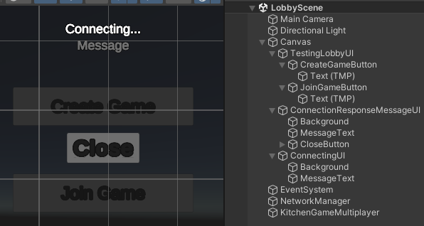

以让其适配切换场景到选择场景中（目前只是很简陋没搞）


最后由于切换场景的逻辑更改，所以原来的菜单联机做法就不合适了


##### b:新建脚本`TestingCharacterSelectUI.cs`


```csharp
using UnityEngine;
using UnityEngine.UI;

public class TestingCharacterSelectUI : MonoBehaviour
{
    [SerializeField] private Button readyButton;

    private void Awake() {
        readyButton.onClick.AddListener(() => {
            CharacterSelectReady.Instance.SetPlayerReady();
        });
    }
}
```

##### c:新建脚本`CharacterSelectReady.cs`


```csharp
using System.Collections.Generic;
using Unity.Netcode;
using UnityEngine;

public class CharacterSelectReady : NetworkBehaviour
{
    public static CharacterSelectReady Instance { get; private set; }

    private Dictionary<ulong, bool> playerReadyDictionary;

    private void Awake() {
        Instance = this;
        playerReadyDictionary = new Dictionary<ulong, bool>();
    }

    public void SetPlayerReady() {
        SetPlayerReadyServerRpc();
    }

    [ServerRpc(RequireOwnership = false)]
    private void SetPlayerReadyServerRpc(ServerRpcParams serverRpcParams = default) {
        playerReadyDictionary[serverRpcParams.Receive.SenderClientId] = true;
        bool allClientsReady = true;
        foreach (ulong clientId in NetworkManager.Singleton.ConnectedClientsIds) {
            if (!playerReadyDictionary.ContainsKey(clientId) || !playerReadyDictionary[clientId]) {
                allClientsReady = false;
                break;
            }
        }

        if (allClientsReady) {
            //state.Value = State.CountdownToStart;
            Loader.LoadNetwork(Loader.Scene.GameScene);
        }

        Debug.Log("All Clients Ready：" + allClientsReady);
    }
}
```

##### d:新建脚本`ConnectionResponseMessageUI.cs`


为了方便我们测试延迟情况，所以修改重连次数


```csharp
using System;
using TMPro;
using Unity.Netcode;
using UnityEngine;
using UnityEngine.UI;

public class ConnectionResponseMessageUI : MonoBehaviour
{
    [SerializeField] private TextMeshProUGUI messageText;
    [SerializeField] private Button closeButton;

    private void Awake() {
        closeButton.onClick.AddListener(Hide);
    }

    private void Start() {
        KitchenGameMultiplayer.Instance.OnFailedToJoinGame += KitchenGameMultiplayer_OnFailedToJoinGame;
        Hide();
    }

    private void KitchenGameMultiplayer_OnFailedToJoinGame(object sender, EventArgs e) {
        Show();

        messageText.text = NetworkManager.Singleton.DisconnectReason;

        //如果延迟没有加入是不会提示文本的，这里自己补充
        if(messageText.text == "") {
            messageText.text = "Failed to connect";
        }
    }

    private void Show() {
        gameObject.SetActive(true);
    }

    private void Hide() {
        gameObject.SetActive(false);
    }

    //取消订阅事件的情况，发生在我们发布者与订阅者生命周期不一致的情况
    //比如这里断连信息出现了，就该只在lobby场景中提示，而不该影响到其他场景，所以要销毁
    private void OnDestroy() {
        KitchenGameMultiplayer.Instance.OnFailedToJoinGame -= KitchenGameMultiplayer_OnFailedToJoinGame;
    }
}
```

##### e:新建脚本`ConnectingUI.cs`

```csharp
using System;
using UnityEngine;

public class ConnectingUI : MonoBehaviour
{
    private void Start() {
        KitchenGameMultiplayer.Instance.OnTryingToJoinGame += KitchenGameMultiplayer_OnTryingToJoinGame;
        KitchenGameMultiplayer.Instance.OnFailedToJoinGame += KitchenGameMultiplayer_OnFailedToJoinGame;
        Hide();
    }

    private void KitchenGameMultiplayer_OnFailedToJoinGame(object sender, EventArgs e) {
        Hide();
    }

    private void KitchenGameMultiplayer_OnTryingToJoinGame(object sender, EventArgs e) {
        Show();
    }

    private void Show() {
        gameObject.SetActive(true);
    }

    private void Hide() {
        gameObject.SetActive(false);
    }

    private void OnDestroy() {
        KitchenGameMultiplayer.Instance.OnTryingToJoinGame -= KitchenGameMultiplayer_OnTryingToJoinGame;
        KitchenGameMultiplayer.Instance.OnFailedToJoinGame -= KitchenGameMultiplayer_OnFailedToJoinGame;
    }
}
```

##### f:修改脚本`KitchenGameManager.cs`

注意加入引用


玩家预制体的生成逻辑也要发生一些改变


```csharp
using System;
using System.Collections.Generic;
using Unity.Netcode;
using UnityEngine;
using UnityEngine.SceneManagement;

public class KitchenGameManager : NetworkBehaviour
{
    //新增玩家预制体的引用
    [SerializeField] private Transform playerPrefab;

    public override void OnNetworkSpawn() {
        state.OnValueChanged += State_OnValueChanged;
        isGamePaused.OnValueChanged += IsGamePaused_OnValueChanged;
        if (IsServer) {
            NetworkManager.Singleton.OnClientDisconnectCallback += NetworkManager_OnClientDisconnectCallback;
            //补充相应的事件，获取所有的客户端
            NetworkManager.Singleton.SceneManager.OnLoadEventCompleted += SceneManager_OnLoadEventCompleted;
        }
    }
    //实现相应操作，因为之前我们不再默认在一个场景中借助玩家预制体生成玩家对象
    //而是通过遍历所有客户端，当我们进入到游戏中借助预制体列表中查找到玩家预制体。
    private void SceneManager_OnLoadEventCompleted(string sceneName, LoadSceneMode loadSceneMode, List<ulong> clientsCompleted, List<ulong> clientsTimedOut) {
        foreach(ulong clientId in NetworkManager.Singleton.ConnectedClientsIds) {
            Transform playerTransform = Instantiate(playerPrefab);
            playerTransform.GetComponent<NetworkObject>().SpawnAsPlayerObject(clientId, true);
        }
    }

    //....省略
}
```

##### g:修改脚本`KitchenGameMultiplayer.cs`

```csharp
using System;
using Unity.Netcode;
using UnityEngine;
using UnityEngine.SceneManagement;

public class KitchenGameMultiplayer : NetworkBehaviour
{
    //限定玩家总数
    private const int MAX_PLAYER_AMOUNT = 4;

    public static KitchenGameMultiplayer Instance { get; private set; }

    //弄事件
    public event EventHandler OnTryingToJoinGame;
    public event EventHandler OnFailedToJoinGame;

    [SerializeField] private KitchenObjectListSO kitchenObjectListSO;

    private void Awake() {
        Instance = this;
        DontDestroyOnLoad(this);
    }

    public void StartHost() {
        NetworkManager.Singleton.ConnectionApprovalCallback += NetworkManager_ConnectionApprovalCallback;
        NetworkManager.Singleton.StartHost();
    }

    private void NetworkManager_ConnectionApprovalCallback(NetworkManager.ConnectionApprovalRequest connectionApprovalRequest, NetworkManager.ConnectionApprovalResponse connectionApprovalResponse) {
        //再次更改
        if(SceneManager.GetActiveScene().name != Loader.Scene.CharacterSelectScene.ToString()) {
            connectionApprovalResponse.Approved = false;
            connectionApprovalResponse.Reason = "Game has already started";
            return;
        }

        if(NetworkManager.Singleton.ConnectedClientsIds.Count >= MAX_PLAYER_AMOUNT) {
            connectionApprovalResponse.Approved = false;
            connectionApprovalResponse.Reason = "Game is full";
            return;
        }
        connectionApprovalResponse.Approved = true;
    }

    public void StartClient() {
        //补充事件的调用
        OnTryingToJoinGame?.Invoke(this, EventArgs.Empty);

        //再专门处理断连的情况
        NetworkManager.Singleton.OnClientDisconnectCallback += NetworkManager_OnClientDisconnectCallback;
        NetworkManager.Singleton.StartClient();
    }

    private void NetworkManager_OnClientDisconnectCallback(ulong clientId) {
        //专门调用断连的问题
        OnFailedToJoinGame?.Invoke(this, EventArgs.Empty);
    }

    public void SpawnKitchenObject(KitchenObjectSO kitchenObjectSO, IKitchenObjectParent kitchenObjectParent) {
        SpawnKitchenObjectServerRpc(GetKitchenObjectSOIndex(kitchenObjectSO), kitchenObjectParent.GetNetworkObject());
    }

    [ServerRpc(RequireOwnership = false)]
    private void SpawnKitchenObjectServerRpc(int kitchenObjectSOIndex, NetworkObjectReference kitchenObjectParentNetworkObjectReference) {
        KitchenObjectSO kitchenObjectSO = GetKitchenObjectSOFromIndex(kitchenObjectSOIndex);


        Transform kitchenObjectTransform = Instantiate(kitchenObjectSO.prefab);

        NetworkObject kitchenObjectNetworkObject = kitchenObjectTransform.GetComponent<NetworkObject>();
        kitchenObjectNetworkObject.Spawn(true);

        KitchenObject kitchenObject = kitchenObjectTransform.GetComponent<KitchenObject>();

        kitchenObjectParentNetworkObjectReference.TryGet(out NetworkObject kitchenObjectParentNetworkObject);
        IKitchenObjectParent kitchenObjectParent = kitchenObjectParentNetworkObject.GetComponent<IKitchenObjectParent>();

        kitchenObject.SetKitchenObjectParent(kitchenObjectParent);
    }
    
    public int GetKitchenObjectSOIndex(KitchenObjectSO kitchenObjectSO) {
        return kitchenObjectListSO.kitchenObjectSOList.IndexOf(kitchenObjectSO);
    }

    public KitchenObjectSO GetKitchenObjectSOFromIndex(int kitchenObjectSOIndex) {
        return kitchenObjectListSO.kitchenObjectSOList[kitchenObjectSOIndex];
    }

    public void DestroyKitchenObject(KitchenObject kitchenObject) {
        DestroyKitchenObjectServerRpc(kitchenObject.NetworkObject);
    }

    [ServerRpc(RequireOwnership = false)]
    private void DestroyKitchenObjectServerRpc(NetworkObjectReference kitchenObjectNetworkObjectReference) {
        kitchenObjectNetworkObjectReference.TryGet(out NetworkObject kitchenObjectNetworkObject);
        KitchenObject kitchenObject = kitchenObjectNetworkObject.GetComponent<KitchenObject>();
        ClearKitchenObjectOnParentClientRpc(kitchenObjectNetworkObjectReference);
        kitchenObject.DestroySelf();
    }

    [ClientRpc]
    private void ClearKitchenObjectOnParentClientRpc(NetworkObjectReference kitchenObjectNetworkObjectReference) {
        kitchenObjectNetworkObjectReference.TryGet(out NetworkObject kitchenObjectNetworkObject);
        KitchenObject kitchenObject = kitchenObjectNetworkObject.GetComponent<KitchenObject>();

        kitchenObject.ClearKitchenObjectOnParent();
    }
}
```

##### h:Debug

1. 单个玩家加入房间，过段时间后就输出文本信息表示连接失败
2. 一个房主，3个加入，多出来的都提示房间已满！
3. 当三个玩家联机游戏开始，最后一个迟到没加入房间，就提示游戏开始了

#### [3]菜单场景

为了测试我们回到菜单栏中确实销毁一些不该有的单例，所以调整


##### a:新建脚本`MainMenuCleanUp.cs`

```csharp
using Unity.Netcode;
using UnityEngine;

public class MainMenuCleanUp : MonoBehaviour
{
    private void Awake() {
        if(NetworkManager.Singleton != null) {
            Destroy(NetworkManager.Singleton.gameObject);
        }

        if (KitchenGameMultiplayer.Instance != null) {
            Destroy(KitchenGameMultiplayer.Instance.gameObject);
        }
    }
}
```


##### b:修改脚本`MainMenuUI.cs`

```csharp
using UnityEngine;
using UnityEngine.UI;
public class MainMenuUI : MonoBehaviour {
    [SerializeField] private Button playButton;
    [SerializeField] private Button quitButton;

    private void Awake() {
        playButton.onClick.AddListener(() => {
            //Loader.Load(Loader.Scene.GameScene);
            //改动切换的场景
            Loader.Load(Loader.Scene.LobbyScene);
        });

        quitButton.onClick.AddListener(() => {
            Application.Quit();
        });

        Time.timeScale = 1f;
    }
}
```

### 007 角色选择场景

#### [1]重改界面

有多少个客户端就显示多少个数量


##### a:新建脚本`CharacterSelectUI.cs`


所以改动的界面如下：


这里要实现两个按钮，其中退回到菜单界面要做的就是清除掉网络管理器并切换场景，而准备按钮要做的就是调用`CharacterSelectReady`单例提供的`SetPlayerReady`方法。

这个方法干嘛的？

> 主要工作是通知服务器某个玩家已经准备好，服务器会更新状态并通知所有客户端。如果所有玩家都已经准备好，服务器会加载游戏场景。这个流程确保了在所有玩家都准备好之前不会开始游戏。

```csharp
using Unity.Netcode;
using UnityEngine;
using UnityEngine.UI;

public class CharacterSelectUI : MonoBehaviour
{
    [SerializeField] private Button mainMenuButton;
    [SerializeField] private Button readyButton;

    private void Awake() {
        mainMenuButton.onClick.AddListener(() => {
            NetworkManager.Singleton.Shutdown();
            Loader.Load(Loader.Scene.MainMenuScene);
        });

        readyButton.onClick.AddListener(() => {
            CharacterSelectReady.Instance.SetPlayerReady();
        });
    }
}
```

##### b:新建脚本`CharacterSelectPlayer.cs`

不要忘记绑定的预制体

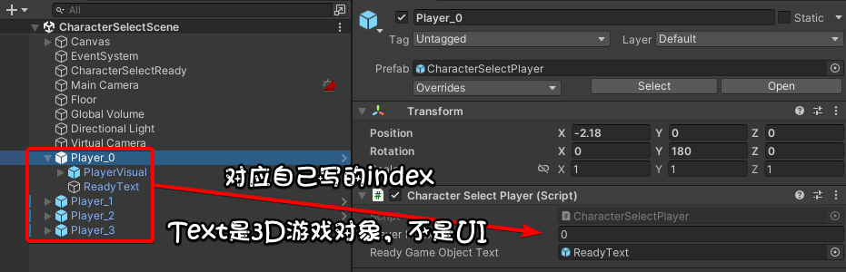

```csharp
using System;
using UnityEngine;

public class CharacterSelectPlayer : MonoBehaviour
{
    //这里专门修改玩家的索引到检查器中
    [SerializeField] private int playerIndex;
    [SerializeField] private GameObject readyGameObjectText;

    private void Start() {
        //无论玩家的准备状态或连接状态发生变化时，界面都会及时反映最新的状态。
        KitchenGameMultiplayer.Instance.OnPlayerDataNetworkListChanged += KitchenGameMultiplayer_OnPlayerDataNetworkListChanged;
        CharacterSelectReady.Instance.OnReadyChanged += CharacterSelectReady_OnReadyChanged;
        UpdatePlayer();//当玩家连接状态才显示玩家预制体
    }

    private void CharacterSelectReady_OnReadyChanged(object sender, EventArgs e) {
        UpdatePlayer();
    }

    private void KitchenGameMultiplayer_OnPlayerDataNetworkListChanged(object sender, EventArgs e) {
        UpdatePlayer();
    }

    private void UpdatePlayer() {
        //检查玩家是否连接
        if (KitchenGameMultiplayer.Instance.IsPlayerIndexConnected(playerIndex)) {
            Show();//显示玩家预制体
            //这里获取客户端id
            PlayerData playerData = KitchenGameMultiplayer.Instance.GetPlayerDataFromPlayerIndex(playerIndex);
            readyGameObjectText.SetActive(CharacterSelectReady.Instance.IsPlayerReady(playerData.clientId));
        }
        else {
            Hide();
        }
    }

    private void Show() {
        gameObject.SetActive(true);
    }

    private void Hide() {
        gameObject.SetActive(false);
    }
}
```

##### c:新建脚本`PlayerData.cs`

```csharp
//自定义数据
using System;
using Unity.Netcode;

public struct PlayerData:IEquatable<PlayerData>,INetworkSerializable
{
    public ulong clientId;

    public bool Equals(PlayerData other) {
        return clientId == other.clientId;
    }

    public void NetworkSerialize<T>(BufferSerializer<T> serializer) where T : IReaderWriter {
        serializer.SerializeValue(ref clientId);
    }
}
```

##### d:修改脚本`KitchenGameMultiplayer.cs`

```csharp
using System;
using Unity.Netcode;
using UnityEngine;
using UnityEngine.SceneManagement;

public class KitchenGameMultiplayer : NetworkBehaviour
{
    private const int MAX_PLAYER_AMOUNT = 4;

    public static KitchenGameMultiplayer Instance { get; private set; }

    public event EventHandler OnTryingToJoinGame;
    public event EventHandler OnFailedToJoinGame;
    //弄个专门的事件，处理玩家数据的联网列表修改
    public event EventHandler OnPlayerDataNetworkListChanged;

    [SerializeField] private KitchenObjectListSO kitchenObjectListSO;

    //网络列表存储我们自定义的结构体类型
    private NetworkList<PlayerData> playerDataNetworkList;

    private void Awake() {
        Instance = this;
        DontDestroyOnLoad(this);
        //初始化
        playerDataNetworkList = new NetworkList<PlayerData>();
        //我有个疑问？为什么又用联网提供的OnClientConnectedCallback更新客户端id
        //这里又自己写自定义事件呢？
        playerDataNetworkList.OnListChanged += PlayerDataNetworkList_OnListChanged;
    }

    private void PlayerDataNetworkList_OnListChanged(NetworkListEvent<PlayerData> changeEvent) {
        //调用自己自定义的事件
        OnPlayerDataNetworkListChanged?.Invoke(this, EventArgs.Empty);
    }

    public void StartHost() {
        NetworkManager.Singleton.ConnectionApprovalCallback += NetworkManager_ConnectionApprovalCallback;
        //在这里添加专门处理网络连接要做的操作：更新客户端id
        NetworkManager.Singleton.OnClientConnectedCallback += NetworkManager_OnClientConnectedCallback;
        NetworkManager.Singleton.StartHost();
    }

    //更新客户端id
    private void NetworkManager_OnClientConnectedCallback(ulong clientId) {
        playerDataNetworkList.Add(new PlayerData {
            clientId = clientId,
        });
    }

    //....省略

    //公开对应玩家索引是否连接
    public bool IsPlayerIndexConnected(int playerIndex) {
        return playerIndex < playerDataNetworkList.Count;
    }

    //基于index获取到玩家的数据，目前的数据只存客户端id，所以是获取客户端id
    public PlayerData GetPlayerDataFromPlayerIndex(int playerIndex) {
        return playerDataNetworkList[playerIndex];
    }
}
```

##### e:修改脚本`CharacterSelectReady.cs`

```csharp
using System;
using System.Collections.Generic;
using Unity.Netcode;
using UnityEngine;

public class CharacterSelectReady : NetworkBehaviour
{
    public static CharacterSelectReady Instance { get; private set; }

    //弄个准备事件
    public event EventHandler OnReadyChanged;

    private Dictionary<ulong, bool> playerReadyDictionary;

    private void Awake() {
        Instance = this;
        playerReadyDictionary = new Dictionary<ulong, bool>();
    }

    public void SetPlayerReady() {
        SetPlayerReadyServerRpc();
    }

    [ServerRpc(RequireOwnership = false)]
    private void SetPlayerReadyServerRpc(ServerRpcParams serverRpcParams = default) {
        //这里调用
        SetPlayerReadyClientRpc(serverRpcParams.Receive.SenderClientId);
        playerReadyDictionary[serverRpcParams.Receive.SenderClientId] = true;
        bool allClientsReady = true;
        foreach (ulong clientId in NetworkManager.Singleton.ConnectedClientsIds) {
            if (!playerReadyDictionary.ContainsKey(clientId) || !playerReadyDictionary[clientId]) {
                allClientsReady = false;
                break;
            }
        }

        if (allClientsReady) {
            Loader.LoadNetwork(Loader.Scene.GameScene);
        }

        Debug.Log("All Clients Ready：" + allClientsReady);
    }

    //之前弄的playerReadyDictionary只限于服务端知道那些客户端id知道它启动了
    //这里做的调整就是让客户端也知道那些客户端id启动了
    [ClientRpc]
    private void SetPlayerReadyClientRpc(ulong clientId) {
        playerReadyDictionary[clientId]= true;
        //这里调用，通知其他组件有玩家的准备状态发生了改变
        OnReadyChanged?.Invoke(this, new EventArgs());
    }

    //返回玩家是否可以的状态
    public bool IsPlayerReady(ulong clientId) {
        return playerReadyDictionary.ContainsKey(clientId) && playerReadyDictionary[clientId];
    }
}
```

#### [2]选择颜色

早期版本


Debug：

> 实现服务端踢人，客户端能选择不重样的颜色

##### a:修改脚本`KitchenGameMultiplayer.cs`

```csharp
using System;
using System.Collections.Generic;
using Unity.Netcode;
using UnityEngine;
using UnityEngine.SceneManagement;

public class KitchenGameMultiplayer : NetworkBehaviour
{
//...
    //这里公开可以弄的颜色
    [SerializeField] private List<Color> playerColorList;

//...

    public void StartHost() {
        NetworkManager.Singleton.ConnectionApprovalCallback += NetworkManager_ConnectionApprovalCallback;
        NetworkManager.Singleton.OnClientConnectedCallback += NetworkManager_OnClientConnectedCallback;
        //
        NetworkManager.Singleton.OnClientDisconnectCallback += NetworkManager_Server_OnClientDisconnectCallback;
        NetworkManager.Singleton.StartHost();
    }
    //断连要移除相关的数据
    private void NetworkManager_Server_OnClientDisconnectCallback(ulong clientId) {
        for(int i = 0; i < playerDataNetworkList.Count; i++) {
            PlayerData playerData = playerDataNetworkList[i];
            if(playerData.clientId == clientId) {
                playerDataNetworkList.RemoveAt(i);
            }
        }
    }

//...

    public void StartClient() {
        OnTryingToJoinGame?.Invoke(this, EventArgs.Empty);
        //
        NetworkManager.Singleton.OnClientDisconnectCallback += NetworkManager_Client_OnClientDisconnectCallback;
        NetworkManager.Singleton.StartClient();
    }

//...

    //公开哪些颜色是可以给玩家调的
    public Color GetPlayerColor(int colorId) {
        return playerColorList[colorId];
    }

    //
    public PlayerData GetPlayerDataFromClientId(ulong clientId) {
        foreach(PlayerData playerData in playerDataNetworkList) {
            if(playerData.clientId == clientId) {
                return playerData;
            }
        }
        return default;
    }

    //获取index
    public int GetPlayerDataIndexFromClientId(ulong clientId) {
        for(int i= 0; i < playerDataNetworkList.Count; i++) {
            if (playerDataNetworkList[i].clientId == clientId) {
                return i;
            }
        }
        return -1;
    }

    //
    public PlayerData GetPlayerData() {
        return GetPlayerDataFromClientId(NetworkManager.Singleton.LocalClientId);
    }

    //
    public void ChangePlayerColor(int colorId) {
        ChangePlayerColorServerRpc(colorId);
    }
    //
    [ServerRpc(RequireOwnership = false)]
    private void ChangePlayerColorServerRpc(int colorId,ServerRpcParams serverRpcParams = default) {
        if (!IsColorAvailable(colorId)) {
            //颜色不能再用了
            return;
        }

        int playerDataIndex = GetPlayerDataIndexFromClientId(serverRpcParams.Receive.SenderClientId);

        PlayerData playerData = playerDataNetworkList[playerDataIndex];
        playerData.colorId = colorId;
        playerDataNetworkList[playerDataIndex] = playerData;    
    }
    //
    private bool IsColorAvailable(int colorId) {
        foreach(PlayerData playerData in playerDataNetworkList) {
            if(playerData.colorId == colorId) {
                //已经在用了
                return false;
            }
        }
        return true;
    }

    //
    private int GetFirstUnusedColorId() {
        for(int i = 0; i < playerColorList.Count; i++) {
            if (IsColorAvailable(i)) {
                return i;
            }
        }
        return -1;
    }

    //踢玩家功能
    public void KickPlayer(ulong clientId) {
        NetworkManager.Singleton.DisconnectClient(clientId);
        NetworkManager_Server_OnClientDisconnectCallback(clientId);//要确保能触发
    }
    
    public int Get_Const_MAX_PLAYER_AMOUNT() {
        return MAX_PLAYER_AMOUNT;
    }
}
```

##### b:新建脚本`PlayerVisual.cs`


```csharp
using UnityEngine;

public class PlayerVisual : MonoBehaviour
{
    [SerializeField] private MeshRenderer headMeshRenderer;
    [SerializeField] private MeshRenderer bodyMeshRenderer;

    private Material material;

    private void Awake() {
        material = new Material(headMeshRenderer.material);
        headMeshRenderer.material = material;
        bodyMeshRenderer.material = material;
    }

    public void SetPlayerColor(Color color) {
        material.color = color;
    }
}
```

##### c:新建脚本`CharacterSelectPlayer.cs`


```csharp
using System;
using Unity.Netcode;
using UnityEngine;
using UnityEngine.UI;

public class CharacterSelectPlayer : MonoBehaviour
{
    [SerializeField] private int playerIndex;
    [SerializeField] private GameObject readyGameObjectText;
    //挂载有PlayerVisual脚本的游戏对象
    [SerializeField] private PlayerVisual playerVisual;
    //踢人按钮，只交给服务端可以控制
    [SerializeField] private Button kickButton;

    //实现踢人
    private void Awake() {
        kickButton.onClick.AddListener(() => {
            PlayerData playerData = KitchenGameMultiplayer.Instance.GetPlayerDataFromPlayerIndex(playerIndex);
            KitchenGameMultiplayer.Instance.KickPlayer(playerData.clientId);
        });
    }

    //...

    private void UpdatePlayer() {
        if (KitchenGameMultiplayer.Instance.IsPlayerIndexConnected(playerIndex)) {
            Show();
            PlayerData playerData = KitchenGameMultiplayer.Instance.GetPlayerDataFromPlayerIndex(playerIndex);
            readyGameObjectText.SetActive(CharacterSelectReady.Instance.IsPlayerReady(playerData.clientId));
            //在这里专门说明给玩家切换颜色，目前先展示根据客户端给颜色
            //playerVisual.SetPlayerColor(KitchenGameMultiplayer.Instance.GetPlayerColor(playerIndex));
            //现在改动了，可以选择颜色
            playerVisual.SetPlayerColor(KitchenGameMultiplayer.Instance.GetPlayerColor(playerData.colorId));

        }
        else {
            Hide();
        }
    }

    //...

    //
    private void OnDestroy() {
        KitchenGameMultiplayer.Instance.OnPlayerDataNetworkListChanged-= KitchenGameMultiplayer_OnPlayerDataNetworkListChanged;
        CharacterSelectReady.Instance.OnReadyChanged -= CharacterSelectReady_OnReadyChanged;
    }
}
```

##### d:新建脚本`CharacterColorSelectSingleUI.cs`


```csharp
using System;
using UnityEngine;
using UnityEngine.UI;

public class CharacterColorSelectSingleUI : MonoBehaviour
{
    [SerializeField] private int colorId;
    [SerializeField] private Image image;
    [SerializeField] private GameObject selectedGameObject;

    private void Awake() {
        GetComponent<Button>().onClick.AddListener(() => {
            KitchenGameMultiplayer.Instance.ChangePlayerColor(colorId);
        });
    }

    private void Start() {
        KitchenGameMultiplayer.Instance.OnPlayerDataNetworkListChanged += KitchenGameMultiplayer_OnPlayerDataNetworkListChanged;
        image.color = KitchenGameMultiplayer.Instance.GetPlayerColor(colorId);
        UpdateIsSelected();
    }

    private void KitchenGameMultiplayer_OnPlayerDataNetworkListChanged(object sender, EventArgs e) {
        UpdateIsSelected();
    }

    private void UpdateIsSelected() {
        if(KitchenGameMultiplayer.Instance.GetPlayerData().colorId == colorId) {
            selectedGameObject.SetActive(true);
        }
        else {
            selectedGameObject.SetActive(false);
        }
    }

    //突然断连，确保不出错
    private void OnDestroy() {
        KitchenGameMultiplayer.Instance.OnPlayerDataNetworkListChanged -= KitchenGameMultiplayer_OnPlayerDataNetworkListChanged;
    }
}
```

##### e:修改脚本`PlayerData.cs`

```csharp
using System;
using Unity.Netcode;

public struct PlayerData:IEquatable<PlayerData>,INetworkSerializable
{
    public ulong clientId;
    //补充
    public int colorId;

    public bool Equals(PlayerData other) {
        return clientId == other.clientId && colorId == other.colorId;
    }

    public void NetworkSerialize<T>(BufferSerializer<T> serializer) where T : IReaderWriter {
        serializer.SerializeValue(ref clientId);
        serializer.SerializeValue(ref colorId);
    }
}
```

##### f:修改脚本`HostDisconnectUI.cs`

注意这个同名的游戏对象是在选择场景中


```csharp
using Unity.Netcode;
using UnityEngine;
using UnityEngine.UI;

public class HostDisconnectUI : MonoBehaviour
{
    //...
    private void Awake() {
        playAgainButton.onClick.AddListener(() => {
            //CharacterSelectUI,GameOverUI,GamePauseUI也要加，这个是后续会用到的
            KitchenGameLobby.Instance.LeaveLobby();
            NetworkManager.Singleton.Shutdown();
            Loader.Load(Loader.Scene.MainMenuScene);
        });
    }
    
    //补充
    private void OnDestroy() {
        NetworkManager.Singleton.OnClientDisconnectCallback -= NetworkManager_OnClientDisconnectCallback;
    }
}
```

##### g:修改脚本`Player.cs`

对应的踢人按钮自己要设置好，画布的设置就懒得说了


不要忘记对player脚本的引用


```csharp
using System;
using System.Collections.Generic;
using Unity.Netcode;
using UnityEngine;

public class Player : NetworkBehaviour, IKitchenObjectParent {
    //....
    //挂载引用脚本
    [SerializeField] private PlayerVisual playerVisual;

    //..

    public override void OnNetworkSpawn() {

        if (IsOwner) {
            LocalInstance = this;

        }
        countersLayerMask = LayerMask.GetMask("Counters");

        //transform.position = spawnPositionList[(int)OwnerClientId];
        //改动这里确保之后按顺序索引，而不是玩家的客户端id，以免出现bug（多次被踢出/离开房间然后重加入）
        transform.position = spawnPositionList[KitchenGameMultiplayer.Instance.GetPlayerDataIndexFromClientId(OwnerClientId)];

        OnAnyPlayerSpawned?.Invoke(this, EventArgs.Empty);

        if (IsServer) {
            NetworkManager.Singleton.OnClientDisconnectCallback += NetworkManager_OnClientDisconnectCallback;
        }
    }

    //...

    private void Start() {
        GameInput.Instance.OnInteractAction += GameInput_OnInteractAction;
        GameInput.Instance.OnInteractAlternateAction += GameInput_OnInteractAlternateAction;
        //更新颜色
        PlayerData playerData = KitchenGameMultiplayer.Instance.GetPlayerDataFromClientId(OwnerClientId);
        playerVisual.SetPlayerColor(KitchenGameMultiplayer.Instance.GetPlayerColor(playerData.colorId));
    }

    //...
}
```

### 008 重改连接大厅

#### [1]准备工作

先下插件


确保我们的unity项目是正常登录状态的，应该不会有人去破解unity吧？不会吧？接着去unity云仓库设置


到网站中设置


接着把我们的项目托管到云中


如果服务中没问题，我们的项目就该正常创建


接着在云端中配好lobby，右上角会有个`launch`按钮，点击它，自动跳转到setupguid小栏中，后续一直点next即可。


#### [2]重写新建与加入房间操作

到Lobby场景中如下操作。


##### a:新建脚本`KitchenGameLobby.cs`

将其变成单例，但是要注意不要因为切换场景而销毁掉它。


```csharp
using System;
using System.Collections.Generic;
using Unity.Services.Authentication;
using Unity.Services.Core;
using Unity.Services.Lobbies;
using Unity.Services.Lobbies.Models;
using UnityEngine;
using UnityEngine.SceneManagement;

public class KitchenGameLobby : MonoBehaviour
{
    public static KitchenGameLobby Instance { get; private set; }

    public event EventHandler OnCreateLobbyStarted;
    public event EventHandler OnCreateLobbyFailed;
    public event EventHandler OnJoinStarted;
    public event EventHandler OnQuickJoinFailed;
    public event EventHandler OnJoinFailed;
    public event EventHandler<OnLobbyListChangedEventArgs> OnLobbyListChanged;
    public class OnLobbyListChangedEventArgs : EventArgs {
        public List<Lobby> lobbyList;
    }

    private Lobby joinedLobby;
    //
    private float heartbeatTimer;
    private float listLobbiesTimer;

    private void Awake() {
        Instance = this;
        //?????
        DontDestroyOnLoad(gameObject);
        InitializeUnityAuthentication();
    }

    //这个又干嘛的呢？
    private async void InitializeUnityAuthentication() {
        //只创建一次
        if(UnityServices.State != ServicesInitializationState.Initialized) {
            //配置中通过随机一次给定一个名称
            InitializationOptions initializationOptions = new InitializationOptions();
            initializationOptions.SetProfile(UnityEngine.Random.Range(0, 10000).ToString());

            await UnityServices.InitializeAsync(initializationOptions);
            await AuthenticationService.Instance.SignInAnonymouslyAsync();
        }
    }

    private void Update() {
        HandleHeartbeat();
        HandlePeriodicListLobbies();
    }

    private void HandlePeriodicListLobbies() {
        if(joinedLobby == null && 
            AuthenticationService.Instance.IsSignedIn &&
            SceneManager.GetActiveScene().name == Loader.Scene.LobbyScene.ToString()) {
            listLobbiesTimer -= Time.deltaTime;
            if (listLobbiesTimer <= 0f) {
                float listLobbiesTimerMax = 3f;
                listLobbiesTimer = listLobbiesTimerMax;
                ListLobbies();
            }
        }
    }

    private void HandleHeartbeat() {
        if (IsLobbyHost()) {
            heartbeatTimer -= Time.deltaTime;
            if(heartbeatTimer <= 0f) {
                float heartbeatTimerMax = 15f;
                heartbeatTimer = heartbeatTimerMax;

                LobbyService.Instance.SendHeartbeatPingAsync(joinedLobby.Id);
            }
        }
    }

    private bool IsLobbyHost() {
        return joinedLobby != null && joinedLobby.HostId == AuthenticationService.Instance.PlayerId;
    }

    private async void ListLobbies() {
        try {
            QueryLobbiesOptions queryLobbiesOptions = new QueryLobbiesOptions {
                Filters = new List<QueryFilter> {
                new QueryFilter(QueryFilter.FieldOptions.AvailableSlots,"0",QueryFilter.OpOptions.GT)
            }
            };
            QueryResponse queryResponse = await LobbyService.Instance.QueryLobbiesAsync(queryLobbiesOptions);
            OnLobbyListChanged?.Invoke(this, new OnLobbyListChangedEventArgs {
                lobbyList = queryResponse.Results
            });
        }catch (LobbyServiceException e) {
            Debug.Log(e);
        }
        
    }

    public async void CreateLobby(string lobbyName,bool isPrivate) {
        OnCreateLobbyStarted?.Invoke(this,EventArgs.Empty);
        //要注意信息不是实时的，所以我们才需要及时调整视觉信息
        try {
            joinedLobby = await LobbyService.Instance.CreateLobbyAsync(lobbyName,
            KitchenGameMultiplayer.Instance.Get_Const_MAX_PLAYER_AMOUNT(),
            new CreateLobbyOptions {
                IsPrivate = isPrivate,
            });

            KitchenGameMultiplayer.Instance.StartHost();
            Loader.LoadNetwork(Loader.Scene.CharacterSelectScene);
        }
        catch(LobbyServiceException e) {
            Debug.Log(e);
            OnCreateLobbyFailed?.Invoke(this, EventArgs.Empty);
        }
    }

    public async void QuickJoin() {
        OnJoinStarted?.Invoke(this, EventArgs.Empty);
        try {
            joinedLobby = await LobbyService.Instance.QuickJoinLobbyAsync();
            KitchenGameMultiplayer.Instance.StartClient();
        }
        catch(LobbyServiceException e) {
            Debug.Log(e);
            OnQuickJoinFailed?.Invoke(this, EventArgs.Empty);
        }
    }

    public async void JoinWithId(string lobbyId) {
        OnJoinStarted?.Invoke(this, EventArgs.Empty);
        try {
            joinedLobby = await LobbyService.Instance.JoinLobbyByIdAsync(lobbyId);
            KitchenGameMultiplayer.Instance.StartClient();
        }
        catch (LobbyServiceException e) {
            Debug.Log(e);
            OnJoinFailed?.Invoke(this, EventArgs.Empty);
        }
    }

    public async void JoinWithCode(string lobbyCode) {
        OnJoinStarted?.Invoke(this, EventArgs.Empty);
        try {
            joinedLobby = await LobbyService.Instance.JoinLobbyByCodeAsync(lobbyCode);
            KitchenGameMultiplayer.Instance.StartClient();
        }catch(LobbyServiceException e) {
            Debug.Log(e);
            OnJoinFailed?.Invoke(this, EventArgs.Empty);
        }
    }

    public async void DeleteLobby() {
        if(joinedLobby != null) {
            try {
                await LobbyService.Instance.DeleteLobbyAsync(joinedLobby.Id);
                joinedLobby = null;
            }catch(LobbyServiceException e) {
                Debug.Log(e);
            }
        }
    }

    public async void LeaveLobby() {
        if(joinedLobby != null) {
            try {
                await LobbyService.Instance.RemovePlayerAsync(joinedLobby.Id,AuthenticationService.Instance.PlayerId);
                joinedLobby = null;
            }catch(LobbyServiceException e) {
                Debug.Log(e);
            }
        }
    }

    public async void KickPlayer(string playerId) {
        if (IsLobbyHost()) {
            try {
                await LobbyService.Instance.RemovePlayerAsync(joinedLobby.Id, playerId);
            }
            catch (LobbyServiceException e) {
                Debug.Log(e);
            }
        }
    }

    public Lobby GetLobby() {
        return joinedLobby;
    }
}
```

##### b:修改脚本`MainMenuCleanUp.cs`

```csharp
using Unity.Netcode;
using UnityEngine;

public class MainMenuCleanUp : MonoBehaviour
{
    private void Awake() {
        if(NetworkManager.Singleton != null) {
            Destroy(NetworkManager.Singleton.gameObject);
        }

        if (KitchenGameMultiplayer.Instance != null) {
            Destroy(KitchenGameMultiplayer.Instance.gameObject);
        }
        //?????
        if(KitchenGameLobby.Instance != null) {
            Destroy(KitchenGameLobby.Instance.gameObject);
        }
    }
}
```

##### c:修改脚本`LobbyUI.cs`

```csharp
using UnityEngine;
using UnityEngine.UI;

public class LobbyUI : MonoBehaviour
{
    [SerializeField] private Button mainMenuButton;
    [SerializeField] private Button createLobbyButton;
    [SerializeField] private Button quickJoinButton;

    private void Awake() {
        mainMenuButton.onClick.AddListener(() => {
            Loader.Load(Loader.Scene.MainMenuScene);
        });
        createLobbyButton.onClick.AddListener(() => {
            KitchenGameLobby.Instance.CreateLobby("LobbyName", false);
        });
        quickJoinButton.onClick.AddListener(() => {
            KitchenGameLobby.Instance.QuickJoin();
        });
    }
}
```

#### [3]创建用户名与私人房间号

##### a:新建脚本`LobbyCreateUI.cs`


```csharp
using TMPro;
using UnityEngine;
using UnityEngine.UI;

public class LobbyCreateUI : MonoBehaviour
{
    [SerializeField] private Button closeButton;
    [SerializeField] private Button createPublicButton;
    [SerializeField] private Button createPrivateButton;
    [SerializeField] private TMP_InputField lobbyNameInputField;

    private void Awake() {
        createPublicButton.onClick.AddListener(() => {
            KitchenGameLobby.Instance.CreateLobby(lobbyNameInputField.text, false);
        });
        createPrivateButton.onClick.AddListener(() => {
            KitchenGameLobby.Instance.CreateLobby(lobbyNameInputField.text,true);
        });
        closeButton.onClick.AddListener(() => {
            Hide();
        });
    }

    private void Start() {
        Hide();
    }

    public void Show() {
        gameObject.SetActive(true);
    }
    private void Hide() {
        gameObject.SetActive(false);
    }
}
```

##### b:修改脚本`LobbyUI.cs`


```csharp
using TMPro;
using UnityEngine;
using UnityEngine.UI;

public class LobbyUI : MonoBehaviour
{
    [SerializeField] private Button mainMenuButton;
    [SerializeField] private Button createLobbyButton;
    [SerializeField] private Button quickJoinButton;
    //新增
    [SerializeField] private LobbyCreateUI lobbyCreateUI;
    [SerializeField] private Button joinCodeButton;
    [SerializeField] private TMP_InputField joinCodeInputField;
    [SerializeField] private TMP_InputField playerNameInputField;

    private void Awake() {
        mainMenuButton.onClick.AddListener(() => {
            //退回大厅要消除掉lobby给的id
            KitchenGameLobby.Instance.LeaveLobby();
            Loader.Load(Loader.Scene.MainMenuScene);
        });
        createLobbyButton.onClick.AddListener(() => {
            //KitchenGameLobby.Instance.CreateLobby("LobbyName", false);
            lobbyCreateUI.Show();
        });
        quickJoinButton.onClick.AddListener(() => {
            KitchenGameLobby.Instance.QuickJoin();
        });
        joinCodeButton.onClick.AddListener(() => {
            KitchenGameLobby.Instance.JoinWithCode(joinCodeInputField.text);
        });
    }

    private void Start() {
        playerNameInputField.text = KitchenGameMultiplayer.Instance.GetPlayerName();
        playerNameInputField.onValueChanged.AddListener((string newText) => {
            KitchenGameMultiplayer.Instance.SetPlayerName(newText);
        });
    }
}
```

##### c:修改脚本`CharacterSelectUI.cs`

到C哈让出terSelectScene中新增两个Text，分别表示玩家自定义的lobbyName和LobbyCode房间名

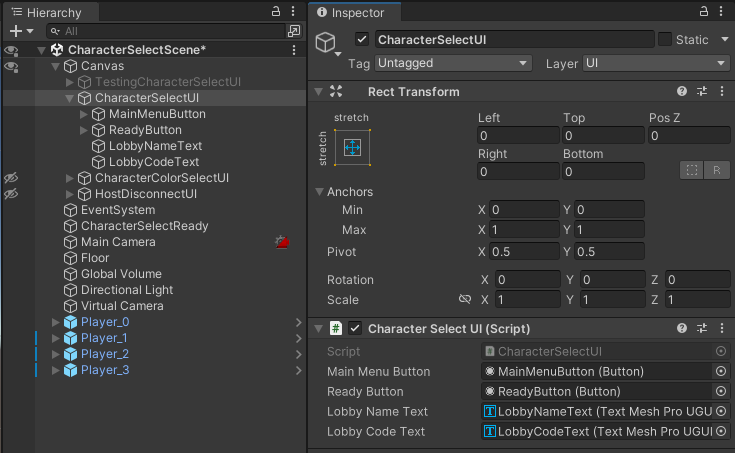

```csharp
using TMPro;
using Unity.Netcode;
using Unity.Services.Lobbies.Models;
using UnityEngine;
using UnityEngine.UI;

public class CharacterSelectUI : MonoBehaviour
{
    [SerializeField] private Button mainMenuButton;
    [SerializeField] private Button readyButton;
    //新增
    [SerializeField] private TextMeshProUGUI lobbyNameText;
    [SerializeField] private TextMeshProUGUI lobbyCodeText;

    private void Awake() {
        mainMenuButton.onClick.AddListener(() => {
            NetworkManager.Singleton.Shutdown();
            Loader.Load(Loader.Scene.MainMenuScene);
        });

        readyButton.onClick.AddListener(() => {
            CharacterSelectReady.Instance.SetPlayerReady();
        });
    }

    private void Start() {
        Lobby lobby = KitchenGameLobby.Instance.GetLobby();

        lobbyNameText.text = "Lobby Name：" + lobby.Name;
        lobbyCodeText.text = "Lobby Code：" + lobby.LobbyCode;
    }
}
```

##### d:修改脚本`KitchenGameMultiplayer.cs`

```csharp
using System;
using System.Collections.Generic;
using Unity.Netcode;
using Unity.Services.Authentication;
using UnityEngine;
using UnityEngine.SceneManagement;

public class KitchenGameMultiplayer : NetworkBehaviour
{
    private const int MAX_PLAYER_AMOUNT = 4;
    //
    private const string PLAYER_PREFS_PLAYER_NAME_MULTIPLAYER = "PlayerNameMultiplayer";
    private string playerName;

    public static KitchenGameMultiplayer Instance { get; private set; }

    public event EventHandler OnTryingToJoinGame;
    public event EventHandler OnFailedToJoinGame;
    public event EventHandler OnPlayerDataNetworkListChanged;

    [SerializeField] private KitchenObjectListSO kitchenObjectListSO;
    [SerializeField] private List<Color> playerColorList;

    private NetworkList<PlayerData> playerDataNetworkList;

    private void Awake() {
        Instance = this;
        DontDestroyOnLoad(this);

        //存放
        playerName = PlayerPrefs.GetString(PLAYER_PREFS_PLAYER_NAME_MULTIPLAYER,"PlayerName"+UnityEngine.Random.Range(100,1000));

        playerDataNetworkList = new NetworkList<PlayerData>();
        playerDataNetworkList.OnListChanged += PlayerDataNetworkList_OnListChanged;
    }

    //获取
    public string GetPlayerName() {
        return playerName;
    }
    //设置
    public void SetPlayerName(string playerName) {
        this.playerName = playerName;
        PlayerPrefs.SetString(PLAYER_PREFS_PLAYER_NAME_MULTIPLAYER, playerName);
    }

    private void PlayerDataNetworkList_OnListChanged(NetworkListEvent<PlayerData> changeEvent) {
        OnPlayerDataNetworkListChanged?.Invoke(this, EventArgs.Empty);
    }

    public void StartHost() {
        NetworkManager.Singleton.ConnectionApprovalCallback += NetworkManager_ConnectionApprovalCallback;
        NetworkManager.Singleton.OnClientConnectedCallback += NetworkManager_OnClientConnectedCallback;
        NetworkManager.Singleton.OnClientDisconnectCallback += NetworkManager_Server_OnClientDisconnectCallback;
        NetworkManager.Singleton.StartHost();
    }

    private void NetworkManager_Server_OnClientDisconnectCallback(ulong clientId) {
        for(int i = 0; i < playerDataNetworkList.Count; i++) {
            PlayerData playerData = playerDataNetworkList[i];
            if(playerData.clientId == clientId) {
                playerDataNetworkList.RemoveAt(i);
            }
        }
    }

    private void NetworkManager_OnClientConnectedCallback(ulong clientId) {
        playerDataNetworkList.Add(new PlayerData {
            clientId = clientId,
            colorId = GetFirstUnusedColorId(),
        });
        //
        SetPlayerNameServerRpc(GetPlayerName());
        SetPlayerIdServerRpc(AuthenticationService.Instance.PlayerId);
    }

    private void NetworkManager_ConnectionApprovalCallback(NetworkManager.ConnectionApprovalRequest connectionApprovalRequest, NetworkManager.ConnectionApprovalResponse connectionApprovalResponse) {
        if(SceneManager.GetActiveScene().name != Loader.Scene.CharacterSelectScene.ToString()) {
            connectionApprovalResponse.Approved = false;
            connectionApprovalResponse.Reason = "Game has already started";
            return;
        }

        if(NetworkManager.Singleton.ConnectedClientsIds.Count >= MAX_PLAYER_AMOUNT) {
            connectionApprovalResponse.Approved = false;
            connectionApprovalResponse.Reason = "Game is full";
            return;
        }
        connectionApprovalResponse.Approved = true;
    }

    //改动一下
    public void StartClient() {
        OnTryingToJoinGame?.Invoke(this, EventArgs.Empty);
        NetworkManager.Singleton.OnClientDisconnectCallback += NetworkManager_Client_OnClientDisconnectCallback;
        //补充，这里上传玩家名称到服务器中
        NetworkManager.Singleton.OnClientConnectedCallback += NetworkManager_Client_OnClientConnectedCallback;
        NetworkManager.Singleton.StartClient();
    }
    //实现
    private void NetworkManager_Client_OnClientConnectedCallback(ulong clientId) {
        SetPlayerNameServerRpc(GetPlayerName());
        SetPlayerIdServerRpc(AuthenticationService.Instance.PlayerId);
    }
    //
    [ServerRpc(RequireOwnership = false)]
    private void SetPlayerNameServerRpc(string playerName, ServerRpcParams serverRpcParams = default) {
        int playerDataIndex = GetPlayerDataIndexFromClientId(serverRpcParams.Receive.SenderClientId);

        PlayerData playerData = playerDataNetworkList[playerDataIndex];
        playerData.playerName = playerName;
        playerDataNetworkList[playerDataIndex] = playerData;
    }
    //
    [ServerRpc(RequireOwnership = false)]
    private void SetPlayerIdServerRpc(string playerId, ServerRpcParams serverRpcParams = default) {
        int playerDataIndex = GetPlayerDataIndexFromClientId(serverRpcParams.Receive.SenderClientId);

        PlayerData playerData = playerDataNetworkList[playerDataIndex];
        playerData.playerId = playerId;
        playerDataNetworkList[playerDataIndex] = playerData;
    }
    //改动名称
    private void NetworkManager_Client_OnClientDisconnectCallback(ulong clientId) {
        OnFailedToJoinGame?.Invoke(this, EventArgs.Empty);
    }

    public void SpawnKitchenObject(KitchenObjectSO kitchenObjectSO, IKitchenObjectParent kitchenObjectParent) {
        SpawnKitchenObjectServerRpc(GetKitchenObjectSOIndex(kitchenObjectSO), kitchenObjectParent.GetNetworkObject());
    }

    [ServerRpc(RequireOwnership = false)]
    private void SpawnKitchenObjectServerRpc(int kitchenObjectSOIndex, NetworkObjectReference kitchenObjectParentNetworkObjectReference) {
        KitchenObjectSO kitchenObjectSO = GetKitchenObjectSOFromIndex(kitchenObjectSOIndex);


        Transform kitchenObjectTransform = Instantiate(kitchenObjectSO.prefab);

        NetworkObject kitchenObjectNetworkObject = kitchenObjectTransform.GetComponent<NetworkObject>();
        kitchenObjectNetworkObject.Spawn(true);

        KitchenObject kitchenObject = kitchenObjectTransform.GetComponent<KitchenObject>();

        kitchenObjectParentNetworkObjectReference.TryGet(out NetworkObject kitchenObjectParentNetworkObject);
        IKitchenObjectParent kitchenObjectParent = kitchenObjectParentNetworkObject.GetComponent<IKitchenObjectParent>();

        kitchenObject.SetKitchenObjectParent(kitchenObjectParent);
    }
    
    public int GetKitchenObjectSOIndex(KitchenObjectSO kitchenObjectSO) {
        return kitchenObjectListSO.kitchenObjectSOList.IndexOf(kitchenObjectSO);
    }

    public KitchenObjectSO GetKitchenObjectSOFromIndex(int kitchenObjectSOIndex) {
        return kitchenObjectListSO.kitchenObjectSOList[kitchenObjectSOIndex];
    }

    public void DestroyKitchenObject(KitchenObject kitchenObject) {
        DestroyKitchenObjectServerRpc(kitchenObject.NetworkObject);
    }

    [ServerRpc(RequireOwnership = false)]
    private void DestroyKitchenObjectServerRpc(NetworkObjectReference kitchenObjectNetworkObjectReference) {
        kitchenObjectNetworkObjectReference.TryGet(out NetworkObject kitchenObjectNetworkObject);
        KitchenObject kitchenObject = kitchenObjectNetworkObject.GetComponent<KitchenObject>();
        ClearKitchenObjectOnParentClientRpc(kitchenObjectNetworkObjectReference);
        kitchenObject.DestroySelf();
    }

    [ClientRpc]
    private void ClearKitchenObjectOnParentClientRpc(NetworkObjectReference kitchenObjectNetworkObjectReference) {
        kitchenObjectNetworkObjectReference.TryGet(out NetworkObject kitchenObjectNetworkObject);
        KitchenObject kitchenObject = kitchenObjectNetworkObject.GetComponent<KitchenObject>();

        kitchenObject.ClearKitchenObjectOnParent();
    }

    public bool IsPlayerIndexConnected(int playerIndex) {
        return playerIndex < playerDataNetworkList.Count;
    }

    public PlayerData GetPlayerDataFromPlayerIndex(int playerIndex) {
        return playerDataNetworkList[playerIndex];
    }

    public Color GetPlayerColor(int colorId) {
        return playerColorList[colorId];
    }

    public PlayerData GetPlayerDataFromClientId(ulong clientId) {
        foreach(PlayerData playerData in playerDataNetworkList) {
            if(playerData.clientId == clientId) {
                return playerData;
            }
        }
        return default;
    }

    public int GetPlayerDataIndexFromClientId(ulong clientId) {
        for(int i= 0; i < playerDataNetworkList.Count; i++) {
            if (playerDataNetworkList[i].clientId == clientId) {
                return i;
            }
        }
        return -1;
    }

    public PlayerData GetPlayerData() {
        return GetPlayerDataFromClientId(NetworkManager.Singleton.LocalClientId);
    }

    public void ChangePlayerColor(int colorId) {
        ChangePlayerColorServerRpc(colorId);
    }

    [ServerRpc(RequireOwnership = false)]
    private void ChangePlayerColorServerRpc(int colorId,ServerRpcParams serverRpcParams = default) {
        if (!IsColorAvailable(colorId)) {
            return;
        }

        int playerDataIndex = GetPlayerDataIndexFromClientId(serverRpcParams.Receive.SenderClientId);

        PlayerData playerData = playerDataNetworkList[playerDataIndex];
        playerData.colorId = colorId;
        playerDataNetworkList[playerDataIndex] = playerData;    
    }

    private bool IsColorAvailable(int colorId) {
        foreach(PlayerData playerData in playerDataNetworkList) {
            if(playerData.colorId == colorId) {

                return false;
            }
        }
        return true;
    }


    private int GetFirstUnusedColorId() {
        for(int i = 0; i < playerColorList.Count; i++) {
            if (IsColorAvailable(i)) {
                return i;
            }
        }
        return -1;
    }


    public void KickPlayer(ulong clientId) {
        NetworkManager.Singleton.DisconnectClient(clientId);
        NetworkManager_Server_OnClientDisconnectCallback(clientId);//要确保能触发
    }

    public int Get_Const_MAX_PLAYER_AMOUNT() {
        return MAX_PLAYER_AMOUNT;
    }
}
```

##### e:修改脚本`CharacterSelectPlayer.cs`


```csharp
using System;
using TMPro;
using Unity.Netcode;
using UnityEngine;
using UnityEngine.UI;

public class CharacterSelectPlayer : MonoBehaviour
{
    [SerializeField] private int playerIndex;
    [SerializeField] private GameObject readyGameObjectText;
    [SerializeField] private PlayerVisual playerVisual;
    [SerializeField] private Button kickButton;
    //补充
    [SerializeField] private TextMeshPro playerNameText;

    private void Awake() {
        kickButton.onClick.AddListener(() => {
            PlayerData playerData = KitchenGameMultiplayer.Instance.GetPlayerDataFromPlayerIndex(playerIndex);
            //我们踢人不忘处理lobby，免得重复累加
            KitchenGameLobby.Instance.KickPlayer(playerData.playerId.ToString());
            KitchenGameMultiplayer.Instance.KickPlayer(playerData.clientId);
        });
    }

    private void Start() {
        KitchenGameMultiplayer.Instance.OnPlayerDataNetworkListChanged += KitchenGameMultiplayer_OnPlayerDataNetworkListChanged;
        CharacterSelectReady.Instance.OnReadyChanged += CharacterSelectReady_OnReadyChanged;

        kickButton.gameObject.SetActive(NetworkManager.Singleton.IsServer);
        UpdatePlayer();
    }

    private void CharacterSelectReady_OnReadyChanged(object sender, EventArgs e) {
        UpdatePlayer();
    }

    private void KitchenGameMultiplayer_OnPlayerDataNetworkListChanged(object sender, EventArgs e) {
        UpdatePlayer();
    }

    private void UpdatePlayer() {
        if (KitchenGameMultiplayer.Instance.IsPlayerIndexConnected(playerIndex)) {
            Show();
            PlayerData playerData = KitchenGameMultiplayer.Instance.GetPlayerDataFromPlayerIndex(playerIndex);
            readyGameObjectText.SetActive(CharacterSelectReady.Instance.IsPlayerReady(playerData.clientId));
            //这里改动玩家的名称
            playerNameText.text = playerData.playerName.ToString();
            
            playerVisual.SetPlayerColor(KitchenGameMultiplayer.Instance.GetPlayerColor(playerData.colorId));

        }
        else {
            Hide();
        }
    }

    private void Show() {
        gameObject.SetActive(true);
    }

    private void Hide() {
        gameObject.SetActive(false);
    }

    private void OnDestroy() {
        KitchenGameMultiplayer.Instance.OnPlayerDataNetworkListChanged-= KitchenGameMultiplayer_OnPlayerDataNetworkListChanged;
        CharacterSelectReady.Instance.OnReadyChanged -= CharacterSelectReady_OnReadyChanged;
    }
}
```

##### f:修改脚本`PlayerData.cs`

```csharp
using System;
using Unity.Collections;
using Unity.Netcode;

public struct PlayerData:IEquatable<PlayerData>,INetworkSerializable
{
    public ulong clientId;
    public int colorId;
    //补充，注意不能直接用string不支持
    public FixedString64Bytes playerName;
    public FixedString64Bytes playerId;

    //改写
    public bool Equals(PlayerData other) {
        return 
            clientId == other.clientId && 
            colorId == other.colorId &&
            playerName == other.playerName &&
            playerId == other.playerId;
    }

    public void NetworkSerialize<T>(BufferSerializer<T> serializer) where T : IReaderWriter {
        serializer.SerializeValue(ref clientId);
        serializer.SerializeValue(ref colorId);
        serializer.SerializeValue(ref playerName);
        serializer.SerializeValue(ref playerId);
    }
}
```

##### g:修改脚本`CharacterSelectReady.cs`

```csharp
using System;
using System.Collections.Generic;
using Unity.Netcode;
using UnityEngine;

public class CharacterSelectReady : NetworkBehaviour
{
    public static CharacterSelectReady Instance { get; private set; }

    public event EventHandler OnReadyChanged;

    private Dictionary<ulong, bool> playerReadyDictionary;

    private void Awake() {
        Instance = this;
        playerReadyDictionary = new Dictionary<ulong, bool>();
    }

    public void SetPlayerReady() {
        SetPlayerReadyServerRpc();
    }

    [ServerRpc(RequireOwnership = false)]
    private void SetPlayerReadyServerRpc(ServerRpcParams serverRpcParams = default) {
        SetPlayerReadyClientRpc(serverRpcParams.Receive.SenderClientId);
        playerReadyDictionary[serverRpcParams.Receive.SenderClientId] = true;
        bool allClientsReady = true;
        foreach (ulong clientId in NetworkManager.Singleton.ConnectedClientsIds) {
            if (!playerReadyDictionary.ContainsKey(clientId) || !playerReadyDictionary[clientId]) {
                allClientsReady = false;
                break;
            }
        }

        if (allClientsReady) {
            //这里销毁到我们的lobby
            KitchenGameLobby.Instance.DeleteLobby();
            Loader.LoadNetwork(Loader.Scene.GameScene);
        }

        Debug.Log("All Clients Ready：" + allClientsReady);
    }

    [ClientRpc]
    private void SetPlayerReadyClientRpc(ulong clientId) {
        playerReadyDictionary[clientId]= true;
        OnReadyChanged?.Invoke(this, new EventArgs());
    }

    public bool IsPlayerReady(ulong clientId) {
        return playerReadyDictionary.ContainsKey(clientId) && playerReadyDictionary[clientId];
    }
}
```

#### [4]改动相应的连接提示

##### a:UGUI

重命名之前的`ConnectionResponseMessageUI`为`LobbyMessageUI`，并且改动挂载的cs脚本名称与游戏对象同名。

调整一下层次结构的顺序


##### b:修改脚本`LobbyMessageUI.cs`

```csharp
using System;
using TMPro;
using Unity.Netcode;
using UnityEngine;
using UnityEngine.UI;

public class LobbyMessageUI : MonoBehaviour
{
    [SerializeField] private TextMeshProUGUI messageText;
    [SerializeField] private Button closeButton;

    private void Awake() {
        closeButton.onClick.AddListener(Hide);
    }

    private void Start() {
        KitchenGameMultiplayer.Instance.OnFailedToJoinGame += KitchenGameMultiplayer_OnFailedToJoinGame;
        //补充实现相关的视觉信息，以避免异步带来的不同步的不协调感
        KitchenGameLobby.Instance.OnCreateLobbyStarted += KitchenGameLobby_OnCreateLobbyStarted;
        KitchenGameLobby.Instance.OnCreateLobbyFailed += KitchenGameLobby_OnCreateLobbyFailed;
        KitchenGameLobby.Instance.OnJoinStarted += KitchenGameLobby_OnJoinStarted;
        KitchenGameLobby.Instance.OnJoinFailed += KitchenGameLobby_OnJoinFailed;
        KitchenGameLobby.Instance.OnQuickJoinFailed += KitchenGameLobby_OnQuickJoinFailed;
        Hide();
    }

    private void KitchenGameLobby_OnQuickJoinFailed(object sender, EventArgs e) {
        ShowMessage("Could not find a Lobby to Quick Join!");
    }

    private void KitchenGameLobby_OnJoinFailed(object sender, EventArgs e) {
        ShowMessage("Failed to join Lobby!");
    }

    private void KitchenGameLobby_OnJoinStarted(object sender, EventArgs e) {
        ShowMessage("Joining Lobby...");
    }

    private void KitchenGameLobby_OnCreateLobbyFailed(object sender, EventArgs e) {
        ShowMessage("Failed to create lobby!");
    }

    private void KitchenGameLobby_OnCreateLobbyStarted(object sender, EventArgs e) {
        ShowMessage("Creating Lobby...");
    }

    private void KitchenGameMultiplayer_OnFailedToJoinGame(object sender, EventArgs e) {
        if(NetworkManager.Singleton.DisconnectReason == "") {
            ShowMessage("Failed to connect");
        }
        else {
            ShowMessage(NetworkManager.Singleton.DisconnectReason);
        }
    }

    private void ShowMessage(string message) {
        Show();
        messageText.text = message;
    }

    private void Show() {
        gameObject.SetActive(true);
    }

    private void Hide() {
        gameObject.SetActive(false);
    }

    private void OnDestroy() {
        KitchenGameMultiplayer.Instance.OnFailedToJoinGame -= KitchenGameMultiplayer_OnFailedToJoinGame;
        KitchenGameLobby.Instance.OnCreateLobbyStarted -= KitchenGameLobby_OnCreateLobbyStarted;
        KitchenGameLobby.Instance.OnCreateLobbyFailed -= KitchenGameLobby_OnCreateLobbyFailed;
        KitchenGameLobby.Instance.OnJoinStarted -= KitchenGameLobby_OnJoinStarted;
        KitchenGameLobby.Instance.OnJoinFailed -= KitchenGameLobby_OnJoinFailed;
        KitchenGameLobby.Instance.OnQuickJoinFailed -= KitchenGameLobby_OnQuickJoinFailed;
    }
}
```

#### [5]弄多几个大厅

<video src="./imgs/05_008_[5]1.mp4" position= "absolute" width="100%" height="100%" controls="controls"></video>

##### a:修改脚本`LobbyUI.cs`


```csharp
using System.Collections.Generic;
using TMPro;
using Unity.Services.Lobbies.Models;
using UnityEngine;
using UnityEngine.UI;

public class LobbyUI : MonoBehaviour
{
    [SerializeField] private Button mainMenuButton;
    [SerializeField] private Button createLobbyButton;
    [SerializeField] private Button quickJoinButton;
    [SerializeField] private LobbyCreateUI lobbyCreateUI;
    [SerializeField] private Button joinCodeButton;
    [SerializeField] private TMP_InputField joinCodeInputField;
    [SerializeField] private TMP_InputField playerNameInputField;
    //
    [SerializeField] private Transform lobbyContainer;
    [SerializeField] private Transform lobbyTemplate;

    private void Awake() {
        mainMenuButton.onClick.AddListener(() => {
            KitchenGameLobby.Instance.LeaveLobby();
            Loader.Load(Loader.Scene.MainMenuScene);
        });
        createLobbyButton.onClick.AddListener(() => {
            lobbyCreateUI.Show();
        });
        quickJoinButton.onClick.AddListener(() => {
            KitchenGameLobby.Instance.QuickJoin();
        });
        joinCodeButton.onClick.AddListener(() => {
            KitchenGameLobby.Instance.JoinWithCode(joinCodeInputField.text);
        });

        //
        lobbyTemplate.gameObject.SetActive(false);
    }

    private void Start() {
        playerNameInputField.text = KitchenGameMultiplayer.Instance.GetPlayerName();
        playerNameInputField.onValueChanged.AddListener((string newText) => {
            KitchenGameMultiplayer.Instance.SetPlayerName(newText);
        });

        //
        KitchenGameLobby.Instance.OnLobbyListChanged += KitchenGameLobby_OnLobbyListChanged;
        UpdateLobbyList(new List<Lobby>());
    }

    private void KitchenGameLobby_OnLobbyListChanged(object sender, KitchenGameLobby.OnLobbyListChangedEventArgs e) {
        UpdateLobbyList(e.lobbyList);
    }

    //
    private void UpdateLobbyList(List<Lobby> lobbyList) {
        foreach(Transform child in lobbyContainer) {
            if (child == lobbyTemplate) continue;
            Destroy(child.gameObject);
        }

        foreach(Lobby lobby in lobbyList) {
            Transform lobbyTransform = Instantiate(lobbyTemplate,lobbyContainer);
            lobbyTransform.gameObject.SetActive(true);
            lobbyTransform.GetComponent<LobbyListSingleUI>().SetLobby(lobby);
        }
    }


    //
    private void OnDestroy() {
        KitchenGameLobby.Instance.OnLobbyListChanged -= KitchenGameLobby_OnLobbyListChanged;
    }
}
```


##### b:新建脚本`LobbyListSingleUI.cs`


```csharp
using TMPro;
using Unity.Services.Lobbies.Models;
using UnityEngine;
using UnityEngine.UI;

public class LobbyListSingleUI : MonoBehaviour
{
    [SerializeField] private TextMeshProUGUI lobbyNameText;
    private Lobby lobby;

    private void Awake() {
        GetComponent<Button>().onClick.AddListener(() => {
            KitchenGameLobby.Instance.JoinWithId(lobby.Id);
        });
    }

    public void SetLobby(Lobby lobby) {
        this.lobby = lobby;
        lobbyNameText.text = lobby.Name;
    }
}
```

### 009 中继器

#### [1]准备


确保开启


这个插件工具做的工作就是把我们原来需要考虑的端口，防火墙这些工作都封装好了，这样当我们在网上的不同电脑，只需要创建属于自己那个房间，而不需要交给开发者苦恼，玩家要做的只是加入房间开始属于特定房间的游戏。

#### [2]分配

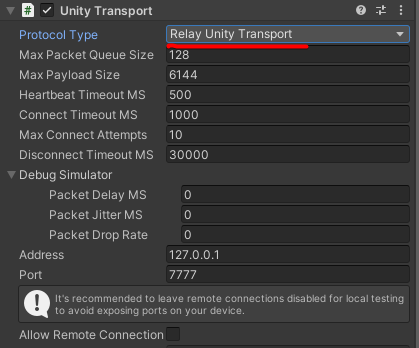

##### a:修改脚本`KitchenGameLobby.cs`

<video src="./imgs/05_009_[2]a1.mp4" position= "absolute" width="100%" height="100%" controls="controls"></video>

```csharp
using System;
using System.Collections.Generic;
using System.Threading.Tasks;
using Unity.Netcode;
using Unity.Netcode.Transports.UTP;
using Unity.Networking.Transport.Relay;
using Unity.Services.Authentication;
using Unity.Services.Core;
using Unity.Services.Lobbies;
using Unity.Services.Lobbies.Models;
using Unity.Services.Relay;
using Unity.Services.Relay.Models;
using UnityEngine;
using UnityEngine.SceneManagement;

public class KitchenGameLobby : MonoBehaviour
{
    //定义要加入的key常量
    private const string KEY_RELAY_JOIN_CODE = "RelayJoinCode";

    //..

    //分配relay
    private async Task<Allocation> AllocateRelay() {
        try {
            Allocation allocation = await RelayService.Instance.CreateAllocationAsync(KitchenGameMultiplayer.Instance.Get_Const_MAX_PLAYER_AMOUNT() - 1);
            return allocation;
        }catch(RelayServiceException e) {
            Debug.Log(e);
            return default;
        }
    }

    //获取中继器的join码
    private async Task<string> GetRelayJoinCode(Allocation allocation) {
        try {
            string relayJoinCode = await RelayService.Instance.GetJoinCodeAsync(allocation.AllocationId);
            return relayJoinCode;
        }
        catch(RelayServiceException e) {
            Debug.Log(e);
            return default;
        }
    }

    //加入relay
    private async Task<JoinAllocation> JoinRelay(string joinCode) {
        try {
            JoinAllocation joinAllocation = await RelayService.Instance.JoinAllocationAsync(joinCode);
            return joinAllocation;
        }catch(RelayServiceException e) {
            Debug.Log(e);
            return default;
        }
    }

    public async void CreateLobby(string lobbyName,bool isPrivate) {
        OnCreateLobbyStarted?.Invoke(this,EventArgs.Empty);
        try {
            joinedLobby = await LobbyService.Instance.CreateLobbyAsync(
                lobbyName,
                KitchenGameMultiplayer.Instance.Get_Const_MAX_PLAYER_AMOUNT(),
                new CreateLobbyOptions {
                    IsPrivate = isPrivate,
                });

            //这里调用分配
            Allocation allocation = await AllocateRelay();
            string relayJoinCode = await GetRelayJoinCode(allocation);

            //这里定义要传入的中继器相关数据
            await LobbyService.Instance.UpdateLobbyAsync(joinedLobby.Id, new UpdateLobbyOptions {
                Data = new Dictionary<string, DataObject> {
                    { KEY_RELAY_JOIN_CODE,new DataObject(DataObject.VisibilityOptions.Member,relayJoinCode)}
                }
            });

            NetworkManager.Singleton.GetComponent<UnityTransport>().SetRelayServerData(new RelayServerData(allocation,"dtls"));

            KitchenGameMultiplayer.Instance.StartHost();
            Loader.LoadNetwork(Loader.Scene.CharacterSelectScene);
        }
        catch(LobbyServiceException e) {
            Debug.Log(e);
            OnCreateLobbyFailed?.Invoke(this, EventArgs.Empty);
        }
    }

    public async void QuickJoin() {
        OnJoinStarted?.Invoke(this, EventArgs.Empty);
        try {
            joinedLobby = await LobbyService.Instance.QuickJoinLobbyAsync();

            //这里分配加入
            string relayJoinCode = joinedLobby.Data[KEY_RELAY_JOIN_CODE].Value;
            JoinAllocation joinAllocation = await JoinRelay(relayJoinCode);
            NetworkManager.Singleton.GetComponent<UnityTransport>().SetRelayServerData(new RelayServerData(joinAllocation, "dtls"));

            KitchenGameMultiplayer.Instance.StartClient();
        }
        catch(LobbyServiceException e) {
            Debug.Log(e);
            OnQuickJoinFailed?.Invoke(this, EventArgs.Empty);
        }
    }

    public async void JoinWithId(string lobbyId) {
        OnJoinStarted?.Invoke(this, EventArgs.Empty);
        try {
            joinedLobby = await LobbyService.Instance.JoinLobbyByIdAsync(lobbyId);

            //这里分配加入
            string relayJoinCode = joinedLobby.Data[KEY_RELAY_JOIN_CODE].Value;
            JoinAllocation joinAllocation = await JoinRelay(relayJoinCode);
            NetworkManager.Singleton.GetComponent<UnityTransport>().SetRelayServerData(new RelayServerData(joinAllocation, "dtls"));

            KitchenGameMultiplayer.Instance.StartClient();
        }
        catch (LobbyServiceException e) {
            Debug.Log(e);
            OnJoinFailed?.Invoke(this, EventArgs.Empty);
        }
    }

    public async void JoinWithCode(string lobbyCode) {
        OnJoinStarted?.Invoke(this, EventArgs.Empty);
        try {
            joinedLobby = await LobbyService.Instance.JoinLobbyByCodeAsync(lobbyCode);

            //这里分配加入
            string relayJoinCode = joinedLobby.Data[KEY_RELAY_JOIN_CODE].Value;
            JoinAllocation joinAllocation = await JoinRelay(relayJoinCode);
            NetworkManager.Singleton.GetComponent<UnityTransport>().SetRelayServerData(new RelayServerData(joinAllocation, "dtls"));

            KitchenGameMultiplayer.Instance.StartClient();
        }catch(LobbyServiceException e) {
            Debug.Log(e);
            OnJoinFailed?.Invoke(this, EventArgs.Empty);
        }
    }

    //...
}
```

### 010 其他

#### 工具

[云Game Server Hosting服务（又名Multiplay）| Unity](https://unity.com/cn/products/game-server-hosting)

Matchmaker

Vivox

看完最后的分手厨房的内容，具体的内容就是：

1. 介绍三个特定的unity联网工具插件，它们各有各的用处game-server-hosting、Matchmaker、Vivox
2. 介绍了我们该怎么考虑可靠与不可靠联网，相应的有丢包率，延迟后，应该怎么查看联网的性能，同步好玩家的数据，位置这些
3. 说明了怎么让玩家切换到单机模式
所以codemonkey教的胡闹厨房完结，这4个月真是跌宕起伏
